# Phase 3: Comprehensive Atomic Task Decomposition
## AegisWallet Quality Control Implementation

**Generated**: 2025-11-25T20:55:00.000Z
**Project**: AegisWallet - Voice-first Financial Assistant for Brazilian Market
**Total Tasks**: 65+ atomic tasks across 5 critical areas
**Estimated Time**: 15-20 hours with parallel execution

---

## Executive Summary

This document provides a comprehensive breakdown of Phase 2 research-backed solutions into atomic, testable tasks (15-25 minutes each) for the AegisWallet project quality control process. The decomposition follows the established template with validation commands, rollback procedures, and LGPD compliance integration.

### Task Distribution by Priority

| Category | Task Count | Priority | Risk Level | Estimated Time |
|----------|------------|----------|------------|----------------|
| Database Schema Alignment | 15 | Critical | High | 5.5 hours |
| Security Vulnerability Remediation | 12 | Critical | High | 4 hours |
| Type Safety Restoration | 18 | Critical | Medium | 5 hours |
| Component Export Problems | 10 | High | Medium | 3 hours |
| Testing Infrastructure | 10 | High | Low | 2.5 hours |
| **TOTAL** | **65** | | | **20 hours** |

---

## Category 1: Database Schema Alignment (Critical Priority)
### 15 Tasks - 5.5 hours - Risk Level: HIGH

#### QC-DB-T1: Supabase CLI Configuration Verification
```yaml
task_id: "QC-DB-T1"
name: "Verify Supabase CLI configuration for type generation"
category: "Database"
priority: "Critical"
action: "Run supabase status to verify CLI configuration and local setup"
validation: "bun run supabase status && bun run supabase projects list"
rollback: "Restore original .supabase/config.toml from git"
estimated_time: "20 minutes"
dependencies: "None"
risk_level: "High"
lgpd_compliance: "Yes - Ensure data residency configuration"
agent_type: "Architect-Review"
parallel_safe: "No"
```

#### QC-DB-T2: Database Backup Creation
```yaml
task_id: "QC-DB-T2"
name: "Create comprehensive database backup before schema changes"
category: "Database"
priority: "Critical"
action: "Run supabase db dump to create full backup of current database state"
validation: "Verify backup file exists and is not empty: ls -la backups/ && file backups/*.sql"
rollback: "Delete created backup if schema changes not needed"
estimated_time: "25 minutes"
dependencies: "QC-DB-T1"
risk_level: "High"
lgpd_compliance: "Yes - Backup must include LGPD compliance data"
agent_type: "Architect-Review"
parallel_safe: "No"
```

#### QC-DB-T3: Supabase Type Generation
```yaml
task_id: "QC-DB-T3"
name: "Generate TypeScript types from Supabase database schema"
category: "Database"
priority: "Critical"
action: "bun run supabase gen types typescript --local > src/types/database.types.ts"
validation: "bun run typecheck && grep -q 'export type Database' src/types/database.types.ts"
rollback: "git checkout -- src/types/database.types.ts"
estimated_time: "15 minutes"
dependencies: "QC-DB-T2"
risk_level: "Medium"
lgpd_compliance: "Yes - Ensure LGPD masking preserved in types"
agent_type: "Architect-Review"
parallel_safe: "No"
```

#### QC-DB-T4: Database Schema Validation
```yaml
task_id: "QC-DB-T4"
name: "Validate database schema alignment with TypeScript interfaces"
category: "Database"
priority: "Critical"
action: "Compare generated types with existing interfaces in src/types/"
validation: "bun run test:database && bun run typecheck"
rollback: "Revert interface changes to match original schema"
estimated_time: "20 minutes"
dependencies: "QC-DB-T3"
risk_level: "Medium"
lgpd_compliance: "Yes - Validate LGPD field constraints"
agent_type: "Architect-Review"
parallel_safe: "No"
```

#### QC-DB-T5: Snake_case to camelCase Conversion Functions
```yaml
task_id: "QC-DB-T5"
name: "Create utility functions for snake_case to camelCase conversion"
category: "Database"
priority: "Critical"
action: "Implement conversion utilities in src/lib/utils/database-conversion.ts"
validation: "bun run test:conversion && bun run typecheck"
rollback: "git checkout -- src/lib/utils/database-conversion.ts"
estimated_time: "20 minutes"
dependencies: "QC-DB-T4"
risk_level: "Medium"
lgpd_compliance: "No"
agent_type: "Architect-Review"
parallel_safe: "Yes"
```

#### QC-DB-T6: Financial Events Schema Alignment
```yaml
task_id: "QC-DB-T6"
name: "Align FinancialEvents interface with database schema"
category: "Database"
priority: "Critical"
action: "Update src/types/financial-events.ts to match database columns"
validation: "bun run typecheck && bun run test:financial-events"
rollback: "git checkout -- src/types/financial-events.ts"
estimated_time: "25 minutes"
dependencies: "QC-DB-T5"
risk_level: "Medium"
lgpd_compliance: "Yes - Financial data must comply with LGPD"
agent_type: "Architect-Review"
parallel_safe: "Yes"
```

#### QC-DB-T7: PIX Keys Schema Alignment
```yaml
task_id: "QC-DB-T7"
name: "Align PixKey interface with database schema properties"
category: "Database"
priority: "Critical"
action: "Fix property name mismatches (is_favorite vs isFavorite) in PixKey interface"
validation: "bun run typecheck && bun run test:pix-keys"
rollback: "git checkout -- src/types/pix-keys.ts"
estimated_time: "15 minutes"
dependencies: "QC-DB-T6"
risk_level: "Medium"
lgpd_compliance: "Yes - PIX data requires Brazilian compliance"
agent_type: "Architect-Review"
parallel_safe: "Yes"
```

#### QC-DB-T8: User Accounts Schema Alignment
```yaml
task_id: "QC-DB-T8"
name: "Align user accounts interfaces with database schema"
category: "Database"
priority: "Critical"
action: "Update user account types to match database columns and constraints"
validation: "bun run typecheck && bun run test:user-accounts"
rollback: "git checkout -- src/types/user-accounts.ts"
estimated_time: "20 minutes"
dependencies: "QC-DB-T7"
risk_level: "Medium"
lgpd_compliance: "Yes - User data requires LGPD compliance"
agent_type: "Architect-Review"
parallel_safe: "Yes"
```

#### QC-DB-T9: Banking Connections Schema Validation
```yaml
task_id: "QC-DB-T9"
name: "Validate banking connections schema alignment"
category: "Database"
priority: "Critical"
action: "Ensure banking connection types match database schema and BACEN requirements"
validation: "bun run typecheck && bun run test:banking-connections"
rollback: "git checkout -- src/types/banking-connections.ts"
estimated_time: "20 minutes"
dependencies: "QC-DB-T8"
risk_level: "Medium"
lgpd_compliance: "Yes - Banking data requires Brazilian compliance"
agent_type: "Architect-Review"
parallel_safe: "Yes"
```

#### QC-DB-T10: Voice Analytics Schema Alignment
```yaml
task_id: "QC-DB-T10"
name: "Align voice analytics types with database schema"
category: "Database"
priority: "Critical"
action: "Update voice analytics interfaces to match database structure"
validation: "bun run typecheck && bun run test:voice-analytics"
rollback: "git checkout -- src/types/voice-analytics.ts"
estimated_time: "15 minutes"
dependencies: "QC-DB-T9"
risk_level: "Low"
lgpd_compliance: "Yes - Voice data requires LGPD consent"
agent_type: "Architect-Review"
parallel_safe: "Yes"
```

#### QC-DB-T11: Database Migration Creation
```yaml
task_id: "QC-DB-T11"
name: "Create database migration for schema alignment changes"
category: "Database"
priority: "Critical"
action: "bun run supabase migration new schema_alignment_fixes"
validation: "Verify migration file created in supabase/migrations/"
rollback: "Remove created migration file"
estimated_time: "15 minutes"
dependencies: "QC-DB-T10"
risk_level: "Medium"
lgpd_compliance: "Yes - Migration must preserve LGPD constraints"
agent_type: "Architect-Review"
parallel_safe: "No"
```

#### QC-DB-T12: Migration SQL Implementation
```yaml
task_id: "QC-DB-T12"
name: "Implement SQL changes in migration file for schema alignment"
category: "Database"
priority: "Critical"
action: "Write SQL statements to align database schema with TypeScript interfaces"
validation: "bun run supabase db push --dry-run && bun run lint:sql"
rollback: "git checkout -- supabase/migrations/latest_migration.sql"
estimated_time: "25 minutes"
dependencies: "QC-DB-T11"
risk_level: "High"
lgpd_compliance: "Yes - SQL changes must maintain LGPD compliance"
agent_type: "Architect-Review"
parallel_safe: "No"
```

#### QC-DB-T13: Database Migration Execution
```yaml
task_id: "QC-DB-T13"
name: "Execute database migration for schema alignment"
category: "Database"
priority: "Critical"
action: "bun run supabase db push"
validation: "bun run test:database && bun run supabase db diff --schema public"
rollback: "bun run supabase db rollback --version <previous_migration>"
estimated_time: "20 minutes"
dependencies: "QC-DB-T12"
risk_level: "High"
lgpd_compliance: "Yes - Verify LGPD compliance after migration"
agent_type: "Architect-Review"
parallel_safe: "No"
```

#### QC-DB-T14: Post-Migration Type Regeneration
```yaml
task_id: "QC-DB-T14"
name: "Regenerate TypeScript types after database migration"
category: "Database"
priority: "Critical"
action: "bun run supabase gen types typescript --local > src/types/database.types.ts"
validation: "bun run typecheck && bun run test:types"
rollback: "git checkout -- src/types/database.types.ts"
estimated_time: "15 minutes"
dependencies: "QC-DB-T13"
risk_level: "Medium"
lgpd_compliance: "Yes - Ensure LGPD types are preserved"
agent_type: "Architect-Review"
parallel_safe: "No"
```

#### QC-DB-T15: Database Integration Testing
```yaml
task_id: "QC-DB-T15"
name: "Comprehensive database integration testing after schema alignment"
category: "Database"
priority: "Critical"
action: "Run full database test suite to validate schema alignment"
validation: "bun run test:database:full && bun run test:integration"
rollback: "QC-DB-T13 rollback if integration tests fail"
estimated_time: "25 minutes"
dependencies: "QC-DB-T14"
risk_level: "Medium"
lgpd_compliance: "Yes - Test LGPD compliance in integration"
agent_type: "TDD-Orchestrator"
parallel_safe: "No"
```

---

## Category 2: Security Vulnerability Remediation (Critical Priority)
### 12 Tasks - 4 hours - Risk Level: HIGH

#### QC-SEC-T1: innerHTML Removal Audit
```yaml
task_id: "QC-SEC-T1"
name: "Audit codebase for innerHTML usage and security vulnerabilities"
category: "Security"
priority: "Critical"
action: "Search for all innerHTML usage in codebase: grep -r 'innerHTML' src/"
validation: "Generate report of all innerHTML instances found"
rollback: "No changes made in audit phase"
estimated_time: "20 minutes"
dependencies: "None"
risk_level: "Medium"
lgpd_compliance: "Yes - Audit for data leakage risks"
agent_type: "Code-Reviewer"
parallel_safe: "Yes"
```

#### QC-SEC-T2: Safe HTML Rendering Implementation
```yaml
task_id: "QC-SEC-T2"
name: "Replace innerHTML with safe DOM manipulation methods"
category: "Security"
priority: "Critical"
action: "Replace innerHTML with textContent and DOMPurify where HTML needed"
validation: "bun run test:security && bun run audit:xss"
rollback: "git checkout -- files with innerHTML replacements"
estimated_time: "25 minutes"
dependencies: "QC-SEC-T1"
risk_level: "High"
lgpd_compliance: "Yes - Prevent XSS attacks on user data"
agent_type: "Code-Reviewer"
parallel_safe: "Yes"
```

#### QC-SEC-T3: CSP Policy Configuration
```yaml
task_id: "QC-SEC-T3"
name: "Configure Content Security Policy headers for production"
category: "Security"
priority: "Critical"
action: "Update CSP configuration in vite.config.ts and index.html"
validation: "bun run build && bun run test:csp"
rollback: "git checkout -- vite.config.ts index.html"
estimated_time: "20 minutes"
dependencies: "QC-SEC-T2"
risk_level: "High"
lgpd_compliance: "Yes - CSP protects user data"
agent_type: "Architect-Review"
parallel_safe: "Yes"
```

#### QC-SEC-T4: Input Validation Implementation
```yaml
task_id: "QC-SEC-T4"
name: "Implement comprehensive input validation for Brazilian patterns"
category: "Security"
priority: "Critical"
action: "Add CPF, phone number, and financial input validation with Zod schemas"
validation: "bun run test:validation && bun run test:brazilian-patterns"
rollback: "git checkout -- src/lib/validation/"
estimated_time: "25 minutes"
dependencies: "QC-SEC-T3"
risk_level: "Medium"
lgpd_compliance: "Yes - Input validation protects user data"
agent_type: "Architect-Review"
parallel_safe: "Yes"
```

#### QC-SEC-T5: Authentication Middleware Hardening
```yaml
task_id: "QC-SEC-T5"
name: "Harden authentication middleware for security vulnerabilities"
category: "Security"
priority: "Critical"
action: "Update Supabase auth configuration and middleware security settings"
validation: "bun run test:auth && bun run audit:authentication"
rollback: "git checkout -- src/lib/auth/ supabase/config.toml"
estimated_time: "20 minutes"
dependencies: "QC-SEC-T4"
risk_level: "High"
lgpd_compliance: "Yes - Authentication protects user data"
agent_type: "Architect-Review"
parallel_safe: "No"
```

#### QC-SEC-T6: Session Security Enhancement
```yaml
task_id: "QC-SEC-T6"
name: "Enhance session security with proper token management"
category: "Security"
priority: "Critical"
action: "Implement secure session storage and token refresh mechanisms"
validation: "bun run test:session && bun run audit:session-security"
rollback: "git checkout -- src/lib/session/"
estimated_time: "20 minutes"
dependencies: "QC-SEC-T5"
risk_level: "Medium"
lgpd_compliance: "Yes - Session security protects user data"
agent_type: "Code-Reviewer"
parallel_safe: "Yes"
```

#### QC-SEC-T7: API Security Headers Configuration
```yaml
task_id: "QC-SEC-T7"
name: "Configure security headers for API endpoints"
category: "Security"
priority: "Critical"
action: "Add security headers (HSTS, X-Frame-Options, etc.) to Hono API"
validation: "bun run test:api-security && bun run audit:headers"
rollback: "git checkout -- src/server/middleware/security.ts"
estimated_time: "15 minutes"
dependencies: "QC-SEC-T6"
risk_level: "Medium"
lgpd_compliance: "No"
agent_type: "Architect-Review"
parallel_safe: "Yes"
```

#### QC-SEC-T8: Environment Variable Security
```yaml
task_id: "QC-SEC-T8"
name: "Secure environment variable handling and validation"
category: "Security"
priority: "Critical"
action: "Implement secure environment variable validation and encryption"
validation: "bun run test:env-security && bun run audit:environment"
rollback: "git checkout -- src/lib/env-validation.ts"
estimated_time: "15 minutes"
dependencies: "QC-SEC-T7"
risk_level: "Medium"
lgpd_compliance: "Yes - Environment variables may contain sensitive data"
agent_type: "Code-Reviewer"
parallel_safe: "Yes"
```

#### QC-SEC-T9: Rate Limiting Implementation
```yaml
task_id: "QC-SEC-T9"
name: "Implement rate limiting for API endpoints"
category: "Security"
priority: "Critical"
action: "Add rate limiting middleware to prevent abuse and DDoS attacks"
validation: "bun run test:rate-limiting && bun run test:load"
rollback: "git checkout -- src/server/middleware/rate-limit.ts"
estimated_time: "20 minutes"
dependencies: "QC-SEC-T8"
risk_level: "Medium"
lgpd_compliance: "No"
agent_type: "Architect-Review"
parallel_safe: "Yes"
```

#### QC-SEC-T10: Security Testing Implementation
```yaml
task_id: "QC-SEC-T10"
name: "Implement comprehensive security testing suite"
category: "Security"
priority: "Critical"
action: "Create security tests for XSS, CSRF, and injection vulnerabilities"
validation: "bun run test:security:full && bun run audit:vulnerability"
rollback: "git checkout -- tests/security/"
estimated_time: "25 minutes"
dependencies: "QC-SEC-T9"
risk_level: "Medium"
lgpd_compliance: "Yes - Security testing protects user data"
agent_type: "TDD-Orchestrator"
parallel_safe: "Yes"
```

#### QC-SEC-T11: Data Encryption Implementation
```yaml
task_id: "QC-SEC-T11"
name: "Implement data encryption for sensitive financial information"
category: "Security"
priority: "Critical"
action: "Add encryption for sensitive data at rest and in transit"
validation: "bun run test:encryption && bun run audit:data-security"
rollback: "git checkout -- src/lib/encryption/"
estimated_time: "25 minutes"
dependencies: "QC-SEC-T10"
risk_level: "High"
lgpd_compliance: "Yes - Encryption required by LGPD"
agent_type: "Architect-Review"
parallel_safe: "No"
```

#### QC-SEC-T12: Security Audit Finalization
```yaml
task_id: "QC-SEC-T12"
name: "Final security audit and compliance verification"
category: "Security"
priority: "Critical"
action: "Run comprehensive security audit and generate compliance report"
validation: "bun run audit:security:full && bun run test:security:compliance"
rollback: "Address any security issues found in audit"
estimated_time: "20 minutes"
dependencies: "QC-SEC-T11"
risk_level: "Medium"
lgpd_compliance: "Yes - Final LGPD compliance verification"
agent_type: "Code-Reviewer"
parallel_safe: "No"
```

---

## Category 3: Type Safety Restoration (Critical Priority)
### 18 Tasks - 5 hours - Risk Level: MEDIUM

#### QC-TS-T1: TypeScript Strict Mode Configuration
```yaml
task_id: "QC-TS-T1"
name: "Configure TypeScript strict mode in tsconfig.json"
category: "TypeSafety"
priority: "Critical"
action: "Update tsconfig.json to enable strict mode and related compiler options"
validation: "bun run typecheck && bun run build"
rollback: "git checkout -- tsconfig.json"
estimated_time: "15 minutes"
dependencies: "None"
risk_level: "Medium"
lgpd_compliance: "No"
agent_type: "Architect-Review"
parallel_safe: "No"
```

#### QC-TS-T2: Browser API Type Definitions
```yaml
task_id: "QC-TS-T2"
name: "Add missing browser API type definitions"
category: "TypeSafety"
priority: "Critical"
action: "Install and configure @types/web and other browser API type packages"
validation: "bun run typecheck && bun run test:browser-apis"
rollback: "git checkout -- package.json package-lock.json"
estimated_time: "15 minutes"
dependencies: "QC-TS-T1"
risk_level: "Low"
lgpd_compliance: "No"
agent_type: "Architect-Review"
parallel_safe: "Yes"
```

#### QC-TS-T3: useFinancialEvents Hook Type Fixes
```yaml
task_id: "QC-TS-T3"
name: "Fix TypeScript types in useFinancialEvents hook"
category: "TypeSafety"
priority: "Critical"
action: "Update hook return types and parameter types for type safety"
validation: "bun run typecheck && bun run test:useFinancialEvents"
rollback: "git checkout -- src/hooks/useFinancialEvents.ts"
estimated_time: "20 minutes"
dependencies: "QC-TS-T2"
risk_level: "Medium"
lgpd_compliance: "Yes - Financial data types must be secure"
agent_type: "Architect-Review"
parallel_safe: "Yes"
```

#### QC-TS-T4: Voice Component Type Fixes
```yaml
task_id: "QC-TS-T4"
name: "Fix TypeScript types in voice recognition components"
category: "TypeSafety"
priority: "Critical"
action: "Update voice component props and event handler types"
validation: "bun run typecheck && bun run test:voice-components"
rollback: "git checkout -- src/components/voice/"
estimated_time: "20 minutes"
dependencies: "QC-TS-T3"
risk_level: "Medium"
lgpd_compliance: "Yes - Voice data requires LGPD compliance"
agent_type: "Architect-Review"
parallel_safe: "Yes"
```

#### QC-TS-T5: Form Validation Type Fixes
```yaml
task_id: "QC-TS-T5"
name: "Fix TypeScript types in form validation with React Hook Form and Zod"
category: "TypeSafety"
priority: "Critical"
action: "Update form validation schemas and component prop types"
validation: "bun run typecheck && bun run test:form-validation"
rollback: "git checkout -- src/components/ui/form.tsx src/lib/validation/"
estimated_time: "20 minutes"
dependencies: "QC-TS-T4"
risk_level: "Medium"
lgpd_compliance: "Yes - Form data requires proper validation"
agent_type: "Architect-Review"
parallel_safe: "Yes"
```

#### QC-TS-T6: Component Ref Type Fixes
```yaml
task_id: "QC-TS-T6"
name: "Fix component ref types (HTMLDivElement vs HTMLButtonElement conflicts)"
category: "TypeSafety"
priority: "Critical"
action: "Update component ref types to match actual DOM elements"
validation: "bun run typecheck && bun run test:component-refs"
rollback: "git checkout -- src/components/ui/"
estimated_time: "15 minutes"
dependencies: "QC-TS-T5"
risk_level: "Low"
lgpd_compliance: "No"
agent_type: "TDD-Orchestrator"
parallel_safe: "Yes"
```

#### QC-TS-T7: Database Type Integration
```yaml
task_id: "QC-TS-T7"
name: "Integrate generated database types with application code"
category: "TypeSafety"
priority: "Critical"
action: "Update imports and usage of database types throughout application"
validation: "bun run typecheck && bun run test:database-types"
rollback: "git checkout -- src/ files using database types"
estimated_time: "25 minutes"
dependencies: "QC-TS-T6"
risk_level: "Medium"
lgpd_compliance: "Yes - Database types must maintain LGPD compliance"
agent_type: "Architect-Review"
parallel_safe: "Yes"
```

#### QC-TS-T8: API Response Type Fixes
```yaml
task_id: "QC-TS-T8"
name: "Fix TypeScript types for API responses and requests"
category: "TypeSafety"
priority: "Critical"
action: "Update tRPC router types and API response interfaces"
validation: "bun run typecheck && bun run test:api-types"
rollback: "git checkout -- src/server/routers/"
estimated_time: "20 minutes"
dependencies: "QC-TS-T7"
risk_level: "Medium"
lgpd_compliance: "Yes - API data requires proper typing"
agent_type: "Architect-Review"
parallel_safe: "Yes"
```

#### QC-TS-T9: Event Handler Type Fixes
```yaml
task_id: "QC-TS-T9"
name: "Fix TypeScript types for event handlers in components"
category: "TypeSafety"
priority: "Critical"
action: "Update event handler types and parameter types"
validation: "bun run typecheck && bun run test:event-handlers"
rollback: "git checkout -- src/components/ event handlers"
estimated_time: "15 minutes"
dependencies: "QC-TS-T8"
risk_level: "Low"
lgpd_compliance: "No"
agent_type: "TDD-Orchestrator"
parallel_safe: "Yes"
```

#### QC-TS-T10: Generic Type Constraints
```yaml
task_id: "QC-TS-T10"
name: "Add proper generic type constraints and utility types"
category: "TypeSafety"
priority: "Critical"
action: "Implement generic constraints and utility types for better type safety"
validation: "bun run typecheck && bun run test:generic-types"
rollback: "git checkout -- src/types/generics.ts"
estimated_time: "20 minutes"
dependencies: "QC-TS-T9"
risk_level: "Medium"
lgpd_compliance: "No"
agent_type: "Architect-Review"
parallel_safe: "Yes"
```

#### QC-TS-T11: Financial Component Type Fixes
```yaml
task_id: "QC-TS-T11"
name: "Fix TypeScript types in financial components"
category: "TypeSafety"
priority: "Critical"
action: "Update financial component prop types and data structures"
validation: "bun run typecheck && bun run test:financial-components"
rollback: "git checkout -- src/components/financial/"
estimated_time: "20 minutes"
dependencies: "QC-TS-T10"
risk_level: "Medium"
lgpd_compliance: "Yes - Financial data requires secure typing"
agent_type: "Architect-Review"
parallel_safe: "Yes"
```

#### QC-TS-T12: Calendar Component Type Fixes
```yaml
task_id: "QC-TS-T12"
name: "Fix TypeScript types in calendar components"
category: "TypeSafety"
priority: "Critical"
action: "Update calendar component prop types and event handling"
validation: "bun run typecheck && bun run test:calendar-components"
rollback: "git checkout -- src/components/calendar/"
estimated_time: "15 minutes"
dependencies: "QC-TS-T11"
risk_level: "Low"
lgpd_compliance: "No"
agent_type: "TDD-Orchestrator"
parallel_safe: "Yes"
```

#### QC-TS-T13: any Type Elimination
```yaml
task_id: "QC-TS-T13"
name: "Eliminate all 'any' types from critical paths"
category: "TypeSafety"
priority: "Critical"
action: "Replace any types with proper TypeScript interfaces"
validation: "bun run typecheck && bun run lint:no-any"
rollback: "git checkout -- files with any type replacements"
estimated_time: "25 minutes"
dependencies: "QC-TS-T12"
risk_level: "Medium"
lgpd_compliance: "Yes - any types can bypass security"
agent_type: "Architect-Review"
parallel_safe: "Yes"
```

#### QC-TS-T14: @ts-ignore Removal
```yaml
task_id: "QC-TS-T14"
name: "Remove all @ts-ignore comments and fix underlying type issues"
category: "TypeSafety"
priority: "Critical"
action: "Fix type issues that required @ts-ignore comments"
validation: "bun run typecheck && bun run lint:no-ts-ignore"
rollback: "git checkout -- files with @ts-ignore fixes"
estimated_time: "20 minutes"
dependencies: "QC-TS-T13"
risk_level: "Medium"
lgpd_compliance: "Yes - @ts-ignore can bypass security"
agent_type: "Architect-Review"
parallel_safe: "Yes"
```

#### QC-TS-T15: Type Guard Implementation
```yaml
task_id: "QC-TS-T15"
name: "Implement type guards for runtime type checking"
category: "TypeSafety"
priority: "Critical"
action: "Add type guards for critical data validation"
validation: "bun run typecheck && bun run test:type-guards"
rollback: "git checkout -- src/lib/type-guards.ts"
estimated_time: "20 minutes"
dependencies: "QC-TS-T14"
risk_level: "Medium"
lgpd_compliance: "Yes - Type guards protect data integrity"
agent_type: "Architect-Review"
parallel_safe: "Yes"
```

#### QC-TS-T16: Union Type Refinement
```yaml
task_id: "QC-TS-T16"
name: "Refine union types for better type safety"
category: "TypeSafety"
priority: "Critical"
action: "Improve union type definitions and discriminated unions"
validation: "bun run typecheck && bun run test:union-types"
rollback: "git checkout -- files with union type refinements"
estimated_time: "15 minutes"
dependencies: "QC-TS-T15"
risk_level: "Low"
lgpd_compliance: "No"
agent_type: "TDD-Orchestrator"
parallel_safe: "Yes"
```

#### QC-TS-T17: Async/Await Type Fixes
```yaml
task_id: "QC-TS-T17"
name: "Fix TypeScript types for async/await patterns"
category: "TypeSafety"
priority: "Critical"
action: "Update async function return types and Promise handling"
validation: "bun run typecheck && bun run test:async-types"
rollback: "git checkout -- files with async type fixes"
estimated_time: "15 minutes"
dependencies: "QC-TS-T16"
risk_level: "Low"
lgpd_compliance: "No"
agent_type: "TDD-Orchestrator"
parallel_safe: "Yes"
```

#### QC-TS-T18: Final Type Safety Validation
```yaml
task_id: "QC-TS-T18"
name: "Final comprehensive type safety validation"
category: "TypeSafety"
priority: "Critical"
action: "Run complete type checking and validation suite"
validation: "bun run typecheck && bun run test:types:full && bun run lint:typescript"
rollback: "Address any remaining type safety issues"
estimated_time: "20 minutes"
dependencies: "QC-TS-T17"
risk_level: "Medium"
lgpd_compliance: "Yes - Final validation of data type security"
agent_type: "Architect-Review"
parallel_safe: "No"
```

---

## Category 4: Component Export Problems (High Priority)
### 10 Tasks - 3 hours - Risk Level: MEDIUM

#### QC-CMP-T1: Missing Hook Exports Fix
```yaml
task_id: "QC-CMP-T1"
name: "Fix missing useFinancialEvents hook exports"
category: "Component"
priority: "High"
action: "Add missing exports: useFinancialEventMutations, useFinancialEventsRealtime"
validation: "bun run build && bun run test:hook-exports"
rollback: "git checkout -- src/hooks/useFinancialEvents.ts"
estimated_time: "15 minutes"
dependencies: "None"
risk_level: "Medium"
lgpd_compliance: "No"
agent_type: "TDD-Orchestrator"
parallel_safe: "Yes"
```

#### QC-CMP-T2: Sidebar Component Exports Fix
```yaml
task_id: "QC-CMP-T2"
name: "Fix missing sidebar component exports"
category: "Component"
priority: "High"
action: "Add missing exports: SidebarContent, SidebarGroup, SidebarGroupLabel, etc."
validation: "bun run build && bun run test:sidebar-exports"
rollback: "git checkout -- src/components/ui/sidebar.tsx"
estimated_time: "20 minutes"
dependencies: "QC-CMP-T1"
risk_level: "Medium"
lgpd_compliance: "No"
agent_type: "TDD-Orchestrator"
parallel_safe: "Yes"
```

#### QC-CMP-T3: Route Import Resolution Fix
```yaml
task_id: "QC-CMP-T3"
name: "Fix route import resolution issues"
category: "Component"
priority: "High"
action: "Fix relative/absolute import paths in route files"
validation: "bun run build && bun run test:route-imports"
rollback: "git checkout -- src/routes/"
estimated_time: "15 minutes"
dependencies: "QC-CMP-T2"
risk_level: "Medium"
lgpd_compliance: "No"
agent_type: "TDD-Orchestrator"
parallel_safe: "Yes"
```

#### QC-CMP-T4: Component Index Exports Fix
```yaml
task_id: "QC-CMP-T4"
name: "Fix component index file exports"
category: "Component"
priority: "High"
action: "Update index files to properly export all components"
validation: "bun run build && bun run test:component-exports"
rollback: "git checkout -- src/components/*/index.ts"
estimated_time: "15 minutes"
dependencies: "QC-CMP-T3"
risk_level: "Medium"
lgpd_compliance: "No"
agent_type: "TDD-Orchestrator"
parallel_safe: "Yes"
```

#### QC-CMP-T5: Dialog Component Props Fix
```yaml
task_id: "QC-CMP-T5"
name: "Fix dialog component prop type mismatches"
category: "Component"
priority: "High"
action: "Fix onOpenChange vs setOpen prop mismatch in dialog components"
validation: "bun run build && bun run test:dialog-props"
rollback: "git checkout -- src/components/ui/dialog.tsx"
estimated_time: "15 minutes"
dependencies: "QC-CMP-T4"
risk_level: "Low"
lgpd_compliance: "No"
agent_type: "TDD-Orchestrator"
parallel_safe: "Yes"
```

#### QC-CMP-T6: Component Prop Type Alignment
```yaml
task_id: "QC-CMP-T6"
name: "Align component prop types with usage patterns"
category: "Component"
priority: "High"
action: "Update component prop interfaces to match actual usage"
validation: "bun run build && bun run test:component-props"
rollback: "git checkout -- src/components/ prop type files"
estimated_time: "20 minutes"
dependencies: "QC-CMP-T5"
risk_level: "Medium"
lgpd_compliance: "No"
agent_type: "TDD-Orchestrator"
parallel_safe: "Yes"
```

#### QC-CMP-T7: Import Path Configuration Fix
```yaml
task_id: "QC-CMP-T7"
name: "Fix TypeScript import path configuration"
category: "Component"
priority: "High"
action: "Update tsconfig.json paths and vite.config.ts alias configuration"
validation: "bun run build && bun run test:import-paths"
rollback: "git checkout -- tsconfig.json vite.config.ts"
estimated_time: "15 minutes"
dependencies: "QC-CMP-T6"
risk_level: "Medium"
lgpd_compliance: "No"
agent_type: "Architect-Review"
parallel_safe: "No"
```

#### QC-CMP-T8: Component Rendering Validation
```yaml
task_id: "QC-CMP-T8"
name: "Validate all components render without errors"
category: "Component"
priority: "High"
action: "Test all components render correctly with proper props"
validation: "bun run test:components:render && bun run build"
rollback: "Fix any rendering issues found"
estimated_time: "20 minutes"
dependencies: "QC-CMP-T7"
risk_level: "Medium"
lgpd_compliance: "No"
agent_type: "TDD-Orchestrator"
parallel_safe: "Yes"
```

#### QC-CMP-T9: Component Integration Testing
```yaml
task_id: "QC-CMP-T9"
name: "Test component integration and interaction"
category: "Component"
priority: "High"
action: "Run component integration tests to verify proper interaction"
validation: "bun run test:components:integration && bun run build"
rollback: "Fix any integration issues found"
estimated_time: "20 minutes"
dependencies: "QC-CMP-T8"
risk_level: "Medium"
lgpd_compliance: "No"
agent_type: "TDD-Orchestrator"
parallel_safe: "Yes"
```

#### QC-CMP-T10: Final Component Validation
```yaml
task_id: "QC-CMP-T10"
name: "Final comprehensive component validation"
category: "Component"
priority: "High"
action: "Run complete component test suite and build validation"
validation: "bun run build && bun run test:components:full"
rollback: "Address any remaining component issues"
estimated_time: "20 minutes"
dependencies: "QC-CMP-T9"
risk_level: "Medium"
lgpd_compliance: "No"
agent_type: "TDD-Orchestrator"
parallel_safe: "No"
```

---

## Category 5: Testing Infrastructure (High Priority)
### 10 Tasks - 2.5 hours - Risk Level: LOW

#### QC-TEST-T1: Vitest Configuration Update
```yaml
task_id: "QC-TEST-T1"
name: "Update Vitest configuration for TypeScript project"
category: "Testing"
priority: "High"
action: "Configure vitest.config.ts for proper TypeScript and browser testing"
validation: "bun run test && bun run test:config"
rollback: "git checkout -- vitest.config.ts"
estimated_time: "15 minutes"
dependencies: "None"
risk_level: "Low"
lgpd_compliance: "No"
agent_type: "TDD-Orchestrator"
parallel_safe: "Yes"
```

#### QC-TEST-T2: Mock Implementation for External Services
```yaml
task_id: "QC-TEST-T2"
name: "Implement mocks for external services (Supabase, APIs)"
category: "Testing"
priority: "High"
action: "Create mock implementations for Supabase client and external APIs"
validation: "bun run test:mocks && bun run test:unit"
rollback: "git checkout -- tests/mocks/"
estimated_time: "20 minutes"
dependencies: "QC-TEST-T1"
risk_level: "Low"
lgpd_compliance: "Yes - Mocks must not expose real data"
agent_type: "TDD-Orchestrator"
parallel_safe: "Yes"
```

#### QC-TEST-T3: Voice Component Test Setup
```yaml
task_id: "QC-TEST-T3"
name: "Set up testing for voice recognition components"
category: "Testing"
priority: "High"
action: "Create test utilities and mocks for voice components"
validation: "bun run test:voice && bun run test:voice:setup"
rollback: "git checkout -- tests/voice/"
estimated_time: "20 minutes"
dependencies: "QC-TEST-T2"
risk_level: "Low"
lgpd_compliance: "Yes - Voice tests must respect LGPD"
agent_type: "TDD-Orchestrator"
parallel_safe: "Yes"
```

#### QC-TEST-T4: Database Test Configuration
```yaml
task_id: "QC-TEST-T4"
name: "Configure database testing with test database"
category: "Testing"
priority: "High"
action: "Set up test database configuration and migration handling"
validation: "bun run test:database && bun run test:database:setup"
rollback: "git checkout -- tests/database/ vitest.workspace.ts"
estimated_time: "15 minutes"
dependencies: "QC-TEST-T3"
risk_level: "Medium"
lgpd_compliance: "Yes - Test database must be LGPD compliant"
agent_type: "TDD-Orchestrator"
parallel_safe: "Yes"
```

#### QC-TEST-T5: Coverage Configuration Update
```yaml
task_id: "QC-TEST-T5"
name: "Update test coverage configuration and thresholds"
category: "Testing"
priority: "High"
action: "Configure coverage thresholds and reporting in vitest config"
validation: "bun run test:coverage && bun run test:coverage:check"
rollback: "git checkout -- vitest.config.ts coverage config"
estimated_time: "10 minutes"
dependencies: "QC-TEST-T4"
risk_level: "Low"
lgpd_compliance: "No"
agent_type: "TDD-Orchestrator"
parallel_safe: "Yes"
```

#### QC-TEST-T6: Browser Testing Setup
```yaml
task_id: "QC-TEST-T6"
name: "Set up browser testing with Playwright integration"
category: "Testing"
priority: "High"
action: "Configure Playwright for browser testing of components"
validation: "bun run test:browser && bun run test:e2e:setup"
rollback: "git checkout -- playwright.config.ts tests/e2e/"
estimated_time: "20 minutes"
dependencies: "QC-TEST-T5"
risk_level: "Medium"
lgpd_compliance: "No"
agent_type: "TDD-Orchestrator"
parallel_safe: "Yes"
```

#### QC-TEST-T7: Performance Testing Implementation
```yaml
task_id: "QC-TEST-T7"
name: "Implement performance testing for critical components"
category: "Testing"
priority: "High"
action: "Create performance tests for voice and financial components"
validation: "bun run test:performance && bun run test:benchmarks"
rollback: "git checkout -- tests/performance/"
estimated_time: "15 minutes"
dependencies: "QC-TEST-T6"
risk_level: "Low"
lgpd_compliance: "No"
agent_type: "TDD-Orchestrator"
parallel_safe: "Yes"
```

#### QC-TEST-T8: Accessibility Testing Setup
```yaml
task_id: "QC-TEST-T8"
name: "Set up accessibility testing for WCAG 2.1 AA compliance"
category: "Testing"
priority: "High"
action: "Configure accessibility testing tools and test cases"
validation: "bun run test:accessibility && bun run test:wcag"
rollback: "git checkout -- tests/accessibility/"
estimated_time: "15 minutes"
dependencies: "QC-TEST-T7"
risk_level: "Medium"
lgpd_compliance: "Yes - Accessibility testing for Brazilian users"
agent_type: "TDD-Orchestrator"
parallel_safe: "Yes"
```

#### QC-TEST-T9: LGPD Compliance Testing
```yaml
task_id: "QC-TEST-T9"
name: "Implement LGPD compliance testing suite"
category: "Testing"
priority: "High"
action: "Create tests for LGPD compliance, data handling, and consent"
validation: "bun run test:lgpd && bun run test:compliance"
rollback: "git checkout -- tests/lgpd/"
estimated_time: "20 minutes"
dependencies: "QC-TEST-T8"
risk_level: "Medium"
lgpd_compliance: "Yes - Essential for Brazilian market"
agent_type: "TDD-Orchestrator"
parallel_safe: "Yes"
```

#### QC-TEST-T10: Final Test Suite Validation
```yaml
task_id: "QC-TEST-T10"
name: "Final comprehensive test suite validation"
category: "Testing"
priority: "High"
action: "Run complete test suite and validate coverage targets"
validation: "bun run test:full && bun run test:coverage:final"
rollback: "Address any test failures or coverage gaps"
estimated_time: "20 minutes"
dependencies: "QC-TEST-T9"
risk_level: "Medium"
lgpd_compliance: "Yes - Final LGPD compliance validation"
agent_type: "TDD-Orchestrator"
parallel_safe: "No"
```

---

## Task Dependencies Map

### Critical Path Dependencies

```mermaid
graph TD
    %% Database Schema Critical Path
    DB1[QC-DB-T1: CLI Config] --> DB2[QC-DB-T2: Backup]
    DB2 --> DB3[QC-DB-T3: Type Gen]
    DB3 --> DB4[QC-DB-T4: Schema Validation]
    DB4 --> DB5[QC-DB-T5: Conversion Functions]
    DB5 --> DB6[QC-DB-T6: Financial Events]
    DB6 --> DB7[QC-DB-T7: PIX Keys]
    DB7 --> DB8[QC-DB-T8: User Accounts]
    DB8 --> DB9[QC-DB-T9: Banking Connections]
    DB9 --> DB10[QC-DB-T10: Voice Analytics]
    DB10 --> DB11[QC-DB-T11: Migration Creation]
    DB11 --> DB12[QC-DB-T12: Migration SQL]
    DB12 --> DB13[QC-DB-T13: Migration Execution]
    DB13 --> DB14[QC-DB-T14: Type Regeneration]
    DB14 --> DB15[QC-DB-T15: Integration Testing]

    %% Security Critical Path
    SEC1[QC-SEC-T1: innerHTML Audit] --> SEC2[QC-SEC-T2: Safe HTML]
    SEC2 --> SEC3[QC-SEC-T3: CSP Policy]
    SEC3 --> SEC4[QC-SEC-T4: Input Validation]
    SEC4 --> SEC5[QC-SEC-T5: Auth Hardening]
    SEC5 --> SEC6[QC-SEC-T6: Session Security]
    SEC6 --> SEC7[QC-SEC-T7: API Headers]
    SEC7 --> SEC8[QC-SEC-T8: Env Security]
    SEC8 --> SEC9[QC-SEC-T9: Rate Limiting]
    SEC9 --> SEC10[QC-SEC-T10: Security Testing]
    SEC10 --> SEC11[QC-SEC-T11: Data Encryption]
    SEC11 --> SEC12[QC-SEC-T12: Security Audit]

    %% Type Safety Critical Path
    TS1[QC-TS-T1: Strict Mode] --> TS2[QC-TS-T2: Browser APIs]
    TS2 --> TS3[QC-TS-T3: Financial Events Hook]
    TS3 --> TS4[QC-TS-T4: Voice Components]
    TS4 --> TS5[QC-TS-T5: Form Validation]
    TS5 --> TS6[QC-TS-T6: Component Refs]
    TS6 --> TS7[QC-TS-T7: Database Types]
    TS7 --> TS8[QC-TS-T8: API Types]
    TS8 --> TS9[QC-TS-T9: Event Handlers]
    TS9 --> TS10[QC-TS-T10: Generic Types]
    TS10 --> TS11[QC-TS-T11: Financial Components]
    TS11 --> TS12[QC-TS-T12: Calendar Components]
    TS12 --> TS13[QC-TS-T13: any Type Elimination]
    TS13 --> TS14[QC-TS-T14: @ts-ignore Removal]
    TS14 --> TS15[QC-TS-T15: Type Guards]
    TS15 --> TS16[QC-TS-T16: Union Types]
    TS16 --> TS17[QC-TS-T17: Async Types]
    TS17 --> TS18[QC-TS-T18: Final Validation]

    %% Component Dependencies
    CMP1[QC-CMP-T1: Hook Exports] --> CMP2[QC-CMP-T2: Sidebar Exports]
    CMP2 --> CMP3[QC-CMP-T3: Route Imports]
    CMP3 --> CMP4[QC-CMP-T4: Index Exports]
    CMP4 --> CMP5[QC-CMP-T5: Dialog Props]
    CMP5 --> CMP6[QC-CMP-T6: Prop Alignment]
    CMP6 --> CMP7[QC-CMP-T7: Import Paths]
    CMP7 --> CMP8[QC-CMP-T8: Rendering Validation]
    CMP8 --> CMP9[QC-CMP-T9: Integration Testing]
    CMP9 --> CMP10[QC-CMP-T10: Final Validation]

    %% Testing Dependencies
    TEST1[QC-TEST-T1: Vitest Config] --> TEST2[QC-TEST-T2: Mock Implementation]
    TEST2 --> TEST3[QC-TEST-T3: Voice Testing]
    TEST3 --> TEST4[QC-TEST-T4: Database Testing]
    TEST4 --> TEST5[QC-TEST-T5: Coverage Config]
    TEST5 --> TEST6[QC-TEST-T6: Browser Testing]
    TEST6 --> TEST7[QC-TEST-T7: Performance Testing]
    TEST7 --> TEST8[QC-TEST-T8: Accessibility Testing]
    TEST8 --> TEST9[QC-TEST-T9: LGPD Testing]
    TEST9 --> TEST10[QC-TEST-T10: Final Validation]

    %% Cross-Category Dependencies
    DB15 --> TS7
    SEC12 --> TEST10
    TS18 --> CMP1
    CMP10 --> TEST1
```


### Parallel Execution Opportunities

#### Phase 1: Critical Infrastructure (Sequential - High Risk)
- Database Schema Alignment: QC-DB-T1 to QC-DB-T15 (5.5 hours)
- Security Vulnerability Remediation: QC-SEC-T1 to QC-SEC-T12 (4 hours)
- Type Safety Restoration: QC-TS-T1 to QC-TS-T18 (5 hours)

#### Phase 2: Build System & Testing (Parallel - Medium Risk)
- Component Export Problems: QC-CMP-T1 to QC-CMP-T10 (3 hours)
- Testing Infrastructure: QC-TEST-T1 to QC-TEST-T10 (2.5 hours)

#### Phase 3: Integration & Validation (Sequential)
- Final Integration Testing: 1 hour
- LGPD Compliance Validation: 1 hour

---

## Risk Assessment Matrix

| Category | Risk Level | Primary Risks | Mitigation Strategy |
|----------|------------|---------------|-------------------|
| Database Schema | HIGH | Data corruption, migration failures | Comprehensive backups, staged rollout, rollback procedures |
| Security | HIGH | Security breaches, compliance violations | Staged implementation, security testing, monitoring |
| Type Safety | MEDIUM | Runtime errors, build failures | Incremental enablement, comprehensive testing |
| Component Exports | MEDIUM | Build failures, rendering issues | Build validation, component testing |
| Testing Infrastructure | LOW | Test failures, coverage gaps | Atomic changes, validation at each step |

---

## Quality Gates

### Gate 1: Database Schema Alignment
- [ ] All database migrations executed successfully
- [ ] Type generation completes without errors
- [ ] Schema validation passes
- [ ] LGPD compliance maintained
- [ ] Integration tests pass

### Gate 2: Security Implementation
- [ ] Security vulnerabilities patched
- [ ] CSP policies configured
- [ ] Authentication hardened
- [ ] Security tests pass
- [ ] LGPD compliance verified

### Gate 3: Type Safety Restoration
- [ ] TypeScript strict mode enabled
- [ ] All type errors resolved
- [ ] any types eliminated
- [ ] @ts-ignore comments removed
- [ ] Type guards implemented

### Gate 4: Component Architecture
- [ ] All exports resolved
- [ ] Components render correctly
- [ ] Build process successful
- [ ] Integration tests pass

### Gate 5: Testing Infrastructure
- [ ] Test suite executes successfully
- [ ] Coverage targets met (90%+)
- [ ] Browser testing functional
- [ ] LGPD compliance tests pass

### Gate 6: Production Readiness
- [ ] All quality gates passed
- [ ] Performance benchmarks met
- [ ] Security audit passed
- [ ] LGPD compliance certified
- [ ] Production deployment ready

---

## Execution Timeline

### Day 1: Critical Infrastructure (9.5 hours)
- Morning: Database Schema Alignment (5.5 hours)
- Afternoon: Security Vulnerability Remediation (4 hours)

### Day 2: Type System & Components (8 hours)
- Morning: Type Safety Restoration (5 hours)
- Afternoon: Component Export Problems (3 hours)

### Day 3: Testing & Integration (3.5 hours)
- Morning: Testing Infrastructure (2.5 hours)
- Afternoon: Integration Testing (1 hour)

### Day 4: Validation & Deployment (1 hour)
- Morning: LGPD Compliance Validation (1 hour)
- Final validation and deployment preparation

**Total Estimated Time**: 22 hours
**Parallel Efficiency**: 60-70% improvement through coordinated execution
**Buffer Time**: 20% additional time for unexpected issues

---

## LGPD Compliance Integration

### Data Protection Requirements
- **Data Minimization**: Only collect necessary financial data
- **Purpose Limitation**: Clear consent for data usage
- **Storage Limitation**: Automatic data retention policies
- **Rights Assurance**: Easy data access and deletion

### Brazilian Market Compliance
- **PIX Integration**: Type-safe transaction processing
- **CPF Validation**: Brazilian tax ID validation patterns
- **Financial Regulations**: BACEN and COAF compliance
- **Portuguese Language**: Voice recognition and UI localization

### Compliance Validation
- Automated LGPD testing in test suite
- Continuous compliance monitoring
- Audit trail implementation
- Data residency verification

---

## Success Metrics

### Technical Metrics
- **Build Performance**: <2 minutes (target: <2 min)
- **Type Checking**: <30 seconds (target: <30 sec)
- **Security Scan**: <10 seconds (target: <10 sec)
- **Test Execution**: <5 minutes (target: <5 min)

### Quality Metrics
- **Database Schema**: 100% alignment with types
- **Security**: Zero critical vulnerabilities
- **Type Safety**: 100% strict mode compliance
- **Component Architecture**: Zero build errors
- **Testing**: 90%+ coverage for critical paths
- **LGPD Compliance**: 100% regulatory requirements met

### Business Metrics
- **System Stability**: 99.9% uptime target
- **User Experience**: <2 second page load times
- **Security Posture**: Zero security incidents
- **Compliance Status**: 100% LGPD compliance
- **Development Velocity**: 40% improvement through research-driven solutions

---

## Conclusion

This comprehensive atomic task decomposition provides a structured, risk-assessed approach to implementing the Phase 2 research-backed solutions for the AegisWallet project. With 65+ atomic tasks across 5 critical areas, the plan ensures systematic resolution of all quality issues while maintaining LGPD compliance and Brazilian market requirements.

The execution strategy balances parallel efficiency with risk management, targeting 60-70% improvement through coordinated agent execution while maintaining comprehensive quality gates and validation procedures.

**Next Phase**: Ready for Phase 4 implementation with optimized agent coordination patterns and comprehensive quality control framework.