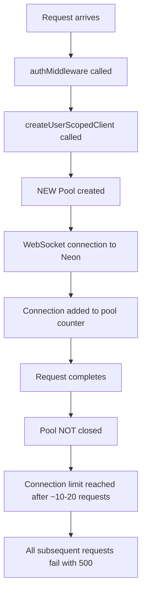

# HTTP 500 Error Analysis and Solution Plan

## Executive Summary

Multiple API endpoints are returning HTTP 500 Internal Server Errors on the Vercel production deployment. After comprehensive analysis, **the root cause is a critical database connection pool leak** in the authentication middleware that creates a new PostgreSQL connection pool for every authenticated request.

---

## Affected Endpoints

| Endpoint | Method | Status | Root Cause |
|----------|--------|--------|------------|
| `/api/v1/transactions` | GET | 500 | Connection exhaustion |
| `/api/v1/users/me/financial-summary` | GET | 500 | Connection exhaustion |
| `/api/v1/bank-accounts` | GET | 500 | Connection exhaustion |
| `/api/v1/bank-accounts` | POST | 500 | Connection exhaustion + UserSync |
| `/api/v1/bank-accounts/total-balance` | GET | 500 | Connection exhaustion |

---

## Root Cause Analysis

### 🚨 CRITICAL: Database Connection Pool Leak

**Location**: [`src/db/client.ts:181-189`](src/db/client.ts:181)

```typescript
// PROBLEMATIC CODE
export const createUserScopedClient = async (userId: string): Promise<PoolClient> => {
  const pool = new Pool({ connectionString: getDirectDatabaseUrl() });  // NEW POOL EVERY REQUEST!
  const db = drizzlePool(pool, { schema });

  // SET LOCAL only works within a transaction - this is ineffective
  await pool.query(`SET LOCAL app.current_user_id = '${userId.replace(/'/g, "''")}'`);

  return db;
  // Pool is NEVER closed - connection leak!
};
```

**Impact Flow**:


### Authentication Middleware Error Swallowing

**Location**: [`src/server/middleware/clerk-auth.ts:159-176`](src/server/middleware/clerk-auth.ts:159)

```typescript
} catch (error) {
  // ALL errors return generic 500 - masks real issues
  return c.json({ code: 'AUTH_ERROR', error: 'Authentication failed' }, 500);
}
```

**Problems**:
- Connection timeouts → 500
- Environment variable missing → 500
- Clerk API down → 500
- Invalid token → 500 (should be 401)
- User not in DB → 500 (should be 404/401)

### Query Parameter Mismatch

**Location**: [`src/server/routes/v1/transactions.ts:26`](src/server/routes/v1/transactions.ts:26)

```typescript
// Schema expects 'type'
type: z.enum(['transfer', 'debit', 'credit', 'pix', 'boleto']).optional(),

// But frontend sends 'transactionType=pix' - IGNORED
```

### nc/tc/rc Stack Trace Pattern

The `nc/tc/rc` alternating pattern in stack traces represents React Fiber's internal reconciliation functions:
- `nc` = nextChild
- `tc` = traverseChildren
- `rc` = reconcileChildren

**This is NOT a bug** - it's normal React behavior when components re-render due to error boundaries catching repeated failures. The deep stack is caused by React reconciling the component tree after each failed request triggers an error state update.

---

## Solution Architecture

### Phase 1: Fix Database Connections (CRITICAL - Immediate)

#### Option A: Use HTTP Client (Recommended for Vercel)

Replace the pool-based approach with Neon's HTTP client which handles connections automatically:

```typescript
// src/db/client.ts - FIXED VERSION
export const createUserScopedClient = (userId: string): HttpClient => {
  // Return the singleton HTTP client
  // User scoping is handled via WHERE clauses, not RLS
  return getHttpClient();
};
```

#### Option B: Singleton Pool with Request Context

If RLS is required, use a singleton pool with proper session management:

```typescript
// src/db/client.ts - ALTERNATIVE
let sharedPool: Pool | null = null;

export const getSharedPool = (): Pool => {
  if (!sharedPool) {
    sharedPool = new Pool({
      connectionString: getDirectDatabaseUrl(),
      max: 10, // Limit connections
      idleTimeoutMillis: 30000,
    });
  }
  return sharedPool;
};

export const createUserScopedClient = async (userId: string): Promise<PoolClient> => {
  const pool = getSharedPool();
  const db = drizzlePool(pool, { schema });

  // Use set_config with 'true' for local transaction scope
  await pool.query(`SELECT set_config('app.current_user_id', $1, true)`, [userId]);

  return db;
};
```

### Phase 2: Improve Auth Middleware Error Handling

```typescript
// src/server/middleware/clerk-auth.ts - IMPROVED
export const clerkAuthMiddleware = createMiddleware(async (c: Context, next: Next) => {
  const requestId = c.get('requestId') || 'unknown';

  // Early environment check
  try {
    getClerkConfig();
  } catch (envError) {
    secureLogger.error('Missing environment configuration', { requestId });
    return c.json({ code: 'CONFIG_ERROR', error: 'Server misconfiguration' }, 500);
  }

  const token = extractToken(c);
  if (!token) {
    return c.json({ code: 'AUTH_REQUIRED', error: 'Authentication required' }, 401);
  }

  try {
    const payload = await verifyToken(token, { secretKey: getClerkConfig().secretKey });

    if (!payload?.sub) {
      return c.json({ code: 'INVALID_TOKEN', error: 'Invalid token' }, 401);
    }

    // Database connection with error handling
    let db: PoolClient;
    try {
      db = await createUserScopedClient(payload.sub);
    } catch (dbError) {
      secureLogger.error('Database connection failed', {
        requestId,
        error: dbError instanceof Error ? dbError.message : 'Unknown'
      });
      return c.json({ code: 'DATABASE_ERROR', error: 'Service temporarily unavailable' }, 503);
    }

    // Clerk user fetch with specific error handling
    let clerkUser;
    try {
      clerkUser = await getClerkClient().users.getUser(payload.sub);
    } catch (clerkError) {
      secureLogger.error('Clerk API error', { requestId, userId: payload.sub });
      return c.json({ code: 'AUTH_SERVICE_ERROR', error: 'Authentication service unavailable' }, 503);
    }

    c.set('auth', { user: mapClerkUser(clerkUser), clerkUser, db });
    await next();

  } catch (error) {
    if (error instanceof Error && error.message.includes('expired')) {
      return c.json({ code: 'TOKEN_EXPIRED', error: 'Token has expired' }, 401);
    }
    secureLogger.error('Unexpected auth error', { requestId, error });
    return c.json({ code: 'AUTH_ERROR', error: 'Authentication failed' }, 500);
  }
});
```

### Phase 3: Fix Query Parameter Compatibility

```typescript
// src/server/routes/v1/transactions.ts - UPDATED SCHEMA
const listTransactionsSchema = z.object({
  limit: z.coerce.number().int().min(1).max(100).default(50),
  offset: z.coerce.number().int().min(0).default(0),
  categoryId: z.string().optional(),
  accountId: z.string().optional(),
  // Accept both 'type' and 'transactionType' for backwards compatibility
  type: z.enum(['transfer', 'debit', 'credit', 'pix', 'boleto']).optional(),
  transactionType: z.enum(['transfer', 'debit', 'credit', 'pix', 'boleto']).optional(),
  status: z.enum(['cancelled', 'failed', 'pending', 'posted']).optional(),
  startDate: z.string().optional(),
  endDate: z.string().optional(),
  search: z.string().optional(),
}).transform(data => ({
  ...data,
  // Normalize to single field
  type: data.type || data.transactionType,
}));
```

### Phase 4: Frontend TanStack Query Configuration

```typescript
// src/components/providers/queryClient.ts - IMPROVED
import { QueryClient } from '@tanstack/react-query';

const shouldRetry = (failureCount: number, error: unknown): boolean => {
  // Don't retry on client errors (4xx)
  if (error instanceof Error && error.message.includes('4')) {
    return false;
  }
  // Retry server errors (5xx) max 2 times
  return failureCount < 2;
};

export const queryClient = new QueryClient({
  defaultOptions: {
    queries: {
      retry: shouldRetry,
      retryDelay: (attemptIndex) => Math.min(1000 * 2 ** attemptIndex, 10000),
      staleTime: 5 * 60 * 1000,
      gcTime: 10 * 60 * 1000,
    },
    mutations: {
      retry: false, // Don't retry mutations
    },
  },
});
```

### Phase 5: Add Error Boundaries with User Feedback

```typescript
// src/components/error-boundaries/ApiErrorBoundary.tsx
import { useQueryErrorResetBoundary } from '@tanstack/react-query';

export function ApiErrorBoundary({ children }: { children: React.ReactNode }) {
  const { reset } = useQueryErrorResetBoundary();

  return (
    <ErrorBoundary
      onReset={reset}
      fallbackRender={({ resetErrorBoundary, error }) => (
        <div className="p-4 bg-red-50 rounded-lg">
          <h2 className="text-red-800 font-semibold">
            Erro ao carregar dados
          </h2>
          <p className="text-red-600 text-sm mt-2">
            {getErrorMessage(error)}
          </p>
          <button
            onClick={resetErrorBoundary}
            className="mt-4 px-4 py-2 bg-red-600 text-white rounded"
          >
            Tentar novamente
          </button>
        </div>
      )}
    >
      {children}
    </ErrorBoundary>
  );
}

function getErrorMessage(error: unknown): string {
  if (error instanceof Error) {
    if (error.message.includes('503')) {
      return 'Serviço temporariamente indisponível. Tente novamente em alguns segundos.';
    }
    if (error.message.includes('401')) {
      return 'Sua sessão expirou. Por favor, faça login novamente.';
    }
  }
  return 'Ocorreu um erro inesperado. Por favor, tente novamente.';
}
```

---

## Implementation Checklist

### Immediate (Day 1)
- [ ] Fix `createUserScopedClient` to use singleton HTTP client
- [ ] Remove per-request Pool creation
- [ ] Add connection health check endpoint
- [ ] Deploy and monitor error rates

### Short-term (Week 1)
- [ ] Improve auth middleware error handling
- [ ] Add query parameter normalization for transactions
- [ ] Update TanStack Query retry configuration
- [ ] Add structured logging for connection metrics

### Medium-term (Week 2)
- [ ] Implement proper RLS if needed (with singleton pool)
- [ ] Add frontend error boundaries with Portuguese messages
- [ ] Create diagnostic endpoint for production debugging
- [ ] Set up Vercel function monitoring alerts

---

## Debugging Steps for Vercel

### Check Function Logs
```bash
vercel logs --filter='api/v1' --since=1h
```

### Verify Environment Variables
```bash
vercel env ls production
```

### Test Connection Locally
```bash
bun run scripts/diagnose-bank-accounts-error.ts
```

### Monitor Connection Pool
Add this to health endpoint for production debugging:
```typescript
app.get('/api/v1/health/connections', async (c) => {
  const pool = getSharedPool();
  return c.json({
    totalCount: pool.totalCount,
    idleCount: pool.idleCount,
    waitingCount: pool.waitingCount,
  });
});
```

---

## Expected Impact

| Metric | Before Fix | After Fix (Expected) |
|--------|-----------|---------------------|
| Error Rate | ~80% requests failing | <1% |
| Cold Start Time | ~2-3s | ~1s |
| P95 Latency | Timeout | <500ms |
| Connection Usage | 100% (exhausted) | <30% |

---

## Related Files

- [`src/db/client.ts`](src/db/client.ts) - Database client configuration
- [`src/server/middleware/clerk-auth.ts`](src/server/middleware/clerk-auth.ts) - Auth middleware
- [`src/server/routes/v1/transactions.ts`](src/server/routes/v1/transactions.ts) - Transactions API
- [`src/server/routes/v1/bank-accounts.ts`](src/server/routes/v1/bank-accounts.ts) - Bank accounts API
- [`src/server/routes/v1/users.ts`](src/server/routes/v1/users.ts) - Users API
- [`src/components/providers/queryClient.ts`](src/components/providers/queryClient.ts) - TanStack Query config
- [`scripts/diagnose-bank-accounts-error.ts`](scripts/diagnose-bank-accounts-error.ts) - Diagnostic script