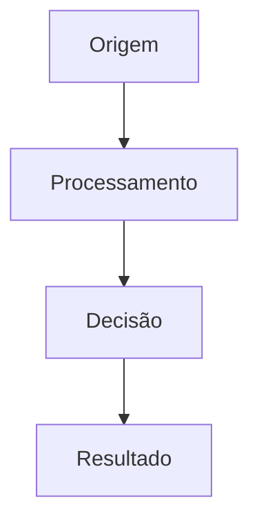

# [TÍTULO DA EXPLICAÇÃO]

## 🤔 O Que é

[Definição clara e concisa do conceito, padrão ou decisão que está sendo explicado]

## 🎯 Por Que é Importante

[Explicação do contexto e do problema que esta abordagem resolve]

## 🏗️ Como Funciona

### [Componente Principal]

[Descrição detalhada de como o componente ou conceito funciona]

```
// Diagrama ou exemplo conceitual
[Componente A] → [Componente B] → [Resultado]
```

### [Outro Componente]

[Descrição detalhada]

## 📈 Benefícios

- **Benefício 1**: [Explicação detalhada]
- **Benefício 2**: [Explicação detalhada]
- **Benefício 3**: [Explicação detalhada]

## ⚖️ Trade-offs

| Aspecto | Prós | Contras |
|---------|------|---------|
| [Aspecto 1] | [Pró] | [Contra] |
| [Aspecto 2] | [Pró] | [Contra] |

## 🔄 Relacionamentos

### Como se Conecta com Outros Componentes

- **[Componente A]**: [Como interage]
- **[Componente B]**: [Como interage]
- **[Componente C]**: [Como interage]

### Fluxo de Dados/Informações



## 📋 Contexto Histórico

### Decisões Anteriores

[Explicação do que existia antes e por que mudou]

### Momento da Decisão

[Contexto de quando e por que esta decisão foi tomada]

## 🛠️ Implementação na AegisWallet

### Onde Encontrar

- **Arquivos**: [Lista de arquivos relevantes]
- **Componentes**: [Lista de componentes]
- **APIs**: [Lista de endpoints]

### Exemplo de Código

```typescript
// Exemplo real da implementação
```

## 🧪 Testes e Validação

[Como este conceito é testado e validado]

## 📚 Referências e Leituras Complementares

- **[Artigo/Livro]**: [Link]
- **[Documentação oficial]**: [Link]
- **[Discussão técnica]**: [Link]

## 🔄 Evolução Futura

[Planos ou ideias para evolução deste conceito]

---

**Público**: [público alvo] | **Complexidade**: [alta/média/baixa]
**Atualizado**: [data] | **Revisado por**: [revisor]
**Contribua**: [GitHub](link) | [Discutir](link)

> Esta explicação faz parte do [Framework Diátaxis](../explanation/diataxis-framework.md) da documentação AegisWallet.
