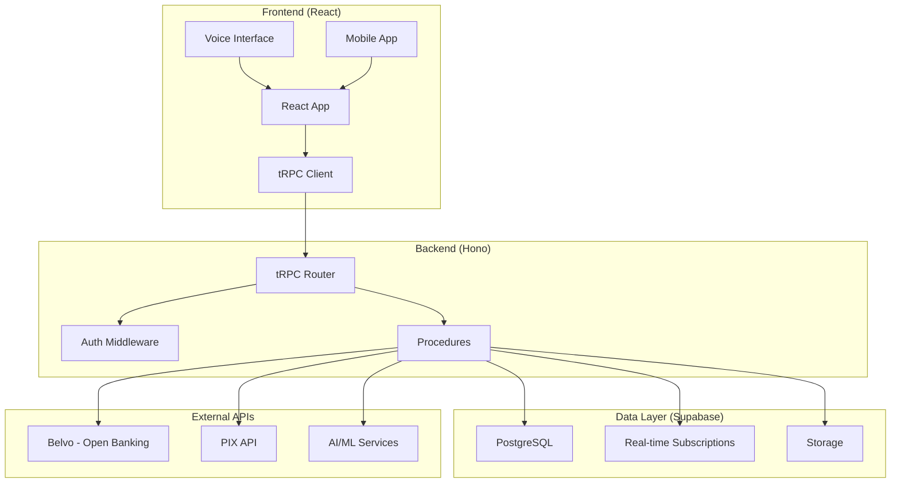

# AegisWallet - Autonomous Financial Assistant Architecture

## Overview

Revolutionary voice-first financial assistant for the Brazilian market, achieving 95% automation through AI-driven financial management with minimal user intervention.

## Executive Summary

**Technology Stack**: Bun + Hono + tRPC + Supabase + React 19  
**Architecture Pattern**: Simplified monolith with real-time subscriptions  
**Target Market**: Brazilian financial system with PIX, boletos, and voice interface  
**Automation Level**: 95% financial operations with progressive trust building  
**Last Architecture Update**: January 6, 2025 - See `docs/architecture/ARCHITECTURE_UPDATE_2025-10-06.md`

### Current Implementation Status
- ✅ Financial Calendar System (Weekly view with drag-and-drop)
- ✅ PIX Integration Complete (Transfer, Receive, History)
- ✅ Voice Interface Foundation (Recognition, Commands, Confirmation)
- ✅ Real-time Sync (Supabase subscriptions)
- ✅ 40+ UI Components (shadcn/ui)
- 🔄 Open Banking Integration (Planned)
- 🔄 AI Autonomy Engine (In Progress)

---

## Core Architecture

### System Diagram



### Technology Stack

| Component | Technology | Version | Purpose |
|-----------|------------|---------|---------|
| **Runtime** | Bun | Latest | Maximum performance |
| **Backend** | Hono | 4.9.9 | Edge-first API framework |
| **API** | tRPC | 11.6.0 | Type-safe API |
| **Database** | Supabase | 2.58.0 | Managed PostgreSQL |
| **Frontend** | React | 19.2.0 | UI framework |
| **Router** | TanStack Router | 1.114.3 | File-based routing |
| **State** | TanStack Query | 5.90.2 | Server state |
| **UI** | Tailwind CSS | 4.1.14 | Styling |
| **Forms** | React Hook Form | 7.55.0 | Form handling |
| **Validation** | Zod | 4.1.11 | Schema validation |

#### Compatibility Validation Checklist

- Confirm Bun, Hono, and tRPC versions match the lockfile before every deploy. If upgrades are required, run `bun install` and rerun `bun run type-check` and `bun run lint` locally.
- Validate Supabase CLI and project schema with `bunx supabase db diff` before applying migrations; rollback if drift is detected.
- Smoke-test React 19 and TanStack Router compatibility in the Vite dev server (`bun dev`) and run Vitest smoke suite (`bun run test:unit --runInBand`) prior to merging.
- Record any intentional version divergence in `README-TESTING.md` so downstream teams inherit the decision context.

### Architecture Principles

- **Voice-First**: Primary interaction through 6 essential voice commands
- **KISS**: Simple, direct implementation without over-engineering
- **YAGNI**: Only essential features from PRD implemented
- **Type Safety**: End-to-end TypeScript with tRPC
- **Real-Time**: Instant updates via Supabase subscriptions

---

## Component Architecture

### Directory Structure (Current Implementation)

**Note**: See `docs/architecture/source-tree.md` for complete structure.

```
src/
├── components/                   # React components by domain
│   ├── ui/                      # shadcn/ui base components (40+)
│   │   └── event-calendar/      # Calendar UI components (NEW)
│   ├── calendar/                # Financial calendar components (NEW)
│   ├── pix/                     # PIX-specific components (NEW)
│   ├── voice/                   # Voice interface components
│   ├── financial/               # Financial display components
│   ├── accessibility/           # A11y components
│   ├── providers/               # Context providers
│   └── layout/                  # Layout wrappers
├── routes/                        # TanStack Router v5 (File-based)
│   ├── __root.tsx                 # Root layout with sidebar
│   ├── dashboard.tsx              # Dashboard (3-column with mini calendar)
│   ├── calendario.tsx             # Weekly calendar page (NEW)
│   ├── saldo.tsx                  # Balance overview
│   ├── contas.tsx                 # Accounts management
│   └── pix/                       # PIX routes (NEW)
│       ├── index.tsx              # PIX dashboard
│       ├── transferir.tsx         # Send PIX
│       ├── receber.tsx            # Receive PIX (QR Code)
│       └── historico.tsx          # PIX history
├── hooks/                         # Custom React hooks
│   ├── use-mobile.ts              # Mobile detection
│   ├── useFinancialEvents.ts      # Calendar events (NEW)
│   ├── usePix.tsx                 # PIX operations (NEW)
│   ├── useVoiceCommand.ts         # Voice processing
│   ├── useVoiceRecognition.ts     # Speech recognition
│   ├── useMultimodalResponse.ts   # Voice responses
│   ├── useSecureConfirmation.ts   # Security checks
│   └── use-transactions.tsx       # Transaction data
├── lib/                           # Core utilities
│   ├── speech/                    # Speech services (NEW)
│   │   ├── SpeechRecognitionService.ts
│   │   └── SpeechSynthesisService.ts
│   ├── security/                  # Security utilities (NEW)
│   │   └── VoiceConfirmationService.ts
│   ├── formatters/                # Data formatters (NEW)
│   │   └── brazilianFormatters.ts
│   ├── analytics/                 # Analytics (NEW)
│   │   └── feedbackCollector.ts
│   └── utils.ts                   # General utilities
├── server/                        # Backend API
│   └── routers/                   # tRPC routers
│       ├── _app.ts                # Main router
│       ├── pix.ts                 # PIX procedures (NEW)
│       └── transactions.ts        # Transaction procedures
├── types/                         # Type definitions
│   ├── database.types.ts          # Supabase generated
│   ├── financial-events.ts        # Calendar types (NEW)
│   └── pix.ts                     # PIX types (NEW)
├── contexts/                      # React contexts
│   └── AuthContext.tsx
├── services/                      # Business logic
│   └── voiceCommandProcessor.ts
└── integrations/                  # External APIs
    └── supabase/                  # Supabase client
        ├── client.ts
        ├── auth.ts
        └── realtime.ts
```

### Core Components

#### Voice Processing
```typescript
// Voice command processing flow
interface VoiceCommand {
  command: string;
  intent: 'balance_query' | 'payment_query' | 'transfer_query';
  confidence: number;
  response: string;
}

// 6 Essential Voice Commands
const ESSENTIAL_COMMANDS = [
  "Como está meu saldo?",
  "Quanto posso gastar esse mês?", 
  "Tem algum boleto programado para pagar?",
  "Tem algum recebimento programado para entrar?",
  "Como ficará meu saldo no final do mês?",
  "Faz uma transferência para tal pessoa?"
];
```

#### Financial Intelligence
```typescript
// AI autonomy levels
interface AutonomyLevel {
  level: number;        // 0-100
  capabilities: string[];  // Available autonomous actions
  confirmationRequired: boolean;
}

// Progressive trust building
const AUTONOMY_LEVELS = {
  LEARNING: { level: 25, requiresConfirmation: true },
  ASSISTANT: { level: 50, requiresConfirmation: true },
  AUTONOMOUS: { level: 75, requiresConfirmation: false },
  TRUSTED: { level: 95, requiresConfirmation: false }
};
```

---

## Database Schema

### Core Tables

```sql
-- Users (extends auth.users)
CREATE TABLE users (
  id UUID PRIMARY KEY REFERENCES auth.users(id),
  email TEXT UNIQUE NOT NULL,
  autonomy_level INTEGER DEFAULT 50 CHECK (autonomy_level >= 50 AND autonomy_level <= 95),
  voice_command_enabled BOOLEAN DEFAULT true,
  created_at TIMESTAMP WITH TIME ZONE DEFAULT now()
);

-- Bank accounts
CREATE TABLE bank_accounts (
  id UUID PRIMARY KEY DEFAULT uuid_generate_v4(),
  user_id UUID REFERENCES users(id) ON DELETE CASCADE,
  belvo_account_id TEXT UNIQUE NOT NULL,
  institution_id TEXT NOT NULL,
  institution_name TEXT NOT NULL,
  account_mask TEXT NOT NULL,
  balance DECIMAL(15,2) DEFAULT 0,
  is_active BOOLEAN DEFAULT true,
  last_sync TIMESTAMP WITH TIME ZONE
);

-- Transactions
CREATE TABLE transactions (
  id UUID PRIMARY KEY DEFAULT uuid_generate_v4(),
  user_id UUID REFERENCES users(id) ON DELETE CASCADE,
  amount DECIMAL(15,2) NOT NULL,
  description TEXT NOT NULL,
  category TEXT,
  transaction_date TIMESTAMP WITH TIME ZONE NOT NULL,
  is_categorized BOOLEAN DEFAULT false,
  confidence_score DECIMAL(3,2),
  created_at TIMESTAMP WITH TIME ZONE DEFAULT now()
);

-- Voice commands history
CREATE TABLE voice_commands (
  id UUID PRIMARY KEY DEFAULT uuid_generate_v4(),
  user_id UUID REFERENCES users(id) ON DELETE CASCADE,
  command TEXT NOT NULL,
  intent TEXT NOT NULL,
  confidence DECIMAL(3,2),
  response TEXT,
  processing_time_ms INTEGER
);
```

### Indexes for Performance

```sql
-- Transaction queries
CREATE INDEX idx_transactions_user_date ON transactions(user_id, transaction_date DESC);
CREATE INDEX idx_transactions_category ON transactions(category);

-- Voice command optimization
CREATE INDEX idx_voice_commands_user_confidence ON voice_commands(user_id, confidence DESC);

-- Bank account sync optimization
CREATE INDEX idx_bank_accounts_sync ON bank_accounts(user_id, last_sync);
```

---

## API Design

### tRPC Procedures Structure

```typescript
export const appRouter = router({
  // Authentication
  auth: router({
    signIn: publicProcedure
      .input(z.object({ email: z.string().email(), password: z.string() }))
      .mutation(authController.signIn),
    
    getProfile: protectedProcedure
      .query(authController.getProfile),
  }),

  // Transactions
  transactions: router({
    getAll: protectedProcedure
      .query(transactionsController.getAll),
    
    categorize: protectedProcedure
      .input(z.object({ description: z.string() }))
      .mutation(aiController.categorizeTransaction),
  }),

  // Voice Commands
  voice: router({
    processCommand: protectedProcedure
      .input(z.object({ audio: z.string() }))
      .mutation(voiceController.processCommand),
  }),

  // Banking Integration
  banking: router({
    linkAccount: protectedProcedure
      .input(z.object({ institutionId: z.string() }))
      .mutation(bankingController.linkAccount),
    
    syncTransactions: protectedProcedure
      .input(z.object({ accountId: z.string() }))
      .mutation(bankingController.syncTransactions),
  }),

  // PIX Payments
  pix: router({
    sendTransfer: protectedProcedure
      .input(z.object({
        key: z.string(),
        keyType: z.enum(['CPF', 'CNPJ', 'EMAIL', 'PHONE', 'RANDOM']),
        amount: z.number(),
      }))
      .mutation(pixController.sendTransfer),
  })
});
```

---

## Real-time Subscriptions

### WebSocket Connections

```typescript
// Real-time event handling
const subscriptions = {
  // Transaction updates
  transactions: realtime.subscribeToTable('transactions', `user_id=eq.${userId}`),
  
  // Balance changes
  balances: realtime.subscribeToTable('bank_accounts', `user_id=eq.${userId}`),
  
  // Voice command responses
  voiceCommands: realtime.subscribeToTable('voice_commands', `user_id=eq.${userId}`),
  
  // PIX status updates
  pixTransactions: realtime.subscribeToTable('pix_transactions', `user_id=eq.${userId}`)
};
```

### Real-time Response Patterns

```typescript
// Voice command processing flow
async function processVoiceCommand(audio: Blob): Promise<VoiceResponse> {
  // 1. Speech-to-text
  const transcript = await speechToText(audio);
  
  // 2. Intent classification
  const intent = classifyCommand(transcript);
  
  // 3. Execute action
  const result = await executeFinancialAction(intent);
  
  // 4. Save command history
  await saveVoiceCommand(user.id, transcript, intent, result);
  
  // 5. Real-time notification (automatic)
  // Supabase triggers subscription update
  
  return result;
}
```

---

## Security Architecture

### Authentication Flow

```typescript
// Multi-layer authentication
interface SecurityLayers {
  primary: 'biometric';    // Face ID, Touch ID
  secondary: 'password';     // Traditional password
  session: 'jwt';           // Session tokens
  device: 'limited';        // Device restrictions
}
```

### Row Level Security (RLS)

```sql
-- Users can only access their own data
CREATE POLICY "Users own data" ON users
  FOR ALL USING (auth.uid() = id);

-- Transaction access control
CREATE POLICY "Transaction access" ON transactions  
  FOR ALL USING (auth.uid() = user_id);

-- Voice command privacy
CREATE POLICY "Voice command privacy" ON voice_commands
  FOR ALL USING (auth.uid() = user_id);
```

### Data Protection

```typescript
// LGPD compliance implementation
interface DataProtection {
  encryption: {
    atRest: 'AES-256';     // Supabase managed
    inTransit: 'TLS 1.3';  // Enforced
  };
  
  retention: {
    financialData: '7 years';  // Legal requirement
    voiceCommands: '1 year';
  };
  
  userRights: {
    access: true;          // Data access requests
    deletion: true;        // Right to be forgotten
    portability: true;      // Data portability
  };
}
```

---

## Performance Optimization

### Database Performance

```sql
-- Optimized queries for financial data
EXPLAIN ANALYZE
SELECT * FROM transactions 
WHERE user_id = $1 
  AND transaction_date >= '2024-01-01' 
ORDER BY transaction_date DESC 
LIMIT 100;

-- Connection pooling configuration
-- Supabase manages automatically
-- Connection pool size: Default 5
-- Max connections: 90 (configurable)
```

### Client Performance

```typescript
// Performance optimizations
const performanceConfig = {
  // Voice command response <1 second
  voiceResponse: {
    target: 500,
    max: 1000
  },
  
  // Transaction sync <3 seconds  
  transactionSync: {
    target: 2000,
    max: 5000
  },
  
  // PIX processing <10 seconds
  pixProcessing: {
    target: 5000,
    max: 10000
  }
};
```

### Caching Strategy

```typescript
// Simple cache implementation (KISS)
const cache = {
  userProfiles: {
    ttl: 5 * 60 * 1000, // 5 minutes
    max: 100
  },
  
  transactionSummary: {
    ttl: 60 * 1000, // 1 minute
    max: 50
  },
  
  exchangeRates: {
    ttl: 24 * 60 * 60 * 1000, // 24 hours
    max: 10
  }
};
```

### Monitoring & Alerting Plan

- Collect Core Web Vitals (`LCP`, `INP`, `CLS`) in the frontend using `web-vitals` and stream them to Supabase Edge Functions.
- Create lightweight alerts in Vercel for build failures and response time regression (>500 ms P95) tied to the production deployment.
- Use Supabase logs to watch PIX and boleto procedures; add a daily automated check that flags error rates above 2%.
- Centralize incident summaries in the weekly ops sync so trends are reviewed without extra tooling.

---

## Deployment Architecture

### Local Development

```bash
# Development workflow
bun run dev:client      # Frontend development (Vite)
bun run dev:server      # Backend development (Hono)
supabase start           # Local Supabase
supabase db push         # Apply migrations
```

### Production Deployment

```bash
# Production workflow
bun run build            # Build frontend
supabase db push --linked  # Deploy migrations
bun run start:server     # Production server start

# Environment variables
NEXT_PUBLIC_SUPABASE_URL=...
NEXT_PUBLIC_SUPABASE_ANON_KEY=...
```

### Deployment Pipeline & Rollback Strategy

1. **CI pipeline (Vercel + Supabase):**
   - Run `bun run lint` → `bun run type-check` → `bun run test:unit` on every pull request.
   - Trigger preview deploys via `pnpm dlx vercel deploy --yes --archive=tgz` only after tests pass.
   - Gate `supabase db push --linked` behind manual approval to avoid accidental schema drift.
2. **Release checklist (main branch):**
   - Tag release and re-run the CI suite.
   - Promote the verified preview to production with `pnpm dlx vercel deploy --prod`.
   - Apply migrations during a low-traffic window; capture `supabase db diff --linked` output before and after.
3. **Rollback plan:**
   - Maintain the previous production deployment in Vercel; rollback instantly with `pnpm dlx vercel rollback` if health checks fail.
   - Revert database changes using the timestamped migration snapshot (`supabase migration revert <timestamp>`), and confirm via smoke tests.
   - Post-rollback, log the incident in `docs/qa/assessments/` with root cause and remediation ownership.

### Infrastructure Considerations

```yaml
# Deployment requirements
services:
  app:
    replicas: 2-3
    resources:
      cpu: "500m"
      memory: "512Mi"
    ports:
      - "3000:3000"
  
  database:
    managed: supabase
    backup: daily
    point-in-time: 30 days
```

- **IaC starter:** Track environment variables in `supabase/config.toml` and Vercel project settings. When introducing new services, add them to a simple Terraform/Bref module or document manual steps in `docs/architecture/source-tree.md` to keep onboarding lightweight.
- **Manual fallback:** If IaC is not ready, record the exact CLI commands (`supabase projects list`, `vercel env pull`) and owners in the release ticket so the process stays reproducible.

---

## Development Workflow

### Local Setup

```bash
# 1. Clone and setup
git clone <repository>
cd aegiswallet
bun install

# 2. Environment setup
cp .env.example .env.local
# Configure Supabase keys

# 3. Start development
bun run dev  # Starts both frontend and backend
```

### Code Patterns

```typescript
// Component pattern (KISS)
export function BalanceCard({ balance }: { balance: number }) {
  return (
    <div className="p-4 border rounded-lg">
      <div className="text-2xl font-bold text-green-600">
        R$ {balance.toLocaleString('pt-BR')}
      </div>
    </div>
  );
}

// Hook pattern (YAGNI)
export function useBalance() {
  const [balance, setBalance] = useState(0);
  
  useEffect(() => {
    fetchBalance().then(setBalance);
  }, []);
  
  return { balance };
}
```

### Testing Strategy

```typescript
// Simple testing approach
describe('Balance', () => {
  it('displays balance correctly', () => {
    render(<BalanceCard balance={1234.56} />);
    expect(screen.getByText('R$ 1.234,56')).toBeInTheDocument();
  });
});
```

---

## Future Scalability

### Modular Expansion Points

1. **New Payment Methods**: Easy addition via new procedures in `server/procedures/`
2. **Enhanced AI**: Simple upgrade path in voice processing logic
3. **Multi-bank Support**: Modular banking integration service
4. **Advanced Analytics**: Separate feature module without core changes

### Scalability Considerations

```typescript
// Architecture supports scaling without major changes
const scalabilityFeatures = {
  horizontal: 'Add more Hono instances',
  database: 'Supabase auto-scaling',
  caching: 'Redis integration ready',
  cdn: 'Static asset delivery via Vite',
  monitoring: 'Built-in error tracking'
};
```

### Reusable Integration Patterns

- Favor tRPC routers that expose typed helpers so new financial flows can import existing validation and error handling.
- Keep Supabase SQL snippets in `supabase/migrations` and reuse them via functions—avoid duplicating triggers when adding new tables.
- Voice command workflows should plug into `lib/voiceCommandProcessor.ts`; extend intent mapping instead of creating parallel pipelines.
- Document any custom webhook or external API adapters under `docs/integrations/` so the same adapter can back future features without rework.

---

## Success Metrics

### Performance Targets
- Voice response time: <500ms (target), <1s (max)
- PIX processing: <5s (target), <10s (max)
- Transaction sync: <2s (target), <5s (max)
- App startup: <3s (target), <5s (max)

### User Experience
- Voice command success rate: >95%
- AI autonomy progression: 50% → 95% (over 3 months)
- Daily engagement: 2-3 voice commands per day
- Manual intervention: <5 minutes/month

### Technical Goals
- System uptime: >99.9%
- Error rate: <0.1%
- API response time: <500ms (95th percentile)
- Database query performance: <100ms (95th percentile)

---

## Conclusion

This architecture provides a solid foundation for the autonomous financial assistant while maintaining simplicity and performance through KISS and YAGNI principles. The modular structure allows for future expansion without compromising current stability, and the voice-first design directly addresses the core Brazilian financial market needs.

The system is ready for immediate MVP development with clear paths for scaling and enhancement as user adoption grows.

---

*Last Updated: January 2024*
*Architecture Version: 1.0*
*Status: Ready for Development*