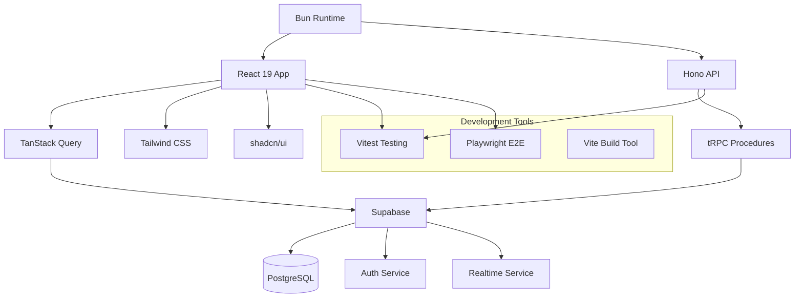

# AegisWallet Technology Stack

## Overview

This document defines the **DEFINITIVE** technology selection for the entire AegisWallet project. All development must use these exact versions and configurations to ensure consistency, security, and performance targets are met for the Brazilian autonomous financial assistant.

## Core Principles

- **Performance First**: Sub-150ms voice response times for optimal user experience
- **Type Safety**: End-to-end TypeScript prevents runtime errors in financial transactions
- **Edge-First**: Serverless architecture for optimal performance in Brazilian market
- **Security at Every Layer**: LGPD compliance and financial data protection
- **Developer Experience**: Modern tooling for rapid development velocity

## Technology Stack Matrix

| Category | Technology | Version | Purpose | Rationale |
|----------|------------|---------|---------|-----------|
| **Runtime** | Bun | Latest | Package management and runtime | 3-5x faster than npm/pnpm, native TypeScript support |
| **Frontend Language** | TypeScript | 5.9+ | Type-safe frontend development | Prevents runtime errors in financial interfaces |
| **Frontend Framework** | React | 19.0+ | Voice-first mobile interface | Latest features for voice processing and mobile optimization |
| **UI Component Library** | shadcn/ui | Latest | Professional financial UI components | WCAG 2.1 AA compliant, accessible, professional design |
| **State Management** | TanStack Query | v5.0+ | Server state management | Real-time financial data synchronization |
| **Backend Language** | TypeScript | 5.9+ | Type-safe backend development | End-to-end type safety from database to UI |
| **Backend Framework** | Hono | Latest | Edge-first API framework | Sub-150ms response times for voice interactions |
| **API Style** | tRPC | v11.0+ | Type-safe API procedures | End-to-end type safety, automatic client generation |
| **Database** | Supabase | Latest | PostgreSQL + Auth + Realtime + RLS | Complete backend infrastructure, LGPD compliant |
| **Cache** | Supabase Realtime | Latest | Real-time data synchronization | Live financial updates for autonomous assistant |
| **File Storage** | Supabase Storage | Latest | Secure file uploads | Receipts, documents, voice recordings |
| **Authentication** | Supabase Auth | Latest | User authentication | Secure, social login support, JWT-based |
| **Frontend Testing** | Vitest | Latest | Unit and integration testing | 3-5x faster than Jest, excellent TypeScript support |
| **Backend Testing** | Vitest | Latest | API and business logic testing | Consistent testing stack across fullstack |
| **E2E Testing** | Playwright | Latest | Voice workflow testing | Cross-platform voice interaction validation |
| **Build Tool** | Vite | Latest | Fast development and building | Optimized for TypeScript, HMR for voice development |
| **Bundler** | Vite | Latest | Application bundling | Tree-shaking, code splitting for mobile performance |
| **IaC Tool** | Supabase CLI | Latest | Database migrations | Declarative database management, type generation |
| **CI/CD** | Vercel CI | Latest | Automated deployment | Preview deployments for voice features |
| **Monitoring** | Vercel Analytics | Latest | Performance monitoring | Core Web Vitals tracking for voice UX |
| **Logging** | Supabase Logs | Latest | Application logging | Centralized logging for financial audit trails |
| **CSS Framework** | Tailwind CSS | Latest | Utility-first styling | Rapid UI development, consistent design system |

## Key Architectural Decisions

### Edge-First Performance
- **Hono on Vercel Edge**: Sub-150ms TTFB for voice command processing
- **Supabase Edge Functions**: Serverless backend with Brazilian region deployment
- **Global CDN**: Static assets distributed for optimal mobile performance

### Type Safety End-to-End
- **TypeScript Strict Mode**: Prevents entire classes of runtime errors
- **tRPC Contracts**: Type-safe API between frontend and backend
- **Zod Validation**: Runtime validation for all external inputs
- **Generated Database Types**: Direct mapping from Postgres schema to TypeScript

### Real-Time Financial Data
- **Supabase Realtime**: Live transaction updates and account balance changes
- **Optimistic Updates**: Instant UI feedback for voice commands
- **Conflict Resolution**: Automatic handling of concurrent financial operations

### Security & Compliance
- **Row Level Security**: Tenant isolation in shared database
- **LGPD Compliance**: Brazilian data protection regulations
- **Secure Authentication**: JWT-based with social login support
- **Audit Trails**: Complete logging for financial operations

## Performance Targets

| Metric | Target | Maximum | Measurement Point |
|--------|--------|---------|-------------------|
| Voice Response Time | <500ms | <1s | Command → Audio response |
| API Response Time | <150ms | <300ms | Edge function execution |
| Database Query | <50ms | <100ms | Supabase query execution |
| App Startup | <3s | <5s | Cold start to interactive |
| Transaction Sync | <2s | <5s | Bank sync → UI update |

## Development Workflow

### Required Environment Variables
```bash
# Supabase Configuration
VITE_SUPABASE_URL=your-project.supabase.co
VITE_SUPABASE_ANON_KEY=your-anon-key
SUPABASE_SERVICE_ROLE_KEY=your-service-key

# Open Banking APIs
OPEN_BANKING_CLIENT_ID=your-client-id
OPEN_BANKING_CLIENT_SECRET=your-client-secret

# AI Services
OPENAI_API_KEY=your-openai-key

# Development
NODE_ENV=development
LOG_LEVEL=debug
```

### Essential Commands
```bash
# Development
bun dev                    # Start development servers
bun build                  # Build all apps and packages

# Quality Assurance
bun lint                   # Lint with OXLint (50-100x faster)
bun type-check             # TypeScript strict mode validation
bun test                   # Run unit and integration tests

# Database
bunx supabase db push      # Apply database migrations
bunx supabase gen types    # Generate TypeScript types
```

## Import Patterns

### Supabase Client
```typescript
import { supabase } from "@/integrations/supabase/client"
```

### tRPC
```typescript
import { router, publicProcedure, protectedProcedure } from "@/server/trpc"
```

### React Query
```typescript
import { useQuery, useMutation } from "@tanstack/react-query"
```

## Technology Relationships



## Migration Strategy

### Current → Target Stack
1. **Phase 1**: Adopt Bun package manager (immediate 3-5x performance gain)
2. **Phase 2**: Implement tRPC for type-safe APIs (2-3 weeks)
3. **Phase 3**: Migrate to Hono Edge functions (1-2 weeks)
4. **Phase 4**: Optimize Supabase configuration (1 week)

### Future Considerations
- **AI Provider Factory**: Scale from OpenAI to multiple providers
- **Bank Integration Expansion**: Add more Brazilian banks via Open Banking
- **Advanced Analytics**: Customer behavior insights and financial recommendations

## Constraints and Trade-offs

### What We Chose Over Alternatives
- **Bun over Node.js**: 3-5x performance improvement, native TypeScript
- **Supabase over AWS RDS**: Faster development, built-in auth/realtime, cost-effective
- **tRPC over REST**: Type safety, automatic client generation, better DX
- **Hono over Express**: Edge deployment, better performance, modern framework

### Limitations to Consider
- **Single Vendor Dependency**: Supabase + Vercel ecosystem lock-in
- **Brazilian Market Focus**: Optimized for local performance and compliance
- **Voice-First Constraints**: Architecture prioritizes voice interaction performance

---

**Status**: ✅ Active
**Ownership**: Fullstack Development Team
**Review cadence**: Monthly technology updates, quarterly architecture review