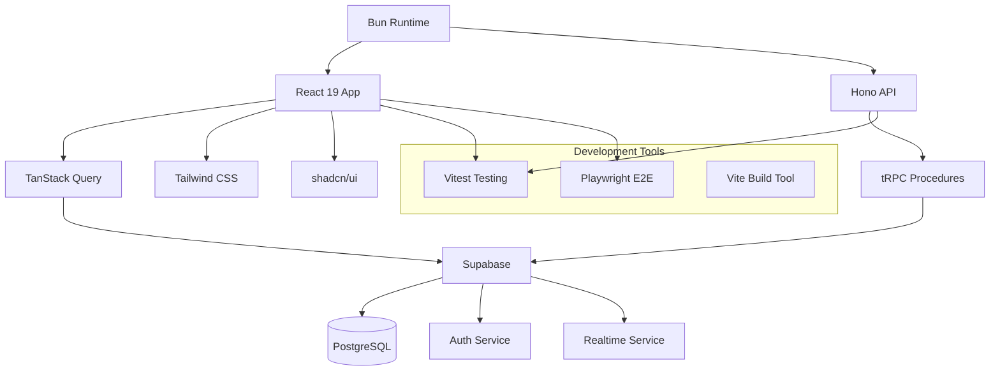

# AegisWallet Technology Stack

## Overview

This document defines the **DEFINITIVE** technology selection for the entire AegisWallet project. All development must use these exact versions and configurations to ensure consistency, security, and performance targets are met for the Brazilian autonomous financial assistant.

## Core Principles

- **Performance First**: Sub-150ms voice response times for optimal user experience
- **Type Safety**: End-to-end TypeScript prevents runtime errors in financial transactions
- **Edge-First**: Serverless architecture for optimal performance in Brazilian market
- **Security at Every Layer**: LGPD compliance and financial data protection
- **Developer Experience**: Modern tooling for rapid development velocity

## Technology Stack Matrix

### Core Runtime & Languages

| Technology | Version | Purpose | Rationale |
|------------|---------|---------|-----------|
| **Bun** | Latest | Package management and runtime | 3-5x faster than npm/pnpm, native TypeScript support |
| **TypeScript** | 5.9.3 | Type-safe development (frontend & backend) | Prevents runtime errors in financial interfaces, end-to-end type safety |
| **Node.js** | Compatible | Runtime compatibility | Bun provides Node.js compatibility for ecosystem libraries |

### Frontend Framework & Libraries

| Technology | Version | Purpose | Rationale |
|------------|---------|---------|-----------|
| **React** | 19.2.0 | Voice-first mobile interface | Latest features for voice processing and mobile optimization |
| **React DOM** | 19.2.0 | React rendering | Required for React 19 web applications |
| **TanStack Router** | 1.132.41 | Type-safe routing | File-based routing with full TypeScript support |
| **TanStack Query** | 5.90.2 | Server state management | Real-time financial data synchronization, caching, optimistic updates |
| **TanStack Query Devtools** | 5.90.2 | Development debugging | Query inspection and debugging tools |

### Routing & State Management

| Technology | Version | Purpose | Rationale |
|------------|---------|---------|-----------|
| **TanStack Router** | 1.132.41 | Client-side routing | Type-safe, file-based routing with code splitting |
| **Zustand** | 5.0.8 | Client state management | Lightweight, simple state management for UI state |
| **TanStack Query** | 5.90.2 | Server state management | Handles server data fetching, caching, and synchronization |

### UI Components & Styling

| Technology | Version | Purpose | Rationale |
|------------|---------|---------|-----------|
| **shadcn/ui** | 3.4.0 | UI component library | WCAG 2.1 AA compliant, accessible, professional design |
| **Radix UI** | Various | Headless UI primitives | Accessible, unstyled components (Avatar, Dialog, Dropdown, etc.) |
| **Tailwind CSS** | 3.4.17 | Utility-first styling | Rapid UI development, consistent design system |
| **tailwindcss-animate** | 1.0.7 | Animation utilities | Pre-built animation classes for Tailwind |
| **tailwind-merge** | 3.3.1 | Class merging utility | Intelligent Tailwind class merging without conflicts |
| **class-variance-authority** | 0.7.1 | Variant management | Type-safe component variants and styling |
| **clsx** | 2.1.1 | Conditional classes | Utility for constructing className strings |
| **next-themes** | 0.4.6 | Theme management | Dark/light mode with system preference support |

### Backend & API

| Technology | Version | Purpose | Rationale |
|------------|---------|---------|-----------|
| **Hono** | 4.9.10 | Edge-first API framework | Sub-150ms response times, lightweight, modern |
| **@hono/node-server** | 1.19.5 | Node.js adapter | Runs Hono on Node.js/Bun runtime |
| **tRPC Server** | 11.6.0 | Type-safe API procedures | End-to-end type safety, automatic client generation |
| **tRPC Client** | 11.6.0 | Type-safe API client | Automatic TypeScript types from server procedures |
| **tRPC React Query** | 11.6.0 | React integration | Seamless integration with TanStack Query |
| **SuperJSON** | 2.2.2 | Data serialization | Handles Date, Map, Set, and other complex types in tRPC |

### Database & Infrastructure

| Technology | Version | Purpose | Rationale |
|------------|---------|---------|-----------|
| **Supabase** | 2.48.3 (CLI) | Backend infrastructure | PostgreSQL + Auth + Realtime + Storage + RLS |
| **@supabase/supabase-js** | 2.58.0 | Supabase client | JavaScript client for Supabase services |
| **PostgreSQL** | Latest (via Supabase) | Relational database | ACID compliance, complex queries, financial data integrity |
| **Supabase Auth** | Included | User authentication | Secure, social login support, JWT-based |
| **Supabase Realtime** | Included | Real-time data sync | Live financial updates for autonomous assistant |
| **Supabase Storage** | Included | File storage | Receipts, documents, voice recordings |
| **Row Level Security (RLS)** | Included | Data access control | Tenant isolation, LGPD compliance |

### Forms & Validation

| Technology | Version | Purpose | Rationale |
|------------|---------|---------|-----------|
| **React Hook Form** | 7.64.0 | Form state management | Performant, flexible form handling with minimal re-renders |
| **@hookform/resolvers** | 5.2.2 | Validation resolvers | Integration with Zod and other validation libraries |
| **Zod** | 4.1.11 | Schema validation | Runtime validation for all external inputs, type inference |

### Animation & Interactions

| Technology | Version | Purpose | Rationale |
|------------|---------|---------|-----------|
| **Motion (Framer Motion)** | 11.18.2 | Animation library | Smooth, performant animations for UI interactions |
| **@dnd-kit/core** | 6.3.1 | Drag and drop | Accessible drag-and-drop functionality |
| **@dnd-kit/modifiers** | 9.0.0 | DnD modifiers | Snap-to-grid, constraints, and other DnD behaviors |
| **@dnd-kit/utilities** | 3.2.2 | DnD utilities | Helper functions for drag-and-drop operations |
| **React Aria Components** | 1.13.0 | Accessible interactions | Adobe's accessible component primitives |

### Icons & Assets

| Technology | Version | Purpose | Rationale |
|------------|---------|---------|-----------|
| **Lucide React** | 0.544.0 | Primary icon library | Beautiful, consistent icons with React components |
| **@tabler/icons-react** | 3.35.0 | Additional icons | Extended icon set for financial interfaces |
| **@remixicon/react** | 4.6.0 | Remix icons | Additional icon options for UI variety |
| **React QR Code** | 2.0.18 | QR code generation | PIX payment QR codes and authentication |

## Key Architectural Decisions

### Edge-First Performance
- **Hono on Vercel Edge**: Sub-150ms TTFB for voice command processing
- **Supabase Edge Functions**: Serverless backend with Brazilian region deployment
- **Global CDN**: Static assets distributed for optimal mobile performance

### Type Safety End-to-End
- **TypeScript Strict Mode**: Prevents entire classes of runtime errors
- **tRPC Contracts**: Type-safe API between frontend and backend
- **Zod Validation**: Runtime validation for all external inputs
- **Generated Database Types**: Direct mapping from Postgres schema to TypeScript

### Real-Time Financial Data
- **Supabase Realtime**: Live transaction updates and account balance changes
- **Optimistic Updates**: Instant UI feedback for voice commands
- **Conflict Resolution**: Automatic handling of concurrent financial operations

### Security & Compliance
- **Row Level Security**: Tenant isolation in shared database
- **LGPD Compliance**: Brazilian data protection regulations
- **Secure Authentication**: JWT-based with social login support
- **Audit Trails**: Complete logging for financial operations

## Performance Targets

| Metric | Target | Maximum | Measurement Point |
|--------|--------|---------|-------------------|
| Voice Response Time | <500ms | <1s | Command → Audio response |
| API Response Time | <150ms | <300ms | Edge function execution |
| Database Query | <50ms | <100ms | Supabase query execution |
| App Startup | <3s | <5s | Cold start to interactive |
| Transaction Sync | <2s | <5s | Bank sync → UI update |

## Development Workflow

### Required Environment Variables
```bash
# Supabase Configuration
VITE_SUPABASE_URL=your-project.supabase.co
VITE_SUPABASE_ANON_KEY=your-anon-key
SUPABASE_SERVICE_ROLE_KEY=your-service-key

# Open Banking APIs
OPEN_BANKING_CLIENT_ID=your-client-id
OPEN_BANKING_CLIENT_SECRET=your-client-secret

# AI Services
OPENAI_API_KEY=your-openai-key

# Development
NODE_ENV=development
LOG_LEVEL=debug
```

### Essential Commands
```bash
# Development
bun dev                    # Start development servers
bun build                  # Build all apps and packages

# Quality Assurance
bun lint                   # Lint with OXLint (50-100x faster)
bun type-check             # TypeScript strict mode validation
bun test                   # Run unit and integration tests

# Database
bunx supabase db push      # Apply database migrations
bunx supabase gen types    # Generate TypeScript types
```

## Import Patterns

### Supabase Client
```typescript
import { supabase } from "@/integrations/supabase/client"
```

### tRPC
```typescript
import { router, publicProcedure, protectedProcedure } from "@/server/trpc"
```

### React Query
```typescript
import { useQuery, useMutation } from "@tanstack/react-query"
```

## Technology Relationships



## Migration Strategy

### Current → Target Stack
1. **Phase 1**: Adopt Bun package manager (immediate 3-5x performance gain)
2. **Phase 2**: Implement tRPC for type-safe APIs (2-3 weeks)
3. **Phase 3**: Migrate to Hono Edge functions (1-2 weeks)
4. **Phase 4**: Optimize Supabase configuration (1 week)

### Future Considerations
- **AI Provider Factory**: Scale from OpenAI to multiple providers
- **Bank Integration Expansion**: Add more Brazilian banks via Open Banking
- **Advanced Analytics**: Customer behavior insights and financial recommendations

## Constraints and Trade-offs

### What We Chose Over Alternatives
- **Bun over Node.js**: 3-5x performance improvement, native TypeScript
- **Supabase over AWS RDS**: Faster development, built-in auth/realtime, cost-effective
- **tRPC over REST**: Type safety, automatic client generation, better DX
- **Hono over Express**: Edge deployment, better performance, modern framework

### Limitations to Consider
- **Single Vendor Dependency**: Supabase + Vercel ecosystem lock-in
- **Brazilian Market Focus**: Optimized for local performance and compliance
- **Voice-First Constraints**: Architecture prioritizes voice interaction performance

---

**Status**: ✅ Active
**Ownership**: Fullstack Development Team
**Review cadence**: Monthly technology updates, quarterly architecture review