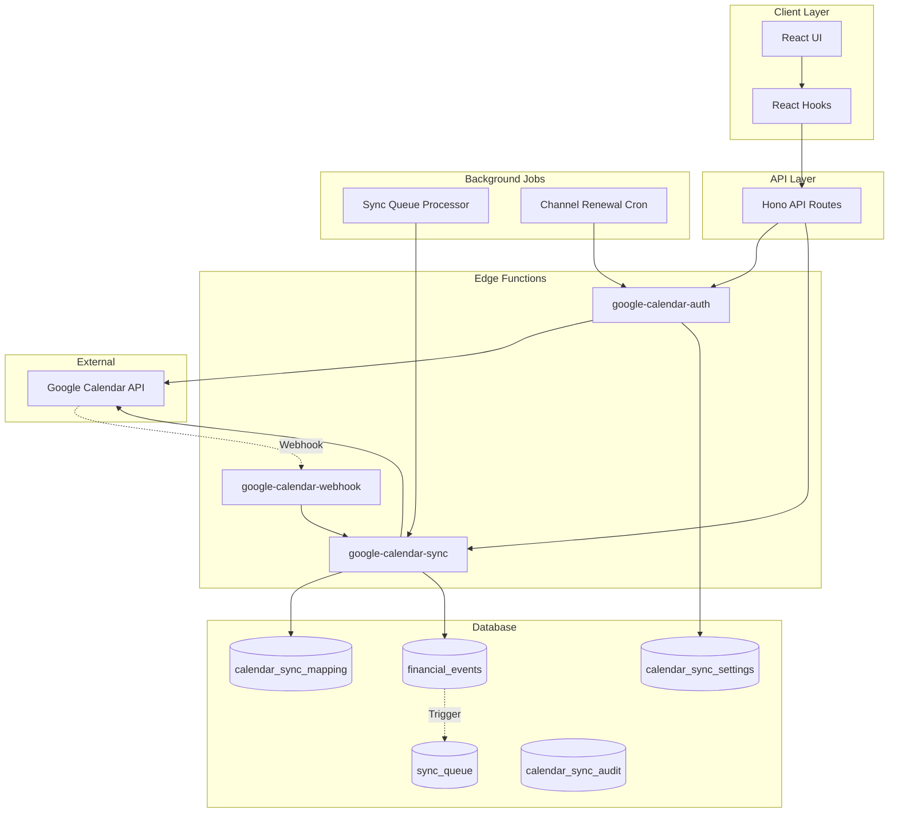

# Google Calendar Bi-Directional Sync Architecture

## Overview

AegisWallet implements a robust bi-directional synchronization system with Google Calendar, enabling seamless integration between financial events and calendar entries. The architecture ensures data consistency, prevents sync loops, and provides real-time updates through webhooks.

## System Architecture



## Data Flow

### Outbound Sync (App → Google)

1. **User Action**: User creates/updates financial event
2. **Database Trigger**: `queue_google_calendar_sync()` inserts into `sync_queue`
3. **Queue Processor**: Background worker picks up pending items
4. **Edge Function**: `google-calendar-sync` with `action=sync_to_google`
5. **API Call**: Encrypted tokens decrypted, Google Calendar API called
6. **Mapping Update**: `calendar_sync_mapping` updated with `sync_source='aegis'`
7. **Audit Log**: Success/failure logged to `calendar_sync_audit`

### Inbound Sync (Google → App)

1. **Google Event Change**: User modifies event in Google Calendar
2. **Webhook Notification**: Google sends push notification to `google-calendar-webhook`
3. **Signature Verification**: Webhook secret validated
4. **Incremental Sync**: `google-calendar-sync` with `action=incremental_sync`
5. **Conflict Resolution**: Timestamps compared, "Last Write Wins"
6. **Database Update**: `financial_events` updated with `sync_source='google'`
7. **Mapping Update**: `calendar_sync_mapping` updated with new version

## Components

### Edge Functions

#### google-calendar-auth
**Purpose**: Handle OAuth flow and webhook channel management

**Actions**:
- `start`: Generate OAuth URL
- `callback`: Exchange code for tokens, encrypt, store, register webhook channel
- `revoke`: Revoke access and clean up
- `renew_channel`: Renew expiring webhook channel

**Security**:
- AES-256-GCM encryption for tokens
- Unique channel ID per user
- Webhook secret generation

#### google-calendar-sync
**Purpose**: Bi-directional event synchronization

**Actions**:
- `sync_to_google`: Push single event to Google
- `sync_from_google`: Pull single event from Google
- `incremental_sync`: Sync only changed events using `syncToken`
- `full_sync`: Complete synchronization (fallback)

**Features**:
- Loop prevention via `sync_source` field
- Conflict resolution via timestamp comparison
- Retry logic with exponential backoff
- Rate limiting (10 requests/second)

#### google-calendar-webhook
**Purpose**: Receive Google Calendar push notifications

**Process**:
1. Verify webhook signature
2. Validate channel expiry
3. Trigger incremental sync
4. Always return 200 OK (prevent channel stop)

### Database Schema

#### calendar_sync_mapping
Tracks relationship between local and Google events

**Key Fields**:
- `sync_source`: 'aegis' | 'google' | 'manual'
- `last_modified_at`: For conflict resolution
- `version`: Optimistic locking counter

#### calendar_sync_settings
User-specific sync configuration

**New Fields**:
- `google_channel_id`: Active webhook channel
- `google_resource_id`: Google resource identifier
- `channel_expiry_at`: Channel expiration (7 days)
- `webhook_secret`: Verification token

#### sync_queue
Asynchronous sync operations

**Fields**:
- `sync_direction`: 'to_google' | 'from_google'
- `status`: 'pending' | 'processing' | 'completed' | 'failed'
- `retry_count`: Number of retry attempts

### Background Jobs

#### channel-renewal-cron.ts
**Schedule**: Daily
**Purpose**: Renew channels expiring within 24 hours

**Process**:
1. Query channels expiring soon
2. Stop old channel
3. Register new channel
4. Update database
5. Retry up to 3 times on failure
6. Disable sync if all retries fail

#### process-sync-queue.ts
**Schedule**: Every 5 minutes (or continuous)
**Purpose**: Process pending sync operations

**Process**:
1. Query pending items (batch of 10)
2. Update status to 'processing'
3. Call appropriate Edge Function
4. Update status to 'completed' or 'failed'
5. Retry with exponential backoff
6. Clean up old items (7 days)

## Sync Strategies

### Full Sync
**When**: Initial setup, sync token invalid
**How**: Fetch all events from Google (last 30 days)
**Result**: Complete synchronization, new `syncToken` stored

### Incremental Sync
**When**: Regular updates, webhook notifications
**How**: Use `syncToken` to fetch only changed events
**Result**: Efficient updates, minimal API calls

### Real-time Sync
**When**: Google Calendar changes
**How**: Webhook triggers incremental sync
**Result**: Near-instant updates

## Loop Prevention

### Strategy
Track origin of changes using `sync_source` field

### Implementation
1. **Outbound**: Set `sync_source='aegis'` when pushing to Google
2. **Inbound**: Set `sync_source='google'` when pulling from Google
3. **Check**: Skip sync if change originated from destination
4. **Timeout**: 5-second window to prevent race conditions

### Example
```typescript
// Before syncing to Google
if (mapping.sync_source === 'google' &&
    new Date(mapping.last_modified_at) > new Date(Date.now() - 5000)) {
  return { skipped: true, reason: 'Recently synced from Google' };
}
```

## Conflict Resolution

### Strategy
"Last Write Wins" based on timestamp comparison

### Process
1. Compare `last_modified_at` timestamps
2. If local newer: Push to Google
3. If Google newer: Pull to local
4. If equal: Skip (already synced)
5. Log conflicts to audit table

### Example
```typescript
const googleModified = new Date(googleEvent.updated);
const localModified = new Date(mapping.last_modified_at);

if (googleModified > localModified) {
  // Google wins - update local
  await updateLocalEvent(googleEvent);
} else {
  // Local wins - skip or push to Google
  return { skipped: true };
}
```

## Security

### Token Encryption
- **Algorithm**: AES-256-GCM
- **Key**: 32-byte encryption key from environment
- **Storage**: IV prepended to ciphertext, base64 encoded
- **Decryption**: Required for all API calls

### Webhook Verification
- **Secret**: Unique per user, stored in database
- **Header**: `X-Goog-Channel-Token` must match
- **Expiry**: Channels expire after 7 days

### Rate Limiting
- **Google API**: 10 requests/second
- **Implementation**: 100ms delay between requests
- **Retry**: Exponential backoff on errors

## Error Handling

### Retry Strategy
- **Max Retries**: 3 attempts
- **Backoff**: Exponential (2^n seconds)
- **Permanent Failure**: After 3 retries, mark as failed

### Error Types
- **404/410**: Event deleted, create new or delete local
- **409**: Conflict, apply resolution strategy
- **429**: Rate limit, increase backoff
- **401**: Token expired, refresh and retry

### Audit Logging
All operations logged to `calendar_sync_audit`:
- Success/failure status
- Error messages
- Conflict details
- Performance metrics

## Monitoring

### Key Metrics
- Sync queue depth
- Processing time per item
- Error rate by type
- Channel renewal success rate

### Queries
```sql
-- Sync queue backlog
SELECT COUNT(*) FROM sync_queue WHERE status = 'pending';

-- Recent errors
SELECT * FROM calendar_sync_audit
WHERE action = 'sync_failed'
ORDER BY created_at DESC LIMIT 10;

-- Channels expiring soon
SELECT user_id, channel_expiry_at
FROM calendar_sync_settings
WHERE channel_expiry_at < NOW() + INTERVAL '24 hours';
```

## Deployment

### Environment Variables
```bash
# Required in Supabase Edge Functions
TOKENS_ENCRYPTION_KEY=<32-byte-hex>
WEBHOOK_SECRET=<random-uuid>
GOOGLE_CLIENT_ID=<oauth-client-id>
GOOGLE_CLIENT_SECRET=<oauth-secret>
```

### Supabase Secrets
```bash
supabase secrets set TOKENS_ENCRYPTION_KEY=your-key
supabase secrets set WEBHOOK_SECRET=your-secret
```

### Webhook URL
Register with Google Calendar API:
```
https://[project].supabase.co/functions/v1/google-calendar-webhook
```

### Cron Jobs
```bash
# Daily channel renewal
0 0 * * * bun scripts/channel-renewal-cron.ts

# Sync queue processing (every 5 minutes)
*/5 * * * * bun scripts/process-sync-queue.ts
```

## Troubleshooting

### Sync Loops Detected
**Symptom**: Events constantly updating
**Solution**: Check `sync_source` logic, increase timeout window

### Webhook Not Receiving
**Symptom**: No real-time updates
**Solution**: Verify webhook URL, check channel expiry, validate secret

### Token Refresh Failures
**Symptom**: 401 errors
**Solution**: Check refresh token, verify encryption key unchanged

### Channel Expiration
**Symptom**: Sync stops after 7 days
**Solution**: Verify cron job running, check renewal logic

## Performance Optimization

### Batch Processing
- Process sync queue in batches of 10
- Rate limit to 10 requests/second
- Use incremental sync over full sync

### Caching
- Cache `syncToken` for incremental syncs
- Store channel info to avoid lookups
- Cache user settings

### Database Optimization
- Indexes on `sync_queue(user_id, status, created_at)`
- Index on `calendar_sync_settings(channel_expiry_at)`
- Cleanup old audit logs (>30 days)

## Future Enhancements

- [ ] Multi-calendar support
- [ ] Custom conflict resolution strategies
- [ ] Batch sync operations
- [ ] Real-time progress updates
- [ ] Advanced analytics dashboard
- [ ] Automatic error recovery
- [ ] Performance monitoring
- [ ] User notifications for conflicts
