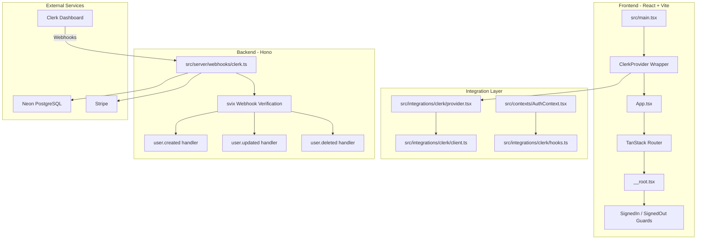

# Plano Aprimorado: Validação e Correção da Integração Clerk + React (Vite)

> **Versão**: 2.0
> **Data**: 2025-12-03
> **Status**: Análise completa, implementação pronta

## Sumário Executivo

### ✅ Descoberta Principal
Após análise detalhada do codebase e da documentação oficial do Clerk, a implementação atual do AegisWallet já está **ALINHADA** com as melhores práticas oficiais. O foco deste plano é em **validação, melhorias incrementais e documentação**.

### Pontos Críticos Identificados

| Aspecto | Status | Observação |
|---------|--------|------------|
| ClerkProvider setup | ✅ Correto | Usa `publishableKey`, não `frontendApi` |
| Variáveis de ambiente | ✅ Correto | `VITE_CLERK_PUBLISHABLE_KEY` com prefixo VITE_ |
| Componentes Clerk | ✅ Correto | SignedIn, SignedOut, RedirectToSignIn |
| Webhook handler | ✅ Correto | Usa svix para verificação |
| TanStack Router | ✅ Correto | Usa @clerk/clerk-react (não @clerk/react-router) |
| Localização PT-BR | ✅ Correto | @clerk/localizations configurado |

### ⚠️ Esclarecimento Importante: Clerk CLI

**NÃO existe CLI oficial do Clerk para validação.** O plano original mencionava "Clerk CLI", mas após pesquisa na documentação oficial:

- Clerk oferece apenas **Dashboard web** e **Backend API**
- Validação deve ser feita via `createClerkClient()` do `@clerk/backend`
- Scripts existentes já usam essa abordagem corretamente

---

## Arquitetura Atual (Validada)



---

## Fase 1: Validação da Configuração Atual

### 1.1 Validação de Variáveis de Ambiente

**Status**: Scripts existentes, melhorias sugeridas

**Arquivo**: [`scripts/validate-clerk-integration.ts`](../../scripts/validate-clerk-integration.ts:33)

**Validações Existentes**:
- ✅ `VITE_CLERK_PUBLISHABLE_KEY` - formato `pk_test_` ou `pk_live_`
- ✅ `CLERK_SECRET_KEY` - formato `sk_test_` ou `sk_live_`
- ✅ `CLERK_WEBHOOK_SECRET` - formato `whsec_`

**Melhoria Sugerida - Consistência de Ambiente**:
```typescript
// Adicionar validação de consistência entre chaves
function validateEnvironmentConsistency() {
  const publishableKey = process.env.VITE_CLERK_PUBLISHABLE_KEY;
  const secretKey = process.env.CLERK_SECRET_KEY;

  const isPublishableTest = publishableKey?.startsWith('pk_test_');
  const isSecretTest = secretKey?.startsWith('sk_test_');

  if (isPublishableTest !== isSecretTest) {
    addResult(
      'Environment consistency',
      'fail',
      'Publishable key and secret key are from different environments',
      ['Both must be either test or live environment']
    );
  }
}
```

**Comando de Validação**:
```bash
bun scripts/validate-clerk-integration.ts
```

### 1.2 Validação do ClerkProvider Setup

**Status**: ✅ Implementação correta

**Arquivos Validados**:

1. [`src/main.tsx`](../../src/main.tsx:46) - Entry point
```typescript
// ✅ CORRETO: ClerkProvider em main.tsx
<React.StrictMode>
  <ClerkProvider>
    <App />
  </ClerkProvider>
</React.StrictMode>
```

2. [`src/integrations/clerk/provider.tsx`](../../src/integrations/clerk/provider.tsx:59) - Wrapper customizado
```typescript
// ✅ CORRETO: Usa publishableKey (não frontendApi)
<BaseClerkProvider
  publishableKey={clerkPublishableKey}
  localization={ptBR}
  appearance={clerkAppearance}
  signInUrl={clerkUrls.signIn}
  signUpUrl={clerkUrls.signUp}
  signInFallbackRedirectUrl={clerkUrls.afterSignIn}
  signUpFallbackRedirectUrl={clerkUrls.afterSignUp}
  afterSignOutUrl={clerkUrls.afterSignOut}
>
```

3. [`src/integrations/clerk/client.ts`](../../src/integrations/clerk/client.ts:11) - Validação de formato
```typescript
// ✅ CORRETO: Validação de formato da chave
if (clerkPublishableKey) {
  if (!clerkPublishableKey.startsWith('pk_test_') &&
      !clerkPublishableKey.startsWith('pk_live_')) {
    console.error('[Clerk] Invalid VITE_CLERK_PUBLISHABLE_KEY format!');
  }
}
```

### 1.3 Validação de Componentes Clerk

**Status**: ✅ Implementação correta

**Arquivo**: [`src/routes/__root.tsx`](../../src/routes/__root.tsx:1)

```typescript
// ✅ CORRETO: Imports de @clerk/clerk-react
import { RedirectToSignIn, SignedIn, SignedOut } from '@clerk/clerk-react';

// ✅ CORRETO: Route protection pattern
<SignedOut>
  <RedirectToSignIn />
</SignedOut>
<SignedIn>
  {/* Protected content */}
</SignedIn>
```

**Componentes Re-exportados**: [`src/integrations/clerk/components.tsx`](../../src/integrations/clerk/components.tsx:8)

---

## Fase 2: Validação via Clerk Backend API

### 2.1 Conexão com Clerk API

**⚠️ IMPORTANTE**: Não existe CLI oficial do Clerk. Use a Backend API.

**Método de Validação**:
```typescript
import { createClerkClient } from '@clerk/backend';

async function validateClerkAPI() {
  const secretKey = process.env.CLERK_SECRET_KEY;
  const clerkClient = createClerkClient({ secretKey });

  // Testar conexão listando usuários
  const userList = await clerkClient.users.getUserList({ limit: 1 });
  console.log(`✅ Conectado ao Clerk (${userList.totalCount} usuários)`);
}
```

**Comando**:
```bash
bun scripts/validate-clerk-integration.ts
```

### 2.2 Validação de Webhook Endpoints

**Dashboard**: https://dashboard.clerk.com/apps/[APP_ID]/webhooks

**Eventos Necessários**:
- `user.created` - Criar usuário no banco de dados
- `user.updated` - Atualizar informações do usuário
- `user.deleted` - Limpar dados do usuário (LGPD compliance)

**Script de Setup**: [`scripts/clerk-setup-webhook.ts`](../../scripts/clerk-setup-webhook.ts:245)

---

## Fase 3: Validação de Webhooks e Database

### 3.1 Webhook Handler

**Status**: ✅ Implementação robusta

**Arquivo**: [`src/server/webhooks/clerk.ts`](../../src/server/webhooks/clerk.ts:67)

**Características Implementadas**:

1. **Verificação de Assinatura via svix**:
```typescript
const wh = new Webhook(webhookSecret);
event = wh.verify(payload, headers) as WebhookEvent;
```

2. **Headers Obrigatórios**:
- `svix-id`
- `svix-timestamp`
- `svix-signature`

3. **Idempotência**:
```typescript
// Verifica se usuário já existe antes de criar
const [existingUser] = await poolDb
  .select()
  .from(users)
  .where(eq(users.id, id))
  .limit(1);

if (existingUser) {
  return c.json({ received: true, message: 'User already exists' });
}
```

4. **Tratamento de Erros com Rollback**:
```typescript
// Em caso de erro, tenta reverter criação no Stripe
try {
  await StripeCustomerService.deleteCustomer(stripeCustomerId);
} catch (rollbackError) {
  secureLogger.error('Failed to rollback Stripe customer');
}
```

### 3.2 Alternativa: verifyWebhook do @clerk/backend

**Versão Moderna** (considerar para migração futura):
```typescript
import { verifyWebhook } from '@clerk/backend/webhooks';

export async function POST(request: Request) {
  try {
    const evt = await verifyWebhook(request);
    // Processar evento
  } catch (err) {
    return new Response('Webhook verification failed', { status: 400 });
  }
}
```

**Vantagens**:
- API mais simples
- Automaticamente busca o signing secret
- Tipagem melhorada para eventos

### 3.3 Validação de Database (Neon)

**Script**: [`scripts/neon-verify-database.ts`](../../scripts/neon-verify-database.ts)

**Tabelas Validadas**:
- `users` (id, email, full_name, organization_id)
- `subscriptions` (user_id, stripe_customer_id, plan_id, status)
- `organizations` (id, name, email, organization_type)

**Comando**:
```bash
bun scripts/neon-verify-database.ts
```

---

## Fase 4: Validação da Integração TanStack Router

### 4.1 Diferenças: TanStack Router vs React Router

| Aspecto | React Router | TanStack Router (AegisWallet) |
|---------|--------------|------------------------------|
| Package Clerk | @clerk/react-router | @clerk/clerk-react ✅ |
| Provider | Com loaderData | Wrapper simples ✅ |
| Middleware | clerkMiddleware | Não necessário ✅ |
| Route Guards | Via componentes | Via componentes ✅ |

### 4.2 Route Guards Implementados

**Arquivo**: [`src/routes/__root.tsx`](../../src/routes/__root.tsx:56)

```typescript
// Páginas públicas que não requerem autenticação
const PUBLIC_PAGES = [
  '/login',
  '/signup',
  '/privacidade',
  '/politica-de-privacidade',
  '/termos-de-uso',
];

function RootComponent() {
  const isPublicPage = useMemo(
    () => PUBLIC_PAGES.some((page) => location.pathname.startsWith(page)),
    [location.pathname]
  );

  // Páginas públicas: renderizar sem providers de autenticação
  if (isPublicPage) {
    return <div className="min-h-screen bg-background"><Outlet /></div>;
  }

  // Páginas protegidas: usar guards do Clerk
  return (
    <>
      <SignedOut><RedirectToSignIn /></SignedOut>
      <SignedIn>{/* Conteúdo protegido */}</SignedIn>
    </>
  );
}
```

### 4.3 AuthContext

**Arquivo**: [`src/contexts/AuthContext.tsx`](../../src/contexts/AuthContext.tsx:1)

**Hooks Utilizados** (todos de @clerk/clerk-react):
- `useAuth()` - Estado de autenticação
- `useUser()` - Dados do usuário
- `useSession()` - Sessão atual e tokens

---

## Fase 5: Documentação Atualizada

### 5.1 Setup Básico do Clerk + React (Vite)

**Referência Oficial**: https://clerk.com/docs/quickstarts/react

```typescript
// src/main.tsx - Setup CORRETO
import { StrictMode } from 'react';
import { createRoot } from 'react-dom/client';
import { ClerkProvider } from '@clerk/clerk-react';
import App from './App';

const PUBLISHABLE_KEY = import.meta.env.VITE_CLERK_PUBLISHABLE_KEY;

if (!PUBLISHABLE_KEY) {
  throw new Error('Missing Clerk Publishable Key');
}

createRoot(document.getElementById('root')!).render(
  <StrictMode>
    <ClerkProvider publishableKey={PUBLISHABLE_KEY} afterSignOutUrl="/">
      <App />
    </ClerkProvider>
  </StrictMode>
);
```

### 5.2 Checklist de Validação Pré-Deploy

```bash
# 1. Validar integração Clerk completa
bun scripts/validate-clerk-integration.ts

# 2. Validar webhook setup
bun scripts/validate-clerk-webhook-setup.ts

# 3. Validar banco de dados
bun scripts/neon-verify-database.ts

# 4. Validar variáveis de ambiente
bun scripts/check-env.ts

# 5. Executar testes
bun test

# 6. Build de produção
bun build
```

### 5.3 Troubleshooting Comum

| Erro | Causa | Solução |
|------|-------|---------|
| `VITE_CLERK_PUBLISHABLE_KEY is missing` | Variável não configurada | Adicionar em `.env.local` com prefixo `VITE_` |
| `Invalid publishable key format` | Chave incorreta | Copiar do Clerk Dashboard > API Keys > React |
| `Webhook verification failed` | Secret incorreto | Renovar secret no Dashboard e atualizar `.env` |
| `frontendApi is deprecated` | Usando API antiga | Migrar para `publishableKey` |

---

## Fase 6: Melhorias Recomendadas

### 6.1 Melhorias no Script de Validação

**Adicionar ao** [`scripts/validate-clerk-integration.ts`](../../scripts/validate-clerk-integration.ts):

```typescript
// Validação de consistência de ambiente
function validateEnvironmentConsistency() {
  const publishableKey = getEnvVar('VITE_CLERK_PUBLISHABLE_KEY');
  const secretKey = getEnvVar('CLERK_SECRET_KEY');

  if (publishableKey && secretKey) {
    const pubEnv = publishableKey.includes('_test_') ? 'test' : 'live';
    const secEnv = secretKey.includes('_test_') ? 'test' : 'live';

    if (pubEnv !== secEnv) {
      addResult(
        'Environment consistency',
        'fail',
        `Keys are from different environments: publishable=${pubEnv}, secret=${secEnv}`,
        ['Ensure both keys are from the same environment (test or live)']
      );
    } else {
      addResult(
        'Environment consistency',
        'pass',
        `Both keys are from ${pubEnv} environment`
      );
    }
  }
}
```

### 6.2 Considerar Migração para verifyWebhook

**Benefícios**:
- API mais moderna e simples
- Menos código boilerplate
- Melhor suporte a tipos

**Implementação Sugerida**:
```typescript
// Nova abordagem (opcional)
import { verifyWebhook, type WebhookEvent } from '@clerk/backend/webhooks';

clerkWebhookHandler.post('/', async (c) => {
  try {
    const evt: WebhookEvent = await verifyWebhook(c.req.raw);
    // Processar evento...
  } catch (err) {
    return c.json({ error: 'Verification failed' }, 400);
  }
});
```

### 6.3 Adicionar Testes E2E para Auth

**Playwright Test Sugerido**:
```typescript
import { test, expect } from '@playwright/test';

test('deve redirecionar para login quando não autenticado', async ({ page }) => {
  await page.goto('/dashboard');
  await expect(page).toHaveURL(/\/login/);
});

test('deve permitir acesso a páginas públicas', async ({ page }) => {
  await page.goto('/politica-de-privacidade');
  await expect(page).not.toHaveURL(/\/login/);
});
```

---

## Comandos de Validação (Bun)

```bash
# Setup completo (primeira vez)
bun scripts/clerk-setup-webhook.ts && \
bun scripts/clerk-sync-users.ts && \
bun scripts/neon-apply-migrations.ts

# Validação rápida (pré-deploy)
bun scripts/validate-clerk-integration.ts && \
bun scripts/validate-clerk-webhook-setup.ts && \
bun scripts/neon-verify-database.ts

# Apenas variáveis de ambiente
bun scripts/check-env.ts

# Testar webhook endpoint
bun scripts/test-clerk-webhook.ts
```

---

## Conclusão

### Status Final

| Fase | Status | Ação Necessária |
|------|--------|-----------------|
| Fase 1: Configuração | ✅ Correto | Apenas melhorias de validação |
| Fase 2: API Validation | ✅ Correto | Scripts existentes funcionais |
| Fase 3: Webhooks | ✅ Correto | Considerar migração futura |
| Fase 4: TanStack Router | ✅ Correto | Documentar diferenças |
| Fase 5: Documentação | ⚠️ Melhorar | Atualizar com este plano |
| Fase 6: Melhorias | 🔄 Opcional | Implementar conforme necessidade |

### Próximos Passos

1. **Imediato**: Executar validação completa com scripts existentes
2. **Curto Prazo**: Atualizar documentação com esclarecimentos
3. **Médio Prazo**: Considerar migração para `verifyWebhook`
4. **Longo Prazo**: Implementar testes E2E de autenticação

---

## Referências

- [Clerk React Quickstart](https://clerk.com/docs/quickstarts/react) - Guia oficial
- [Clerk Webhooks Guide](https://clerk.com/docs/integrations/webhooks/overview) - Webhooks
- [TanStack Router](https://tanstack.com/router/latest) - Roteador usado no projeto
- [@clerk/clerk-react API](https://clerk.com/docs/references/react/overview) - SDK Reference