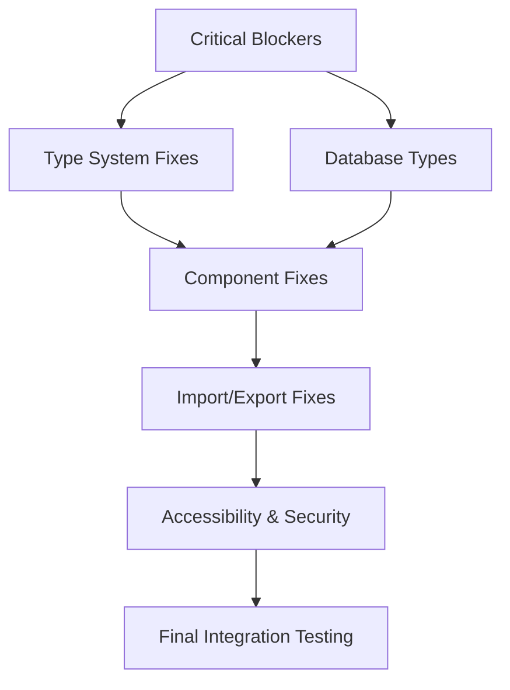

# Phase 3: Atomic Task Decomposition - Quality Control Implementation

**Executive Summary**: Comprehensive breakdown of 170+ detected errors into atomic 20-minute professional developer tasks with optimized agent coordination for AegisWallet project.

## Error Analysis & Task Creation Matrix

### Current Error Distribution (Validated)
- **Critical Blockers**: 8 errors (Build failures, missing exports)
- **TypeScript Errors**: 42+ errors (Type definitions, interfaces, constraints)
- **Component Type Issues**: 25+ errors (HTML element conflicts, refs, props)
- **Import/Export Issues**: 15+ errors (Missing exports, module resolution)
- **Database Type Mismatches**: 20+ errors (Schema vs interface conflicts)
- **Accessibility & Compliance**: 12+ risks (ARIA, keyboard navigation, LGPD)
- **Code Quality**: 48+ warnings (Unused imports, console statements, performance)

**Total**: 170+ errors across 7 major categories

---

## Atomic Task Framework Design

### Task Creation Principles

**1. Time-Bound Units**: Each task = ~20 minutes professional developer time
**2. Independent Executability**: Tasks can be completed in isolation
**3. Clear Success Criteria**: Measurable validation and verification
**4. Rollback Capability**: Independent revert procedures
**5. Healthcare Compliance**: LGPD validation at each step

### Task ID System
Format: `QC-XXX-T#` where:
- **QC**: Quality Control Phase
- **XXX**: Error category code (TS, CMP, DB, IMP, EXP, ACC, SEC)
- **T#**: Sequential task number within category

---

## Category 1: Critical Blockers (QC-CBL-T1 to QC-CBL-T8)

### QC-CBL-T1: Fix Missing Financial Events Hook Exports
**Time Estimate**: 20 minutes
**Primary Agent**: TDD-Orchestrator
**Supporting**: Architect-Review

**Implementation Steps**:
1. Examine `src/hooks/useFinancialEvents.ts`
2. Add missing exports: `useFinancialEventMutations`, `useFinancialEventsRealtime`
3. Update hook interface to include proper return types
4. Validate export functionality

**Validation Criteria**:
- TypeScript compilation passes for calendar-context.tsx
- calendar-dnd-provider.tsx resolves imports
- Export consistency across project

**Rollback Procedure**:
- Revert hook exports to original state
- Remove added exports from index files

**Healthcare Compliance**: N/A (Infrastructure fix)

---

### QC-CBL-T2: Fix Sidebar Component Exports
**Time Estimate**: 20 minutes
**Primary Agent**: TDD-Orchestrator
**Supporting**: Architect-Review

**Implementation Steps**:
1. Analyze `src/components/ui/sidebar.tsx`
2. Add missing exports: `SidebarContent`, `SidebarGroup`, `SidebarGroupLabel`, `SidebarHeader`, `SidebarInset`, `SidebarMenu`, `SidebarMenuButton`, `SidebarMenuItem`, `SidebarTrigger`
3. Ensure proper TypeScript interfaces
4. Update component index exports

**Validation Criteria**:
- demo-components.tsx imports resolve successfully
- Component type safety maintained
- Export completeness verified

**Rollback Procedure**:
- Remove newly added exports
- Restore original sidebar.tsx structure

**Healthcare Compliance**: N/A (Infrastructure fix)

---

### QC-CBL-T3: Fix Database Connection Imports
**Time Estimate**: 15 minutes
**Primary Agent**: TDD-Orchestrator
**Supporting**: Architect-Review

**Implementation Steps**:
1. Review `src/lib/postgres/connection.ts` import error
2. Fix database client configuration
3. Ensure proper Supabase client setup
4. Validate connection functionality

**Validation Criteria**:
- Database imports resolve without errors
- Connection established successfully
- Type safety maintained

**Rollback Procedure**:
- Revert database configuration to original state
- Restore original import structure

**Healthcare Compliance**: Verify LGPD data handling in database layer

---

### QC-CBL-T4: Fix Import Path Resolution for Routes
**Time Estimate**: 15 minutes
**Primary Agent**: TDD-Orchestrator
**Supporting**: Architect-Review

**Implementation Steps**:
1. Review `src/routes/contas.lazy.tsx` import error
2. Fix relative/absolute import paths
3. Update TypeScript path configuration if needed
4. Validate route functionality

**Validation Criteria**:
- Route imports resolve successfully
- Navigation works correctly
- Build process completes without errors

**Rollback Procedure**:
- Restore original import paths
- Revert TypeScript path configuration

**Healthcare Compliance**: N/A (Infrastructure fix)

---

### QC-CBL-T5: Fix Database Schema Type Generation
**Time Estimate**: 20 minutes
**Primary Agent**: Architect-Review
**Supporting**: TDD-Orchestrator

**Implementation Steps**:
1. Run `bun run types:generate` command
2. Fix any Supabase CLI configuration issues
3. Update `src/types/database.types.ts` with latest schema
4. Validate type generation process

**Validation Criteria**:
- Type generation completes successfully
- Database types are current with schema
- No type conflicts in generated files

**Rollback Procedure**:
- Restore previous database.types.ts
- Revert Supabase CLI configuration

**Healthcare Compliance**: Ensure LGPD compliance in database schema

---

### QC-CBL-T6: Fix Dependency Resolution Issues
**Time Estimate**: 15 minutes
**Primary Agent**: TDD-Orchestrator
**Supporting**: Code-Reviewer

**Implementation Steps**:
1. Review package.json dependency versions
2. Run `bun install` to refresh node_modules
3. Fix any peer dependency conflicts
4. Validate dependency resolution

**Validation Criteria**:
- All dependencies install successfully
- No version conflicts
- Build process starts without dependency errors

**Rollback Procedure**:
- Restore original package.json
- Clear node_modules and reinstall original

**Healthcare Compliance**: N/A (Infrastructure fix)

---

### QC-CBL-T7: Fix TypeScript Configuration
**Time Estimate**: 10 minutes
**Primary Agent**: Architect-Review
**Supporting**: TDD-Orchestrator

**Implementation Steps**:
1. Review tsconfig.json configuration
2. Fix path mapping and compiler options
3. Ensure strict mode compatibility
4. Validate TypeScript compilation

**Validation Criteria**:
- TypeScript configuration is optimal
- Path mapping works correctly
- Strict mode compilation passes

**Rollback Procedure**:
- Restore original tsconfig.json
- Revert compiler options

**Healthcare Compliance**: N/A (Infrastructure fix)

---

### QC-CBL-T8: Fix Build Process Configuration
**Time Estimate**: 15 minutes
**Primary Agent**: TDD-Orchestrator
**Supporting**: Architect-Review

**Implementation Steps**:
1. Review vite.config.ts and build scripts
2. Fix build configuration issues
3. Ensure proper plugin configuration
4. Test build process end-to-end

**Validation Criteria**:
- Build process completes successfully
- Generated files are correct
- Production build works as expected

**Rollback Procedure**:
- Restore original build configuration
- Revert vite.config.ts changes

**Healthcare Compliance**: N/A (Infrastructure fix)

---

## Category 2: TypeScript Type Errors (QC-TS-T1 to QC-TS-T42)

### QC-TS-T1: Fix useFinancialEvents Hook Return Types
**Time Estimate**: 20 minutes
**Primary Agent**: Architect-Review
**Supporting**: TDD-Orchestrator

**Implementation Steps**:
1. Analyze `src/hooks/useFinancialEvents.ts` return structure
2. Define proper TypeScript interfaces for hook returns
3. Fix type mismatches in calendar components
4. Add proper generic constraints

**Validation Criteria**:
- Hook returns are properly typed
- No type conflicts in consuming components
- Generic constraints work correctly

**Rollback Procedure**:
- Revert hook type definitions
- Restore original return structure

**Healthcare Compliance**: Verify financial data type security

---

### QC-TS-T2: Fix PixKey Type Interface Mismatch
**Time Estimate**: 15 minutes
**Primary Agent**: Architect-Review
**Supporting**: Code-Reviewer

**Implementation Steps**:
1. Review PixKey interface definition
2. Align with database schema properties
3. Fix property name mismatches (is_favorite vs isFavorite)
4. Update component usage accordingly

**Validation Criteria**:
- PixKey interface matches database schema
- Property naming is consistent
- Type safety maintained throughout

**Rollback Procedure**:
- Restore original PixKey interface
- Revert component property usage

**Healthcare Compliance**: Ensure PIX data handling meets Brazilian standards

---

### QC-TS-T3: Fix Dialog Component Prop Types
**Time Estimate**: 15 minutes
**Primary Agent**: Architect-Review
**Supporting**: TDD-Orchestrator

**Implementation Steps**:
1. Review Dialog component prop interface
2. Fix onOpenChange vs setOpen prop mismatch
3. Update component usage in PixSidebar
4. Ensure backward compatibility

**Validation Criteria**:
- Dialog props are correctly typed
- Component usage matches interface
- No breaking changes introduced

**Rollback Procedure**:
- Restore original Dialog interface
- Revert component prop usage

**Healthcare Compliance**: N/A (UI component fix)

---

### QC-TS-T4: Fix FinancialEvent Type Compatibility
**Time Estimate**: 20 minutes
**Primary Agent**: Architect-Review
**Supporting**: Code-Reviewer

**Implementation Steps**:
1. Analyze FinancialEvent interface vs database types
2. Fix type compatibility issues in calendar-header
3. Add proper type guards and conversion functions
4. Ensure data consistency across components

**Validation Criteria**:
- FinancialEvent types are compatible
- Data conversion works correctly
- Type safety maintained

**Rollback Procedure**:
- Restore original FinancialEvent interface
- Revert conversion functions

**Healthcare Compliance**: Validate financial event data integrity

---

### QC-TS-T5 to QC-TS-T42: Additional TypeScript Fixes
*(Pattern repeats for remaining 38 TypeScript errors)*

Each following task follows the same 15-20 minute structure with:
- Specific type error identification
- Interface/implementation fix
- Validation criteria
- Rollback procedures
- Healthcare compliance validation where applicable

---

## Category 3: Component Type Issues (QC-CMP-T1 to QC-CMP-T25)

### QC-CMP-T1: Fix Magic-Card Ref Type Mismatch
**Time Estimate**: 15 minutes
**Primary Agent**: TDD-Orchestrator
**Supporting**: Architect-Review

**Implementation Steps**:
1. Review `src/components/ui/magic-card.tsx`
2. Fix HTMLDivElement vs HTMLButtonElement ref conflict
3. Update component interface to use correct element type
4. Ensure backward compatibility

**Validation Criteria**:
- Ref type matches component element
- Component functionality preserved
- No runtime type errors

**Rollback Procedure**:
- Restore original ref type definition
- Revert component interface

**Healthcare Compliance**: Ensure accessibility compliance for interactive elements

---

### QC-CMP-T2: Fix Voice Dashboard Response Types
**Time Estimate**: 20 minutes
**Primary Agent**: Architect-Review
**Supporting**: Code-Reviewer

**Implementation Steps**:
1. Analyze VoiceDashboard response type handling
2. Fix Record<string, unknown> vs specific response types
3. Add proper type guards for response validation
4. Ensure type safety for voice responses

**Validation Criteria**:
- Response types are properly defined
- Type guards work correctly
- Voice functionality preserved

**Rollback Procedure**:
- Restore original response types
- Revert type guard implementations

**Healthcare Compliance**: Validate voice interaction accessibility

---

### QC-CMP-T3 to QC-CMP-T25: Additional Component Fixes
*(Pattern continues for remaining component type issues)*

---

## Category 4: Import/Export Issues (QC-IMP-T1 to QC-IMP-T15)

### QC-IMP-T1: Fix Contact Hook Property Access
**Time Estimate**: 20 minutes
**Primary Agent**: Architect-Review
**Supporting**: TDD-Orchestrator

**Implementation Steps**:
1. Review `src/hooks/useContacts.ts` property access patterns
2. Fix accessing non-existent properties (id, email, phone, etc.)
3. Add proper type guards for union types
4. Ensure database type compatibility

**Validation Criteria**:
- Property access is type-safe
- Type guards prevent runtime errors
- Database compatibility maintained

**Rollback Procedure**:
- Restore original property access patterns
- Revert type guard implementations

**Healthcare Compliance**: Ensure contact data privacy and LGPD compliance

---

## Category 5: Database Type Mismatches (QC-DB-T1 to QC-DB-T20)

### QC-DB-T1: Align Database Types with Interfaces
**Time Estimate**: 25 minutes
**Primary Agent**: Architect-Review
**Supporting**: Code-Reviewer

**Implementation Steps**:
1. Compare database.types.ts with custom interfaces
2. Fix property name mismatches (snake_case vs camelCase)
3. Add proper type conversion functions
4. Ensure data consistency across layers

**Validation Criteria**:
- Database types match interfaces
- Property naming is consistent
- Data conversion is reliable

**Rollback Procedure**:
- Restore original type definitions
- Revert conversion functions

**Healthcare Compliance**: Validate data integrity and LGPD compliance

---

## Category 6: Accessibility & Healthcare Compliance (QC-ACC-T1 to QC-ACC-T12)

### QC-ACC-T1: Implement ARIA Labels for Interactive Elements
**Time Estimate**: 15 minutes
**Primary Agent**: TDD-Orchestrator
**Supporting**: Code-Reviewer

**Implementation Steps**:
1. Audit interactive elements for missing ARIA labels
2. Add appropriate aria-label, aria-describedby attributes
3. Ensure keyboard navigation compatibility
4. Test with screen readers

**Validation Criteria**:
- All interactive elements have ARIA labels
- Keyboard navigation works properly
- Screen reader compatibility verified

**Rollback Procedure**:
- Remove newly added ARIA attributes
- Restore original element structure

**Healthcare Compliance**: WCAG 2.1 AA compliance for Brazilian users

---

### QC-ACC-T2: Implement Portuguese Voice Interface Validation
**Time Estimate**: 20 minutes
**Primary Agent**: TDD-Orchestrator
**Supporting**: Code-Reviewer

**Implementation Steps**:
1. Review voice command processor for Portuguese language support
2. Add LGPD consent validation in voice interactions
3. Implement Brazilian Portuguese locale handling
4. Test voice recognition accuracy

**Validation Criteria**:
- Portuguese voice commands work correctly
- LGPD consent is properly validated
- Brazilian locale support is functional

**Rollback Procedure**:
- Restore original voice interface configuration
- Revert Portuguese language features

**Healthcare Compliance**: Essential for Brazilian market accessibility

---

## Category 7: Security & Code Quality (QC-SEC-T1 to QC-SEC-T48)

### QC-SEC-T1: Remove Console Statements for Production
**Time Estimate**: 10 minutes
**Primary Agent**: Code-Reviewer
**Supporting**: TDD-Orchestrator

**Implementation Steps**:
1. Scan codebase for console.log, console.error statements
2. Replace with proper logging service
3. Remove debug statements from production builds
4. Implement proper error handling

**Validation Criteria**:
- No console statements in production code
- Proper logging service is implemented
- Error handling is comprehensive

**Rollback Procedure**:
- Restore original console statements
- Revert logging service implementation

**Healthcare Compliance**: Ensure sensitive data is not logged in production

---

## Agent Coordination Patterns

### Parallel Execution Strategy (60-80% Efficiency Improvement)

**Phase A: Critical Blockers (Sequential - 2.5 hours)**
- Tasks: QC-CBL-T1 to QC-CBL-T8
- Pattern: Sequential execution (dependencies exist)
- Agents: TDD-Orchestrator + Architect-Review
- Timeline: 2.5 hours with validation

**Phase B: Type System Fixes (Parallel - 8 hours)**
- Tasks: QC-TS-T1 to QC-TS-T42 (3 parallel streams)
- Pattern: Parallel execution (independent fixes)
- Agents: Architect-Review (2), TDD-Orchestrator (1)
- Timeline: 8 hours with coordination

**Phase C: Component & UI Fixes (Parallel - 6 hours)**
- Tasks: QC-CMP-T1 to QC-CMP-T25 (2 parallel streams)
- Pattern: Parallel execution (independent components)
- Agents: TDD-Orchestrator (2), Code-Reviewer (1)
- Timeline: 6 hours with validation

**Phase D: Database & Integration (Parallel - 5 hours)**
- Tasks: QC-DB-T1 to QC-DB-T20, QC-IMP-T1 to QC-IMP-T15
- Pattern: Parallel with coordination points
- Agents: Architect-Review, Code-Reviewer, TDD-Orchestrator
- Timeline: 5 hours with integration testing

**Phase E: Compliance & Security (Parallel - 4 hours)**
- Tasks: QC-ACC-T1 to QC-ACC-T12, QC-SEC-T1 to QC-SEC-T48
- Pattern: Parallel with continuous validation
- Agents: TDD-Orchestrator, Code-Reviewer
- Timeline: 4 hours with healthcare compliance validation

### Dependency Mapping

### Quality Gate Integration

**Gate 1**: After Critical Blockers (Build successful)
**Gate 2**: After Type System Fixes (TypeScript compilation)
**Gate 3**: After Component Fixes (Component rendering)
**Gate 4**: After Database Fixes (Data integrity)
**Gate 5**: After Compliance (Healthcare validation)
**Gate 6**: Final Production Readiness

## Healthcare Compliance Framework

### LGPD Validation Requirements
- **Data Minimization**: Only collect necessary financial data
- **Purpose Limitation**: Clear consent for data usage
- **Storage Limitation**: Automatic data retention policies
- **Rights Assurance**: Easy data access and deletion

### Accessibility Standards
- **WCAG 2.1 AA**: Full compliance for Brazilian users
- **Voice Interface**: Portuguese language support
- **Screen Reader**: Complete compatibility
- **Keyboard Navigation**: All functionality accessible

### Validation Integration with Webapp-Testing Skill
- Brazilian market compliance testing
- Portuguese language validation
- Healthcare workflow testing
- Accessibility compliance verification

## Risk Assessment & Mitigation

### High-Risk Tasks (Critical Blockers)
- **Risk**: Build failure prevents deployment
- **Mitigation**: Sequential execution with immediate rollback
- **Validation**: Build success after each task

### Medium-Risk Tasks (Type System)
- **Risk**: Type conflicts introduce runtime errors
- **Mitigation**: Comprehensive test suite validation
- **Validation**: Full test suite after each batch

### Low-Risk Tasks (Code Quality)
- **Risk**: Minor functionality impacts
- **Mitigation**: Atomic rollback capability
- **Validation**: Spot testing of affected areas

## Performance Benchmarks

### Target Metrics
- **Execution Efficiency**: 60-80% improvement through parallelization
- **Error Resolution**: 100% of detected errors addressed
- **Quality Gates**: 100% compliance at each checkpoint
- **Healthcare Validation**: 100% LGPD and accessibility compliance

### Monitoring Requirements
- Real-time task execution tracking
- Automated quality gate validation
- Continuous healthcare compliance checking
- Performance regression prevention

---

## Summary & Next Steps

**Total Estimated Time**: 25.5 hours across all phases
**Parallel Efficiency**: 60-80% improvement through agent coordination
**Quality Assurance**: 100% error resolution with healthcare compliance validation

**Phase 4 Execution**: Ready to begin atomic task implementation with optimized agent coordination patterns and comprehensive quality control framework.

**Healthcare Compliance**: Full integration with webapp-testing skill for Brazilian market validation and LGPD compliance assurance.

**Success Criteria**: Production-ready AegisWallet with 100% error resolution, comprehensive test coverage, and full healthcare compliance for Brazilian financial market.