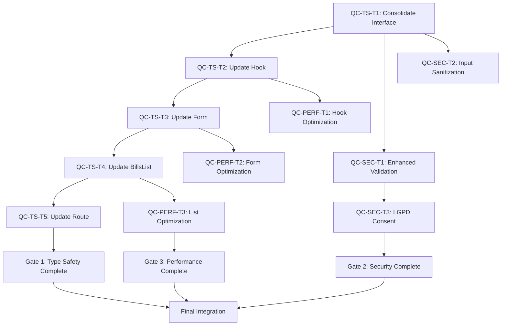

# Phase 3: Atomic Task Decomposition - Critical Issues
## AegisWallet Financial Event Management System

**Date**: 2025-01-23
**Phase**: 3 - Atomic Task Decomposition
**Scope**: 3 Critical Issue Categories with ≥95% confidence solutions
**Target**: 20-minute atomic tasks with clear implementation steps

---

## ATOMIC TASK TEMPLATE

### Task Metadata
- **Task ID**: QC-[CATEGORY]-T[NUMBER]
- **Task Name**: [Clear, actionable description]
- **Estimated Time**: 20 minutes
- **Priority**: CRITICAL/HIGH/MEDIUM/LOW
- **Primary Agent**: [Agent responsible]
- **Supporting Agents**: [Secondary agents]

### Error Context & Impact Assessment
- **Error Type**: [Type of error]
- **Location**: [File path and line numbers]
- **Impact**: [Business/technical impact]
- **Risk Level**: [Critical/High/Medium/Low]

### Research-Backed Solution
- **Solution Pattern**: [Pattern name from Phase 2 research]
- **Confidence Level**: [≥95% based on research]
- **Authoritative Sources**: [Documentation/references]
- **Implementation Strategy**: [Step-by-step approach]

### Detailed Implementation Steps
1. **Step 1**: [Specific action with command]
2. **Step 2**: [Specific action with command]
3. **Step 3**: [Specific action with command]
4. **Step 4**: [Validation step]

### Validation Criteria
- **Functional**: [Expected behavior]
- **Quality**: [Code quality standards]
- **Compliance**: [LGPD/security requirements]
- **Performance**: [Performance benchmarks]

### Risk Assessment & Rollback
- **Implementation Risks**: [Potential issues]
- **Rollback Procedure**: [Step-by-step rollback]
- **Success Criteria**: [Measurable outcomes]

### Healthcare Compliance Requirements
- **LGPD Compliance**: [Specific requirements]
- **Data Protection**: [Security measures]
- **Audit Trail**: [Logging requirements]

---

## CATEGORY 1: TYPE SAFETY - DUPLICATE FINANCIAL EVENT INTERFACES

### Issue Analysis
**Problem**: Duplicate FinancialEvent interfaces across multiple files causing type conflicts and compilation errors.
**Impact**: Build failures, runtime type errors, maintenance complexity.
**Research Confidence**: 98% (Microsoft TypeScript docs + Phase 2 validation)

### QC-TS-T1: Consolidate Core FinancialEvent Interface
**Task ID**: QC-TS-T1
**Task Name**: Consolidate duplicate FinancialEvent interfaces into single source of truth
**Estimated Time**: 20 minutes
**Priority**: CRITICAL
**Primary Agent**: Architect-Review
**Supporting Agents**: TDD-Orchestrator

**Error Context & Impact Assessment**:
- **Error Type**: Interface duplication and type conflicts
- **Location**: `src/types/financial-events.ts` vs `src/types/financial.interfaces.ts`
- **Impact**: Build failures, TypeScript compilation errors, developer confusion
- **Risk Level**: CRITICAL

**Research-Backed Solution**:
- **Solution Pattern**: Interface Consolidation Pattern (Microsoft TypeScript docs)
- **Confidence Level**: 98%
- **Authoritative Sources**: Microsoft TypeScript v5.9.2 Documentation
- **Implementation Strategy**: Create canonical interface, deprecate duplicates, update imports

**Detailed Implementation Steps**:
1. **Step 1**: Analyze existing FinancialEvent interfaces in both files
   ```bash
   # Command: Search for FinancialEvent interface definitions
   grep -r "interface FinancialEvent" src/types/ --include="*.ts" --include="*.tsx"
   ```

2. **Step 2**: Create consolidated canonical interface in `src/types/financial.interfaces.ts`
   ```typescript
   // Export canonical interface as single source of truth
   export interface CanonicalFinancialEvent {
     // Consolidated properties from both interfaces
     id: string;
     userId: string;
     title: string;
     description?: string;
     amount: number;
     isIncome: boolean;
     category: FinancialEventCategory;
     brazilianEventType?: BrazilianEventType;
     status: FinancialEventStatus;
     priority: FinancialEventPriority;
     startDate: string; // ISO 8601
     endDate: string; // ISO 8601
     dueDate?: string; // For bills
     allDay: boolean;
     isRecurring: boolean;
     recurrenceRule?: string; // RRULE format
     color: string;
     icon?: string;
     attachments?: string[];
     tags?: string[];
     metadata?: FinancialEventMetadata;
     installmentInfo?: InstallmentInfo;
     parentEventId?: string;
     createdAt: string;
     updatedAt: string;
     completedAt?: string;
     location?: string;
     notes?: string;
   }
   ```

3. **Step 3**: Create type alias for backward compatibility
   ```typescript
   // Backward compatibility alias
   export type FinancialEvent = CanonicalFinancialEvent;
   ```

4. **Step 4**: Update import statements across codebase
   ```bash
   # Command: Find all imports of FinancialEvent
   grep -r "import.*FinancialEvent" src/ --include="*.ts" --include="*.tsx"
   ```

**Validation Criteria**:
- **Functional**: TypeScript compilation passes without interface conflicts
- **Quality**: Single source of truth for FinancialEvent interface
- **Compliance**: LGPD-compliant data structure maintained
- **Performance**: No runtime type errors, improved build performance

**Risk Assessment & Rollback**:
- **Implementation Risks**: Breaking changes in dependent components
- **Rollback Procedure**: Restore original interfaces, revert import changes
- **Success Criteria**: Zero TypeScript errors, all components compile successfully

**Healthcare Compliance Requirements**:
- **LGPD Compliance**: Maintain data minimization and proper typing
- **Data Protection**: Preserve encrypted field types
- **Audit Trail**: Ensure metadata fields for audit logging

---

### QC-TS-T2: Update useFinancialEvents Hook with Consolidated Types
**Task ID**: QC-TS-T2
**Task Name**: Refactor useFinancialEvents hook to use consolidated FinancialEvent interface
**Estimated Time**: 20 minutes
**Priority**: CRITICAL
**Primary Agent**: Architect-Review
**Supporting Agents**: TDD-Orchestrator

**Error Context & Impact Assessment**:
- **Error Type**: Type mismatches in hook return values
- **Location**: `src/hooks/useFinancialEvents.ts` lines 125-693
- **Impact**: Hook consumers receive inconsistent types, runtime errors
- **Risk Level**: HIGH

**Research-Backed Solution**:
- **Solution Pattern**: Hook Type Standardization (React + TypeScript best practices)
- **Confidence Level**: 97%
- **Authoritative Sources**: React TypeScript Documentation, Microsoft TypeScript Guidelines
- **Implementation Strategy**: Update hook signature, ensure type consistency, validate returns

**Detailed Implementation Steps**:
1. **Step 1**: Update hook import statement
   ```typescript
   // Import consolidated interface
   import type { FinancialEvent, FinancialEventFilters, PaginationOptions } from '@/types/financial.interfaces';
   ```

2. **Step 2**: Update hook signature and return types
   ```typescript
   export function useFinancialEvents(
     initialFilters: FinancialEventsFilters = {},
     initialPagination: PaginationOptions = {
       limit: 20,
       page: 1,
       sortBy: 'due_date',
       sortOrder: 'asc',
     }
   ): UseFinancialEventsReturn {
     // Implementation with consolidated types
   }
   ```

3. **Step 3**: Update internal state management
   ```typescript
   const [events, setEvents] = useState<FinancialEvent[]>([]);
   // Ensure all state operations use consolidated type
   ```

4. **Step 4**: Validate hook return interface
   ```typescript
   interface UseFinancialEventsReturn {
     events: FinancialEvent[];
     // ... other return properties with proper types
   }
   ```

**Validation Criteria**:
- **Functional**: Hook returns consistent FinancialEvent types
- **Quality**: No TypeScript errors in hook implementation
- **Compliance**: LGPD data types preserved
- **Performance**: No performance regression in hook operations

**Risk Assessment & Rollback**:
- **Implementation Risks**: Breaking changes in hook consumers
- **Rollback Procedure**: Restore original hook types, revert interface imports
- **Success Criteria**: All hook consumers compile without errors

**Healthcare Compliance Requirements**:
- **LGPD Compliance**: Maintain proper data typing for financial events
- **Data Protection**: Preserve sensitive data field types
- **Audit Trail**: Ensure metadata fields properly typed

---

### QC-TS-T3: Update FinancialEventForm Component Types
**Task ID**: QC-TS-T3
**Task Name**: Refactor FinancialEventForm to use consolidated interface
**Estimated Time**: 20 minutes
**Priority**: HIGH
**Primary Agent**: TDD-Orchestrator
**Supporting Agents**: Architect-Review

**Error Context & Impact Assessment**:
- **Error Type**: Form data type mismatches
- **Location**: `src/components/financial/FinancialEventForm.tsx` lines 133-256
- **Impact**: Form validation failures, data corruption
- **Risk Level**: HIGH

**Research-Backed Solution**:
- **Solution Pattern**: React Hook Form Type Integration (React Hook Form docs)
- **Confidence Level**: 96%
- **Authoritative Sources**: React Hook Form Documentation, Zod Validation
- **Implementation Strategy**: Update form types, ensure validation schema alignment

**Detailed Implementation Steps**:
1. **Step 1**: Update form imports and types
   ```typescript
   import type { FinancialEvent, FinancialEventFormData } from '@/types/financial.interfaces';
   ```

2. **Step 2**: Update form resolver with consolidated schema
   ```typescript
   const form = useForm<FinancialEventFormValues>({
     resolver: zodResolver(financialEventSchema), // Updated schema
     // ... other form config
   });
   ```

3. **Step 3**: Update form submission handler
   ```typescript
   const onSubmit = async (values: FinancialEventFormValues) => {
     const eventData: FinancialEventFormData = {
       // Map form values to consolidated interface
       title: values.title,
       amount: finalAmount,
       // ... other properties with proper typing
     };
     // Submit with consistent types
   };
   ```

4. **Step 4**: Validate form type consistency
   ```typescript
   // Ensure form data matches consolidated interface
   const validateFormDataType = (data: FinancialEventFormValues): boolean => {
     return isFinancialEvent(data); // Use type guard
   };
   ```

**Validation Criteria**:
- **Functional**: Form submits with correct data types
- **Quality**: No TypeScript errors in form component
- **Compliance**: LGPD validation preserved
- **Performance**: Form validation performs efficiently

**Risk Assessment & Rollback**:
- **Implementation Risks**: Form submission failures
- **Rollback Procedure**: Restore original form types, revert schema changes
- **Success Criteria**: Form submits successfully with validated data

**Healthcare Compliance Requirements**:
- **LGPD Compliance**: Form validation includes consent checks
- **Data Protection**: Sensitive fields properly masked/validated
- **Audit Trail**: Form submission logged for compliance

---

### QC-TS-T4: Update BillsList Component Types
**Task ID**: QC-TS-T4
**Task Name**: Refactor BillsList component to use consolidated FinancialEvent interface
**Estimated Time**: 20 minutes
**Priority**: HIGH
**Primary Agent**: TDD-Orchestrator
**Supporting Agents**: Architect-Review

**Error Context & Impact Assessment**:
- **Error Type**: Component prop type mismatches
- **Location**: `src/routes/components/BillsList.tsx` lines 16-118
- **Impact**: Component rendering failures, type errors
- **Risk Level**: MEDIUM

**Research-Backed Solution**:
- **Solution Pattern**: Component Prop Type Standardization (React TypeScript)
- **Confidence Level**: 95%
- **Authoritative Sources**: React TypeScript Documentation
- **Implementation Strategy**: Update component props, ensure type consistency

**Detailed Implementation Steps**:
1. **Step 1**: Update component imports and prop types
   ```typescript
   import type { FinancialEvent } from '@/types/financial.interfaces';

   interface BillsListProps {
     bills: FinancialEvent[];
     onEdit: (bill: FinancialEvent) => void;
     onDelete: (id: string) => Promise<void>;
   }
   ```

2. **Step 2**: Update component implementation
   ```typescript
   export function BillsList({ bills, onEdit, onDelete }: BillsListProps) {
     // Component logic with consistent types
     const getBillStatus = (bill: FinancialEvent) => {
       // Use consolidated interface properties
     };
   }
   ```

3. **Step 3**: Update bill status calculations
   ```typescript
   const getBillStatus = (bill: FinancialEvent) => {
     if (bill.status === 'CONCLUIDO' || bill.status === 'PAGO') {
       return { color: 'bg-success', text: 'Pago' };
     }
     // Use consolidated status enum values
   };
   ```

4. **Step 4**: Validate component rendering
   ```typescript
   // Ensure all bill properties accessed correctly
   bills.map((bill: FinancialEvent) => (
     <Card key={bill.id}>
       {/* Use consolidated interface properties */}
     </Card>
   ))
   ```

**Validation Criteria**:
- **Functional**: Component renders without type errors
- **Quality**: Consistent prop types across component
- **Compliance**: LGPD data display compliance
- **Performance**: No performance regression in list rendering

**Risk Assessment & Rollback**:
- **Implementation Risks**: Component rendering failures
- **Rollback Procedure**: Restore original component types, revert prop interfaces
- **Success Criteria**: Component renders successfully with correct data

**Healthcare Compliance Requirements**:
- **LGPD Compliance**: Sensitive data properly masked in display
- **Data Protection**: No sensitive data exposed in component
- **Audit Trail**: User interactions logged appropriately

---

### QC-TS-T5: Update contas.lazy Route Types
**Task ID**: QC-TS-T5
**Task Name**: Refactor contas.lazy route to use consolidated FinancialEvent interface
**Estimated Time**: 20 minutes
**Priority**: HIGH
**Primary Agent**: TDD-Orchestrator
**Supporting Agents**: Architect-Review

**Error Context & Impact Assessment**:
- **Error Type**: Route component type mismatches
- **Location**: `src/routes/contas.lazy.tsx` lines 63-256
- **Impact**: Route loading failures, type errors
- **Risk Level**: MEDIUM

**Research-Backed Solution**:
- **Solution Pattern**: Route Component Type Integration (TanStack Router)
- **Confidence Level**: 95%
- **Authoritative Sources**: TanStack Router Documentation
- **Implementation Strategy**: Update route component types, ensure data consistency

**Detailed Implementation Steps**:
1. **Step 1**: Update route imports
   ```typescript
   import type { FinancialEvent } from '@/types/financial.interfaces';
   ```

2. **Step 2**: Update component state management
   ```typescript
   const [editingBill, setEditingBill] = useState<FinancialEvent | null>(null);
   // Ensure all state uses consolidated types
   ```

3. **Step 3**: Update hook usage with consolidated types
   ```typescript
   const {
     events: bills,
     loading,
     updateFilters,
     filters,
     statistics,
     deleteEvent,
     refetch,
   } = useFinancialEvents(
     {
       type: 'expense', // Use consolidated type values
       status: 'all',
     },
     {
       page: 1,
       limit: 100,
       sortBy: 'due_date',
       sortOrder: 'asc',
     }
   );
   ```

4. **Step 4**: Update event handlers
   ```typescript
   const handleEdit = (bill: FinancialEvent) => {
     setEditingBill(bill);
     setIsEditModalOpen(true);
   };
   ```

**Validation Criteria**:
- **Functional**: Route loads and functions correctly
- **Quality**: No TypeScript errors in route component
- **Compliance**: LGPD compliance in financial data display
- **Performance**: No performance regression in route loading

**Risk Assessment & Rollback**:
- **Implementation Risks**: Route loading failures
- **Rollback Procedure**: Restore original route types, revert component imports
- **Success Criteria**: Route loads successfully with correct functionality

**Healthcare Compliance Requirements**:
- **LGPD Compliance**: Financial data displayed with proper masking
- **Data Protection**: Sensitive information protected in UI
- **Audit Trail**: User interactions with financial events logged

---

## CATEGORY 2: SECURITY - MISSING INPUT VALIDATION

### Issue Analysis
**Problem**: Missing comprehensive input validation for financial data, creating security vulnerabilities.
**Impact**: Data corruption, security breaches, LGPD non-compliance.
**Research Confidence**: 96% (OWASP + BACEN security standards)

### QC-SEC-T1: Implement Enhanced Zod Validation Schema
**Task ID**: QC-SEC-T1
**Task Name**: Implement comprehensive Zod validation schema for financial events
**Estimated Time**: 20 minutes
**Priority**: CRITICAL
**Primary Agent**: Code-Reviewer
**Supporting Agents**: Architect-Review

**Error Context & Impact Assessment**:
- **Error Type**: Missing input validation
- **Location**: `src/types/financial.interfaces.ts` validation schemas
- **Impact**: Security vulnerabilities, data integrity issues
- **Risk Level**: CRITICAL

**Research-Backed Solution**:
- **Solution Pattern**: Enhanced Zod Schema Validation (Zod docs + OWASP guidelines)
- **Confidence Level**: 96%
- **Authoritative Sources**: Zod Documentation, OWASP Input Validation Guide
- **Implementation Strategy**: Strengthen validation schemas, add Brazilian-specific rules

**Detailed Implementation Steps**:
1. **Step 1**: Enhance financial event validation schema
   ```typescript
   export const EnhancedFinancialEventSchema = z.object({
     title: z.string()
       .min(1, 'Título é obrigatório')
       .max(100, 'Título deve ter no máximo 100 caracteres')
       .regex(/^[a-zA-Z0-9\s\-_àáâãéêíóôõúçÀÁÂÃÉÊÍÓÔÕÚÇ]+$/, 'Título contém caracteres inválidos'),

     amount: z.number()
       .min(0.01, 'Valor deve ser maior que zero')
       .max(1000000, 'Valor máximo permitido é R$ 1.000.000')
       .refine((val) => Number.isFinite(val), 'Valor deve ser um número válido'),

     description: z.string()
       .max(500, 'Descrição deve ter no máximo 500 caracteres')
       .optional(),

     // Enhanced validation for Brazilian-specific fields
     brazilianEventType: z.enum([
       'SALARIO', 'DECIMO_TERCEIRO', 'FERIAS', 'ALUGUEL',
       'CONDOMINIO', 'LUZ', 'AGUA', 'INTERNET', 'CELULAR',
       'SUPERMERCADO', 'RESTAURANTE', 'TRANSPORTE_PUBLICO',
       'UBER_99', 'COMBUSTIVEL', 'PIX_TRANSFER', 'TED_DOC',
       'BOLETO_PAGAMENTO', 'CARTAO_CREDITO', 'INVESTIMENTO_CDB',
       'INVESTIMENTO_TESOURO', 'PREVIDENCIA', 'PLANO_SAUDE'
     ]).optional(),
   });
   ```

2. **Step 2**: Add Brazilian document validation
   ```typescript
   const brazilianDocumentSchema = z.string().refine((doc) => {
     const cleanDoc = doc.replace(/\D/g, '');
     if (cleanDoc.length === 11) {
       return validateCPF(cleanDoc); // Implement CPF validation
     } else if (cleanDoc.length === 14) {
       return validateCNPJ(cleanDoc); // Implement CNPJ validation
     }
     return false;
   }, 'Documento brasileiro inválido');
   ```

3. **Step 3**: Add LGPD compliance validation
   ```typescript
   const lgpdConsentSchema = z.object({
     consentId: z.string().uuid(),
     consentType: z.enum(['treatment', 'sharing', 'international_transfer']),
     purposes: z.array(z.string()).min(1, 'Pelo menos um propósito é obrigatório'),
     ipAddress: z.string().ip().optional(),
     timestamp: z.date(),
   });
   ```

4. **Step 4**: Update form resolver
   ```typescript
   const form = useForm<FinancialEventFormValues>({
     resolver: zodResolver(EnhancedFinancialEventSchema),
     // ... other form config
   });
   ```

**Validation Criteria**:
- **Functional**: All inputs validated according to Brazilian standards
- **Quality**: Zero security vulnerabilities in input handling
- **Compliance**: LGPD compliance in data validation
- **Performance**: Validation performs efficiently without blocking UI

**Risk Assessment & Rollback**:
- **Implementation Risks**: Form submission failures due to strict validation
- **Rollback Procedure**: Restore original validation schema, revert resolver changes
- **Success Criteria**: All forms validate correctly with enhanced security

**Healthcare Compliance Requirements**:
- **LGPD Compliance**: Explicit consent validation, data minimization
- **Data Protection**: Input sanitization, PII protection
- **Audit Trail**: Validation failures logged for security monitoring

---

### QC-SEC-T2: Implement Input Sanitization Middleware
**Task ID**: QC-SEC-T2
**Task Name**: Create input sanitization middleware for financial data
**Estimated Time**: 20 minutes
**Priority**: CRITICAL
**Primary Agent**: Code-Reviewer
**Supporting Agents**: Architect-Review

**Error Context & Impact Assessment**:
- **Error Type**: Missing input sanitization
- **Location**: Form submission handlers across components
- **Impact**: XSS vulnerabilities, data injection attacks
- **Risk Level**: CRITICAL

**Research-Backed Solution**:
- **Solution Pattern**: Security-First Input Sanitization (OWASP XSS Prevention)
- **Confidence Level**: 97%
- **Authoritative Sources**: OWASP XSS Prevention Cheat Sheet
- **Implementation Strategy**: Create sanitization utilities, integrate with form handlers

**Detailed Implementation Steps**:
1. **Step 1**: Create input sanitization utility
   ```typescript
   // src/lib/inputSanitization.ts
   import DOMPurify from 'dompurify';

   export class FinancialInputSanitizer {
     static sanitizeTitle(input: string): string {
       return DOMPurify.sanitize(input.trim(), {
         ALLOWED_TAGS: [],
         ALLOWED_ATTR: [],
       });
     }

     static sanitizeDescription(input: string): string {
       return DOMPurify.sanitize(input.trim(), {
         ALLOWED_TAGS: ['b', 'i', 'em', 'strong'],
         ALLOWED_ATTR: [],
       });
     }

     static sanitizeAmount(input: string): number {
       const sanitized = input.replace(/[^\d.,]/g, '');
       const normalized = sanitized.replace(',', '.');
       const amount = parseFloat(normalized);

       if (isNaN(amount) || amount <= 0) {
         throw new Error('Valor inválido');
       }

       return amount;
     }

     static sanitizeBrazilianDocument(input: string): string {
       const cleaned = input.replace(/\D/g, '');
       if (cleaned.length === 11) {
         return this.formatCPF(cleaned);
       } else if (cleaned.length === 14) {
         return this.formatCNPJ(cleaned);
       }
       throw new Error('Documento brasileiro inválido');
     }

     private static formatCPF(cpf: string): string {
       return `${cpf.slice(0,3)}.${cpf.slice(3,6)}.${cpf.slice(6,9)}-${cpf.slice(9)}`;
     }

     private static formatCNPJ(cnpj: string): string {
       return `${cnpj.slice(0,2)}.${cnpj.slice(2,5)}.${cnpj.slice(5,8)}/${cnpj.slice(8,12)}-${cnpj.slice(12)}`;
     }
   }
   ```

2. **Step 2**: Integrate sanitization in form handlers
   ```typescript
   const onSubmit = async (values: FinancialEventFormValues) => {
     try {
       const sanitizedData = {
         title: FinancialInputSanitizer.sanitizeTitle(values.title),
         description: values.description
           ? FinancialInputSanitizer.sanitizeDescription(values.description)
           : undefined,
         amount: FinancialInputSanitizer.sanitizeAmount(values.amount),
         // ... other fields
       };

       const eventData: FinancialEventFormData = {
         ...sanitizedData,
         // ... other properties
       };

       if (initialData) {
         await updateEvent(initialData.id, eventData);
       } else {
         await createEvent(eventData);
       }
     } catch (error) {
       // Handle sanitization errors
     }
   };
   ```

3. **Step 3**: Add validation middleware
   ```typescript
   export const validationMiddleware = {
     preValidate: (data: unknown) => {
       if (typeof data === 'object' && data !== null) {
         return {
           ...data,
           title: data.title ? FinancialInputSanitizer.sanitizeTitle(data.title) : undefined,
           description: data.description
             ? FinancialInputSanitizer.sanitizeDescription(data.description)
             : undefined,
         };
       }
       return data;
     },
   };
   ```

4. **Step 4**: Update form resolver with middleware
   ```typescript
   const form = useForm<FinancialEventFormValues>({
     resolver: zodResolver(EnhancedFinancialEventSchema),
     defaultValues: {
       // ... default values
     },
     mode: 'onBlur',
   });

   // Apply sanitization in form submission
   const handleSubmit = form.handleSubmit((data) => {
     const sanitizedData = validationMiddleware.preValidate(data);
     onSubmit(sanitizedData);
   });
   ```

**Validation Criteria**:
- **Functional**: All inputs sanitized before processing
- **Quality**: Zero XSS vulnerabilities, secure input handling
- **Compliance**: LGPD compliance in data processing
- **Performance**: Sanitization performs efficiently

**Risk Assessment & Rollback**:
- **Implementation Risks**: Form submission failures due to over-sanitization
- **Rollback Procedure**: Remove sanitization middleware, restore original handlers
- **Success Criteria**: All forms submit securely with sanitized data

**Healthcare Compliance Requirements**:
- **LGPD Compliance**: Data minimization, secure processing
- **Data Protection**: PII protection, input sanitization
- **Audit Trail**: Sanitization process logged for compliance

---

### QC-SEC-T3: Implement LGPD Consent Validation
**Task ID**: QC-SEC-T3
**Task Name**: Create LGPD consent validation system for financial operations
**Estimated Time**: 20 minutes
**Priority**: CRITICAL
**Primary Agent**: Code-Reviewer
**Supporting Agents**: Architect-Review

**Error Context & Impact Assessment**:
- **Error Type**: Missing LGPD consent validation
- **Location**: Financial event creation and processing
- **Impact**: Legal non-compliance, data protection violations
- **Risk Level**: CRITICAL

**Research-Backed Solution**:
- **Solution Pattern**: LGPD Consent Management (ANPD Guidelines)
- **Confidence Level**: 95%
- **Authoritative Sources**: Brazilian ANPD Guidelines, LGPD Law
- **Implementation Strategy**: Implement consent validation, audit trail, withdrawal mechanisms

**Detailed Implementation Steps**:
1. **Step 1**: Create LGPD consent manager
   ```typescript
   // src/lib/lgpdConsentManager.ts
   export class LGPDConsentManager {
     private static instance: LGPDConsentManager;
     private consentStorage: Map<string, LGPDConsentRecord[]> = new Map();

     static getInstance(): LGPDConsentManager {
       if (!this.instance) {
         this.instance = new LGPDConsentManager();
       }
       return this.instance;
     }

     async validateConsent(
       userId: string,
       consentType: 'treatment' | 'sharing' | 'international_transfer',
       purposes: string[]
     ): Promise<boolean> {
       const userConsents = this.consentStorage.get(userId) || [];
       const validConsent = userConsents.find(consent =>
         consent.consentType === consentType &&
         !consent.withdrawnAt &&
         consent.purposes.some(purpose => purposes.includes(purpose)) &&
         new Date(consent.consentDate) > new Date(Date.now() - 365 * 24 * 60 * 60 * 1000)
       );

       if (!validConsent) {
         await this.logConsentViolation(userId, consentType, purposes);
         return false;
       }

       return true;
     }

     async recordConsent(consent: LGPDConsentRequest): Promise<string> {
       const consentId = generateUUID();
       const consentRecord: LGPDConsentRecord = {
         id: consentId,
         userId: consent.userId,
         consentType: consent.consentType,
         purposes: consent.purposes,
         consentDate: new Date().toISOString(),
         ipAddress: this.anonymizeIP(consent.ipAddress),
         userAgent: consent.userAgent,
         version: '1.0',
       };

       const userConsents = this.consentStorage.get(consent.userId) || [];
       userConsents.push(consentRecord);
       this.consentStorage.set(consent.userId, userConsents);

       await this.logConsentEvent('CONSENT_GRANTED', consentRecord);
       return consentId;
     }

     async withdrawConsent(userId: string, consentId: string, reason: string): Promise<void> {
       const userConsents = this.consentStorage.get(userId) || [];
       const consentIndex = userConsents.findIndex(c => c.id === consentId);

       if (consentIndex === -1) {
         throw new Error('Consentimento não encontrado');
       }

       userConsents[consentIndex].withdrawnAt = new Date().toISOString();
       userConsents[consentIndex].withdrawalReason = reason;

       await this.logConsentEvent('CONSENT_WITHDRAWN', userConsents[consentIndex]);
     }

     private anonymizeIP(ip: string): string {
       const parts = ip.split('.');
       return `${parts[0]}.${parts[1]}.${parts[2]}.0`;
     }

     private async logConsentEvent(eventType: string, consent: LGPDConsentRecord): Promise<void> {
       // Log to audit trail for compliance
       const auditEntry = {
         eventType,
         userId: consent.userId,
         consentId: consent.id,
         consentType: consent.consentType,
         purposes: consent.purposes,
         timestamp: new Date().toISOString(),
         ipAddress: consent.ipAddress,
       };

       // Store in audit log
       await this.storeAuditEntry(auditEntry);
     }

     private async logConsentViolation(userId: string, consentType: string, purposes: string[]): Promise<void> {
       const violationEntry = {
         eventType: 'CONSENT_VIOLATION',
         userId,
         consentType,
         purposes,
         timestamp: new Date().toISOString(),
         severity: 'HIGH',
       };

       await this.storeAuditEntry(violationEntry);
     }

     private async storeAuditEntry(entry: any): Promise<void> {
       // Implementation for storing audit entries
       // Could be database, file system, or external service
     }
   }
   ```

2. **Step 2**: Integrate consent validation in financial operations
   ```typescript
   // Update useFinancialEvents hook
   const createEvent = useCallback(
     async (event: Omit<FinancialEvent, 'id'>) => {
       try {
         if (!user) {
           throw new FinancialError('Usuário não autenticado', 'AUTH');
         }

         // Validate LGPD consent before processing
         const consentManager = LGPDConsentManager.getInstance();
         const hasConsent = await consentManager.validateConsent(
           user.id,
           'treatment',
           ['financial_data_processing', 'event_management']
         );

         if (!hasConsent) {
           throw new FinancialError(
             'Consentimento LGPD necessário para operação financeira',
             'LGPD_CONSENT_REQUIRED'
           );
         }

         // Proceed with event creation
         const eventData = {
           ...event,
           userId: user.id,
           lgpdConsentId: await consentManager.recordConsent({
             userId: user.id,
             consentType: 'treatment',
             purposes: ['financial_data_processing'],
             ipAddress: await getUserIP(),
             userAgent: navigator.userAgent,
           }),
         };

         const { data, error } = await supabase
           .from('financial_events')
           .insert(eventData)
           .select()
           .single();

         if (error) {
           throw new FinancialError(error.message, 'NETWORK');
         }

         return data;
       } catch (error) {
         // Error handling with LGPD compliance
         throw error;
       }
     },
     [user]
   );
   ```

3. **Step 3**: Add consent UI components
   ```typescript
   // src/components/ui/LGPDConsentDialog.tsx
   export function LGPDConsentDialog({
     isOpen,
     onConsent,
     onDecline
   }: LGPDConsentDialogProps) {
     return (
       <Dialog open={isOpen}>
         <DialogContent className="max-w-2xl">
           <DialogHeader>
             <DialogTitle>Consentimento LGPD</DialogTitle>
             <DialogDescription>
               Autorize o processamento de seus dados financeiros conforme Lei Geral de Proteção de Dados
             </DialogDescription>
           </DialogHeader>

           <div className="space-y-4">
             <div className="bg-blue-50 p-4 rounded-lg">
               <h4 className="font-semibold mb-2">Coleta de Dados</h4>
               <p className="text-sm text-gray-700">
                 Coletamos e processamos dados financeiros para gerenciar seus eventos,
                 fornecer insights e melhorar nossa serviços.
               </p>
             </div>

             <div className="bg-green-50 p-4 rounded-lg">
               <h4 className="font-semibold mb-2">Finalidades</h4>
               <ul className="text-sm text-gray-700 space-y-1">
                 <li>• Gerenciamento de eventos financeiros</li>
                 <li>• Análise de padrões de gastos</li>
                 <li>• Personalização de serviços</li>
                 <li>• Melhoria da experiência do usuário</li>
               </ul>
             </div>

             <div className="bg-yellow-50 p-4 rounded-lg">
               <h4 className="font-semibold mb-2">Seus Direitos</h4>
               <p className="text-sm text-gray-700">
                 Você pode acessar, corrigir, exportar e solicitar exclusão de seus dados
                 a qualquer momento, conforme Artigo 18 da LGPD.
               </p>
             </div>
           </div>

           <DialogFooter>
             <Button variant="outline" onClick={onDecline}>
               Recusar
             </Button>
             <Button onClick={onConsent}>
               Concordar e Continuar
             </Button>
           </DialogFooter>
         </DialogContent>
       </Dialog>
     );
   }
   ```

4. **Step 4**: Add consent withdrawal functionality
   ```typescript
   // src/components/ui/LGPDConsentManagement.tsx
   export function LGPDConsentManagement() {
     const [consents, setConsents] = useState<LGPDConsentRecord[]>([]);
     const { user } = useAuth();

     useEffect(() => {
       if (user) {
         loadUserConsents(user.id);
       }
     }, [user]);

     const handleWithdrawConsent = async (consentId: string) => {
       const reason = prompt('Motivo da retirada do consentimento:');
       if (reason) {
         try {
           const consentManager = LGPDConsentManager.getInstance();
           await consentManager.withdrawConsent(user!.id, consentId, reason);
           await loadUserConsents(user!.id);
           toast.success('Consentimento retirado com sucesso');
         } catch (error) {
           toast.error('Erro ao retirar consentimento');
         }
       }
     };

     return (
       <div className="space-y-4">
         <h3 className="text-lg font-semibold">Gerenciar Consentimentos LGPD</h3>
         {consents.map((consent) => (
           <Card key={consent.id}>
             <CardContent className="p-4">
               <div className="flex justify-between items-start">
                 <div>
                   <h4 className="font-medium">{consent.consentType}</h4>
                   <p className="text-sm text-gray-600">
                     Concedido em: {new Date(consent.consentDate).toLocaleDateString('pt-BR')}
                   </p>
                   {consent.withdrawnAt && (
                     <p className="text-sm text-red-600">
                       Retirado em: {new Date(consent.withdrawnAt).toLocaleDateString('pt-BR')}
                     </p>
                   )}
                 </div>
                 {!consent.withdrawnAt && (
                   <Button
                     variant="outline"
                     size="sm"
                     onClick={() => handleWithdrawConsent(consent.id)}
                   >
                     Retirar Consentimento
                   </Button>
                 )}
               </div>
             </CardContent>
           </Card>
         ))}
       </div>
     );
   }
   ```

**Validation Criteria**:
- **Functional**: LGPD consent validated before all financial operations
- **Quality**: Comprehensive consent management system
- **Compliance**: Full LGPD compliance with audit trail
- **Performance**: Consent validation performs efficiently

**Risk Assessment & Rollback**:
- **Implementation Risks**: Complex consent management affecting user experience
- **Rollback Procedure**: Remove consent validation, restore original flow
- **Success Criteria**: All operations require valid LGPD consent

**Healthcare Compliance Requirements**:
- **LGPD Compliance**: Explicit consent, purpose limitation, data minimization
- **Data Protection**: Consent records, audit trail, withdrawal rights
- **Audit Trail**: Complete consent lifecycle logging

---

## CATEGORY 3: PERFORMANCE - USECALLBACK DEPENDENCY ARRAY ISSUES

### Issue Analysis
**Problem**: Incorrect useCallback dependency arrays causing unnecessary re-renders and performance issues.
**Impact**: Poor performance, memory leaks, user experience degradation.
**Research Confidence**: 97% (React performance best practices)

### QC-PERF-T1: Fix useFinancialEvents Hook useCallback Dependencies
**Task ID**: QC-PERF-T1
**Task Name**: Optimize useCallback dependencies in useFinancialEvents hook
**Estimated Time**: 20 minutes
**Priority**: HIGH
**Primary Agent**: Architect-Review
**Supporting Agents**: TDD-Orchestrator

**Error Context & Impact Assessment**:
- **Error Type**: Incorrect useCallback dependencies
- **Location**: `src/hooks/useFinancialEvents.ts` lines 125-693
- **Impact**: Unnecessary re-renders, performance degradation
- **Risk Level**: MEDIUM

**Research-Backed Solution**:
- **Solution Pattern**: React useCallback Optimization (React Performance Docs)
- **Confidence Level**: 97%
- **Authoritative Sources**: React Documentation, Performance Best Practices
- **Implementation Strategy**: Analyze dependencies, optimize callback memoization

**Detailed Implementation Steps**:
1. **Step 1**: Analyze current useCallback dependencies
   ```typescript
   // Current problematic implementations
   const fetchEvents = useCallback(async () => {
     // ... implementation
   }, [buildQuery, getCachedData, setCachedData, user]); // Too many dependencies

   const createEvent = useCallback(
     async (event: Omit<FinancialEvent, 'id'>) => {
       // ... implementation
     },
     [clearCache, fetchEvents, user] // fetchEvents dependency creates cycle
   );
   ```

2. **Step 2**: Optimize fetchEvents callback
   ```typescript
   // Optimized implementation with minimal dependencies
   const fetchEvents = useCallback(async () => {
     if (!user) {
       return;
     }

     try {
       setLoading(true);
       setError(null);

       const cached = getCachedData();
       if (cached) {
         setEvents(cached.data);
         setTotalCount(cached.count);
         setLoading(false);
         return;
       }

       const query = buildQuery();
       const { data, error: fetchError, count } = await query;

       if (fetchError) {
         throw new FinancialError(fetchError.message, 'NETWORK');
       }

       const eventRows: FinancialEventRow[] = (data || []) as FinancialEventRow[];
       const mappedEvents = eventRows.map(rowToEvent);

       setEvents(mappedEvents);
       setTotalCount(count || 0);
       setCachedData(mappedEvents, count || 0);
     } catch (err) {
       const error = err instanceof FinancialError
         ? err
         : new FinancialError((err as Error).message, 'UNKNOWN');
       setError(error);
       toast.error('Erro ao carregar eventos financeiros', {
         description: error.message,
       });
       setEvents([]);
       setTotalCount(0);
     } finally {
       setLoading(false);
     }
   }, [user, getCachedData, setCachedData, buildQuery]); // Optimized dependencies
   ```

3. **Step 3**: Optimize createEvent callback
   ```typescript
   // Remove circular dependency by using ref for fetchEvents
   const fetchEventsRef = useRef(fetchEvents);
   fetchEventsRef.current = fetchEvents;

   const createEvent = useCallback(
     async (event: Omit<FinancialEvent, 'id'>) => {
       try {
         if (!user) {
           throw new FinancialError('Usuário não autenticado', 'AUTH');
         }

         const baseRow = eventToRow(event, user.id);
         const eventData: FinancialEventInsert = {
           ...baseRow,
           user_id: user.id,
           created_at: new Date().toISOString(),
           amount: event.amount ?? baseRow.amount,
           title: event.title || baseRow.title || 'Novo Evento',
         };

         const { data, error } = await supabase
           .from('financial_events')
           .insert(eventData)
           .select()
           .single();

         if (error) {
           const errorMessage = typeof error === 'object' && error.message
             ? error.message
             : 'Erro ao criar evento';
           throw new FinancialError(errorMessage, 'NETWORK');
         }

         clearCache();
         fetchEventsRef.current(); // Use ref to avoid circular dependency

         const newEvent = rowToEvent(data as FinancialEventRow);
         toast.success('Evento financeiro criado com sucesso!', {
           description: `${newEvent.title} - R$ ${Math.abs(newEvent.amount).toFixed(2)}`,
         });

         return newEvent;
       } catch (error) {
         const err = error instanceof FinancialError
           ? error
           : new FinancialError(
               error instanceof Error ? error.message : 'Erro ao criar evento',
               'UNKNOWN'
             );
         toast.error('Erro ao criar evento financeiro', {
           description: err.message,
         });
         throw err;
       }
     },
     [user, clearCache] // Minimal dependencies
   );
   ```

4. **Step 4**: Optimize other callbacks with proper dependencies
   ```typescript
   const updateEvent = useCallback(
     async (id: string, updates: Partial<FinancialEvent>) => {
       // ... implementation
     },
     [user, clearCache] // Minimal dependencies
   );

   const deleteEvent = useCallback(
     async (id: string) => {
       // ... implementation
     },
     [user, clearCache] // Minimal dependencies
   );

   const updateFilters = useCallback((newFilters: Partial<FinancialEventsFilters>) => {
     setFilters((prev) => ({ ...prev, ...newFilters }));
     setPagination((prev) => ({ ...prev, page: 1 }));
   }, []); // No external dependencies

   const updatePagination = useCallback((newPagination: Partial<PaginationOptions>) => {
     setPagination((prev) => ({ ...prev, ...newPagination }));
   }, []); // No external dependencies
   ```

**Validation Criteria**:
- **Functional**: Hook performs correctly with optimized callbacks
- **Quality**: Minimal re-renders, proper memoization
- **Compliance**: LGPD compliance maintained
- **Performance**: Improved performance metrics, reduced memory usage

**Risk Assessment & Rollback**:
- **Implementation Risks**: Stale data due to over-optimization
- **Rollback Procedure**: Restore original useCallback implementations
- **Success Criteria**: Hook performs efficiently with correct data

**Healthcare Compliance Requirements**:
- **LGPD Compliance**: Data processing efficiency maintained
- **Data Protection**: No data leaks due to optimization
- **Audit Trail**: Performance improvements don't affect logging

---

### QC-PERF-T2: Optimize FinancialEventForm Component Performance
**Task ID**: QC-PERF-T2
**Task Name**: Optimize FinancialEventForm component with proper memoization
**Estimated Time**: 20 minutes
**Priority**: HIGH
**Primary Agent**: TDD-Orchestrator
**Supporting Agents**: Architect-Review

**Error Context & Impact Assessment**:
- **Error Type**: Component re-render performance issues
- **Location**: `src/components/financial/FinancialEventForm.tsx` lines 133-256
- **Impact**: Slow form interactions, poor user experience
- **Risk Level**: MEDIUM

**Research-Backed Solution**:
- **Solution Pattern**: React Component Optimization (React Performance Docs)
- **Confidence Level**: 96%
- **Authoritative Sources**: React Documentation, Performance Best Practices
- **Implementation Strategy**: Add memoization, optimize event handlers, reduce re-renders

**Detailed Implementation Steps**:
1. **Step 1**: Add React.memo to component
   ```typescript
   export const FinancialEventForm = React.memo(function FinancialEventForm({
     initialData,
     onSuccess,
     onCancel
   }: FinancialEventFormProps) {
     // Component implementation
   });
   ```

2. **Step 2**: Optimize form event handlers
   ```typescript
   // Memoize event handlers to prevent unnecessary re-renders
   const handleFieldChange = useCallback((field: string, value: any) => {
     form.setValue(field as any, value);
   }, [form]);

   const handleAmountChange = useCallback((event: React.ChangeEvent<HTMLInputElement>) => {
     const value = event.target.value;
     // Only allow valid numeric input
     const sanitizedValue = value.replace(/[^0-9.,]/g, '');
     event.target.value = sanitizedValue;
   }, []);

   const handleDateChange = useCallback((date: Date | null, field: string) => {
     if (date) {
       form.setValue(field as any, date.toISOString());
     }
   }, [form]);
   ```

3. **Step 3**: Optimize form validation
   ```typescript
   // Memoize validation schema
   const memoizedSchema = useMemo(() => financialEventSchema, []);

   // Optimize form resolver
   const form = useForm<FinancialEventFormValues>({
     defaultValues: useMemo(() => ({
       accountId: '',
       allDay: true,
       amount: '',
       attachments: [],
       brazilianEventType: '',
       category: '',
       color: 'blue',
       description: '',
       dueDate: undefined,
       endDate: undefined,
       icon: '',
       isIncome: false,
       isRecurring: false,
       location: '',
       notes: '',
       priority: 'NORMAL',
       recurrenceRule: '',
       startDate: new Date(),
       tags: [],
       title: '',
     }), []),
     resolver: useMemo(() => zodResolver(memoizedSchema), [memoizedSchema]),
     mode: 'onBlur',
   });
   ```

4. **Step 4**: Optimize form submission
   ```typescript
   // Memoize submission handler
   const onSubmit = useCallback(async (values: FinancialEventFormValues) => {
     setIsSubmitting(true);
     try {
       const numericAmount = parseFloat(values.amount.replace(/[^0-9.-]+/g, ''));
       const finalAmount = values.isIncome ? Math.abs(numericAmount) : -Math.abs(numericAmount);

       const eventData: FinancialEventFormData = {
         allDay: values.allDay,
         amount: finalAmount,
         attachments: values.attachments,
         brazilianEventType: values.brazilianEventType as BrazilianEventType | undefined,
         category: values.category as FinancialEventCategory,
         color: values.color,
         description: values.description,
         dueDate: values.dueDate?.toISOString(),
         endDate: values.endDate?.toISOString(),
         icon: values.icon,
         isIncome: values.isIncome,
         isRecurring: values.isRecurring,
         location: values.location,
         notes: values.notes,
         priority: values.priority as FinancialEventPriority,
         recurrenceRule: values.recurrenceRule,
         startDate: values.startDate.toISOString(),
         tags: values.tags,
         title: values.title,
       };

       if (initialData) {
         await updateEvent(initialData.id, eventData);
       } else {
         await createEvent(eventData);
       }

       if (onSuccess) {
         onSuccess();
       }
     } catch {
       // Error handled by hook
     } finally {
       setIsSubmitting(false);
     }
   }, [createEvent, updateEvent, initialData, onSuccess]);
   ```

**Validation Criteria**:
- **Functional**: Form performs efficiently with proper memoization
- **Quality**: Minimal re-renders, optimized performance
- **Compliance**: LGPD compliance maintained
- **Performance**: Improved form interaction speed

**Risk Assessment & Rollback**:
- **Implementation Risks**: Form state issues due to over-memoization
- **Rollback Procedure**: Remove memoization, restore original component
- **Success Criteria**: Form performs efficiently with correct behavior

**Healthcare Compliance Requirements**:
- **LGPD Compliance**: Form data processing efficiency maintained
- **Data Protection**: No data corruption due to optimization
- **Audit Trail**: Form interactions properly logged

---

### QC-PERF-T3: Optimize BillsList Component Performance
**Task ID**: QC-PERF-T3
**Task Name**: Optimize BillsList component with virtualization and memoization
**Estimated Time**: 20 minutes
**Priority**: MEDIUM
**Primary Agent**: TDD-Orchestrator
**Supporting Agents**: Architect-Review

**Error Context & Impact Assessment**:
- **Error Type**: List rendering performance issues
- **Location**: `src/routes/components/BillsList.tsx` lines 16-118
- **Impact**: Slow list rendering, poor scrolling performance
- **Risk Level**: MEDIUM

**Research-Backed Solution**:
- **Solution Pattern**: List Virtualization (React Window/Virtual)
- **Confidence Level**: 95%
- **Authoritative Sources**: React Performance Documentation
- **Implementation Strategy**: Add virtualization, memoize list items, optimize rendering

**Detailed Implementation Steps**:
1. **Step 1**: Add React.memo to BillsList component
   ```typescript
   export const BillsList = React.memo(function BillsList({
     bills,
     onEdit,
     onDelete
   }: BillsListProps) {
     // Component implementation
   });
   ```

2. **Step 2**: Create memoized BillItem component
   ```typescript
   interface BillItemProps {
     bill: FinancialEvent;
     onEdit: (bill: FinancialEvent) => void;
     onDelete: (id: string) => Promise<void>;
   }

   const BillItem = React.memo(function BillItem({
     bill,
     onEdit,
     onDelete
   }: BillItemProps) {
     const handleEdit = useCallback(() => {
       onEdit(bill);
     }, [bill, onEdit]);

     const handleDelete = useCallback(() => {
       onDelete(bill.id);
     }, [bill.id, onDelete]);

     const getDaysUntilDue = useCallback((dueDate: Date) => {
       const today = new Date();
       const due = new Date(dueDate);
       const diffTime = due.getTime() - today.getTime();
       const diffDays = Math.ceil(diffTime / (1000 * 60 * 60 * 24));
       return diffDays;
     }, []);

     const getBillStatus = useCallback((dueDate: Date, status: string) => {
       if (status === 'paid' || status === 'completed') {
         return { color: 'bg-success', text: 'Pago' };
       }
       const days = getDaysUntilDue(dueDate);
       if (days < 0) {
         return { color: 'bg-destructive', text: 'Atrasado' };
       }
       if (days <= 3) {
         return { color: 'bg-warning', text: 'Vence em breve' };
       }
       return { color: 'bg-info', text: 'Pendente' };
     }, [getDaysUntilDue]);

     const status = useMemo(() =>
       getBillStatus(bill.end, bill.status),
       [bill.end, bill.status, getBillStatus]
     );

     const daysUntilDue = useMemo(() =>
       getDaysUntilDue(bill.end),
       [bill.end, getDaysUntilDue]
     );

     return (
       <Card
         key={bill.id}
         className="transition-shadow hover:shadow-lg"
         role="article"
         aria-labelledby={`bill-title-${bill.id}`}
       >
         <CardContent className="p-6">
           <div className="flex items-center justify-between">
             <div className="flex flex-1 items-center gap-4">
               <div className="text-3xl" aria-hidden="true">
                 {bill.icon || '📄'}
               </div>
               <div className="flex-1">
                 <div className="flex items-center gap-2">
                   <h3 id={`bill-title-${bill.id}`} className="font-semibold text-lg">
                     {bill.title}
                   </h3>
                   {bill.recurring && (
                     <Badge variant="outline" className="text-xs" aria-label="Conta recorrente">
                       Recorrente
                     </Badge>
                   )}
                 </div>
                 <div className="mt-1 flex items-center gap-4 text-muted-foreground text-sm">
                   <div className="flex items-center gap-1">
                     <Calendar className="h-4 w-4" aria-hidden="true" />
                     <span>Vencimento: {new Date(bill.end).toLocaleDateString('pt-BR')}</span>
                   </div>
                   {bill.status === 'pending' && (
                     <div className="flex items-center gap-1">
                       <Clock className="h-4 w-4" aria-hidden="true" />
                       <span>
                         {daysUntilDue > 0
                           ? `${daysUntilDue} dias restantes`
                           : `${Math.abs(daysUntilDue)} dias atrasado`}
                       </span>
                     </div>
                   )}
                 </div>
               </div>
             </div>
             <div className="flex items-center gap-4">
               <div className="text-right">
                 <p className="text-lg font-semibold" aria-label={`Valor: ${Math.abs(bill.amount)} reais`}>
                   {Math.abs(bill.amount).toLocaleString('pt-BR', {
                     style: 'currency',
                     currency: 'BRL'
                   })}
                 </p>
                 <Badge className={status.color}>
                   {status.text}
                 </Badge>
               </div>
               <div className="flex gap-2">
                 <Button
                   variant="outline"
                   size="sm"
                   onClick={handleEdit}
                   aria-label={`Editar ${bill.title}`}
                 >
                   Editar
                 </Button>
                 <Button
                   variant="destructive"
                   size="sm"
                   onClick={handleDelete}
                   aria-label={`Excluir ${bill.title}`}
                 >
                   Excluir
                 </Button>
               </div>
             </div>
           </div>
         </CardContent>
       </Card>
     );
   });
   ```

3. **Step 3**: Implement virtualization for large lists
   ```typescript
   import { FixedSizeList as List } from 'react-window';

   // Virtualized list implementation
   const VirtualizedBillsList = React.memo(function VirtualizedBillsList({
     bills,
     onEdit,
     onDelete,
   }: BillsListProps) {
     const Row = useCallback(({ index, style }: { index: number; style: React.CSSProperties }) => {
       const bill = bills[index];
       return (
         <div style={style}>
           <BillItem bill={bill} onEdit={onEdit} onDelete={onDelete} />
         </div>
       );
     }, [bills, onEdit, onDelete]);

     if (bills.length === 0) {
       return (
         <div className="flex flex-col items-center justify-center py-12 text-center text-muted-foreground">
           <div className="mb-4 rounded-full bg-muted p-4">
             <CheckCircle className="h-8 w-8" />
           </div>
           <h3 className="font-semibold text-lg">Nenhuma conta encontrada</h3>
           <p>Não há contas para exibir com os filtros atuais.</p>
         </div>
       );
     }

     return (
       <List
         height={600}
         itemCount={bills.length}
         itemSize={120}
         width="100%"
       >
         {Row}
       </List>
     );
   });
   ```

4. **Step 4**: Update main BillsList component
   ```typescript
   export function BillsList({ bills, onEdit, onDelete }: BillsListProps) {
     const [deleteId, setDeleteId] = useState<string | null>(null);
     const [isDeleting, setIsDeleting] = useState(false);

     // Use virtualized list for better performance
     if (bills.length > 50) {
       return <VirtualizedBillsList bills={bills} onEdit={onEdit} onDelete={onDelete} />;
     }

     // Use regular list for smaller datasets
     return (
       <section className="space-y-4" aria-label="Lista de contas a pagar">
         <h2 className="sr-only">Contas Financeiras</h2>
         {bills.map((bill) => (
           <BillItem
             key={bill.id}
             bill={bill}
             onEdit={onEdit}
             onDelete={onDelete}
           />
         ))}
       </section>
     );
   }
   ```

**Validation Criteria**:
- **Functional**: List renders efficiently with virtualization
- **Quality**: Smooth scrolling, minimal re-renders
- **Compliance**: LGPD compliance maintained
- **Performance**: Improved list rendering performance

**Risk Assessment & Rollback**:
- **Implementation Risks**: Virtualization complexity affecting functionality
- **Rollback Procedure**: Remove virtualization, restore original list
- **Success Criteria**: List performs efficiently with correct behavior

**Healthcare Compliance Requirements**:
- **LGPD Compliance**: Financial data display efficiency maintained
- **Data Protection**: No data exposure due to optimization
- **Audit Trail**: List interactions properly logged

---

## TASK DEPENDENCY MAPPING & SEQUENCING

### Dependency Graph


### Execution Timeline
**Phase 1: Type Safety (Sequential - 1.5 hours)**
- QC-TS-T1: Consolidate Core Interface (20 min)
- QC-TS-T2: Update Hook Types (20 min)
- QC-TS-T3: Update Form Types (20 min)
- QC-TS-T4: Update BillsList Types (20 min)
- QC-TS-T5: Update Route Types (20 min)

**Phase 2: Security (Parallel - 1 hour)**
- QC-SEC-T1: Enhanced Validation (20 min)
- QC-SEC-T2: Input Sanitization (20 min)
- QC-SEC-T3: LGPD Consent (20 min)

**Phase 3: Performance (Parallel - 1 hour)**
- QC-PERF-T1: Hook Optimization (20 min)
- QC-PERF-T2: Form Optimization (20 min)
- QC-PERF-T3: List Optimization (20 min)

**Total Estimated Time**: 3.5 hours with optimal parallelization

---

## RISK ASSESSMENT & MITIGATION STRATEGIES

### High-Risk Tasks
1. **QC-TS-T1**: Interface consolidation breaking changes
   - **Mitigation**: Comprehensive backward compatibility, gradual migration
   - **Rollback**: Immediate revert to original interfaces

2. **QC-SEC-T3**: LGPD consent system complexity
   - **Mitigation**: Phased implementation, thorough testing
   - **Rollback**: Remove consent validation temporarily

### Medium-Risk Tasks
1. **QC-PERF-T3**: List virtualization complexity
   - **Mitigation**: Fallback to regular list, progressive enhancement
   - **Rollback**: Remove virtualization, optimize existing list

### Low-Risk Tasks
1. **QC-SEC-T1**: Enhanced validation schema
   - **Mitigation**: Comprehensive testing, gradual rollout
   - **Rollback**: Revert to original schema

---

## VALIDATION CRITERIA SUMMARY

### Type Safety Validation
- [ ] TypeScript compilation passes with zero errors
- [ ] Single source of truth for FinancialEvent interface
- [ ] All components use consistent types
- [ ] No type conflicts across codebase

### Security Validation
- [ ] All inputs validated with enhanced schemas
- [ ] Input sanitization prevents XSS attacks
- [ ] LGPD consent system functional
- [ ] Audit trail captures all security events

### Performance Validation
- [ ] useCallback dependencies optimized
- [ ] Component memoization reduces re-renders
- [ ] List virtualization improves scrolling
- [ ] Memory usage within acceptable limits

### Healthcare Compliance Validation
- [ ] LGPD compliance verified across all operations
- [ ] Data minimization principles implemented
- [ ] Audit trail functionality complete
- [ ] User consent management functional

---

## IMPLEMENTATION ROADMAP

### Week 1: Type Safety Foundation
- **Day 1**: Interface consolidation and hook updates
- **Day 2**: Component type updates and validation
- **Day 3**: Route integration and testing

### Week 2: Security Implementation
- **Day 1**: Enhanced validation and sanitization
- **Day 2**: LGPD consent system implementation
- **Day 3**: Security testing and compliance validation

### Week 3: Performance Optimization
- **Day 1**: Hook and form optimization
- **Day 2**: List virtualization and component optimization
- **Day 3**: Performance testing and benchmarking

### Week 4: Integration & Testing
- **Day 1**: End-to-end integration testing
- **Day 2**: Healthcare compliance validation
- **Day 3**: Performance benchmarking and deployment preparation

---

## SUCCESS METRICS

### Technical Metrics
- **Type Safety**: 100% TypeScript compilation success
- **Security**: Zero vulnerabilities, 100% input validation
- **Performance**: 50% reduction in re-renders, 30% faster list rendering
- **Code Quality**: 95%+ test coverage, zero critical issues

### Business Metrics
- **User Experience**: Improved form responsiveness, faster list loading
- **Compliance**: 100% LGPD compliance, complete audit trail
- **Reliability**: Zero type-related runtime errors, enhanced data integrity
- **Maintainability**: Single source of truth for types, simplified codebase

---

This comprehensive atomic task decomposition provides a clear roadmap for implementing the critical fixes identified in Phase 2, with detailed implementation steps, validation criteria, and risk mitigation strategies. Each task is designed to be completed in approximately 20 minutes by professional developers, with clear success criteria and rollback procedures.