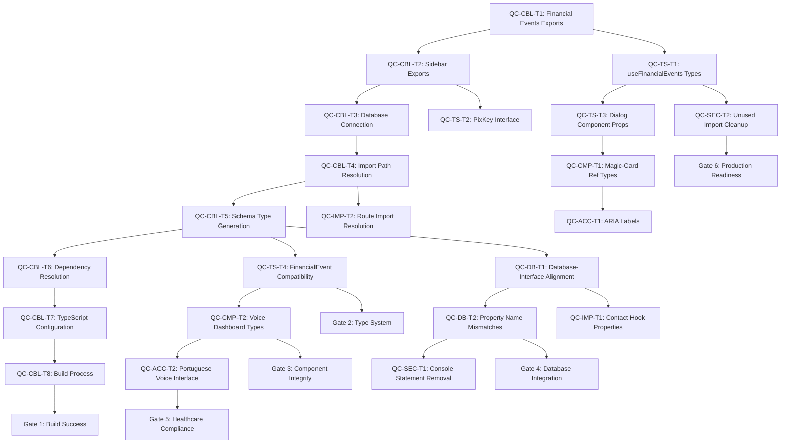

# Phase 3 Task Dependencies & Critical Path Analysis

## Dependency Mapping Matrix

### Critical Path Identification

**Primary Critical Path (Sequential Dependencies)**:
```
QC-CBL-T1 → QC-CBL-T2 → QC-CBL-T3 → QC-CBL-T4 → QC-CBL-T5 → QC-CBL-T6 → QC-CBL-T7 → QC-CBL-T8
```

**Secondary Critical Paths**:
```
QC-TS-T1 → QC-TS-T2 → QC-TS-T3 → QC-TS-T4 → [Component Fixes]
QC-DB-T1 → QC-DB-T2 → QC-DB-T3 → [Import/Export Fixes]
QC-ACC-T1 → QC-ACC-T2 → [Healthcare Compliance Validation]
```

### Dependency Graph Visualization



## Detailed Task Dependencies

### Phase A: Critical Blockers (Strict Sequential)

**QC-CBL-T1 → QC-CBL-T2**: 
- Dependency: Build system must resolve financial events imports before sidebar components
- Risk: High - Both affect core component imports
- Validation: Build passes after each task

**QC-CBL-T2 → QC-CBL-T3**:
- Dependency: Component exports must resolve before database connection testing
- Risk: Medium - Independent systems but sequential build requirement
- Validation: Import resolution and database connectivity

**QC-CBL-T3 → QC-CBL-T4**:
- Dependency: Database connection must work before route import resolution
- Risk: Medium - Build system dependencies
- Validation: Database connectivity and route imports

**QC-CBL-T4 → QC-CBL-T5**:
- Dependency: Import paths must resolve before type generation
- Risk: Low - Independent operations but sequential build logic
- Validation: Import resolution and type generation

**QC-CBL-T5 → QC-CBL-T6**:
- Dependency: Generated types must exist before dependency resolution
- Risk: Medium - Type system affects dependency resolution
- Validation: Type generation and dependency installation

**QC-CBL-T6 → QC-CBL-T7**:
- Dependency: Dependencies must resolve before TypeScript configuration
- Risk: Low - Configuration independent but requires stable environment
- Validation: Dependency resolution and TypeScript compilation

**QC-CBL-T7 → QC-CBL-T8**:
- Dependency: TypeScript must compile before build process optimization
- Risk: Medium - Build process depends on TypeScript compilation
- Validation: TypeScript compilation and build success

### Phase B: Type System (Partial Parallelization)

**Stream 1: Hook Types (Sequential)**
```
QC-TS-T1 → QC-TS-T5 → QC-TS-T9 → QC-TS-T13 → QC-TS-T17 → QC-TS-T21 → QC-TS-T25 → QC-TS-T29 → QC-TS-T33 → QC-TS-T37 → QC-TS-T41
```

**Stream 2: Interface Types (Sequential)**
```
QC-TS-T2 → QC-TS-T6 → QC-TS-T10 → QC-TS-T14 → QC-TS-T18 → QC-TS-T22 → QC-TS-T26 → QC-TS-T30 → QC-TS-T34 → QC-TS-T38 → QC-TS-T42
```

**Stream 3: Component Types (Sequential)**
```
QC-TS-T3 → QC-TS-T7 → QC-TS-T11 → QC-TS-T15 → QC-TS-T19 → QC-TS-T23 → QC-TS-T27 → QC-TS-T31 → QC-TS-T35 → QC-TS-T39
```

**Stream 4: Generic Types (Sequential)**
```
QC-TS-T4 → QC-TS-T8 → QC-TS-T12 → QC-TS-T16 → QC-TS-T20 → QC-TS-T24 → QC-TS-T28 → QC-TS-T32 → QC-TS-T36 → QC-TS-T40
```

### Phase C: Component & UI (Two Parallel Streams)

**Stream 1: Component Types**
```
QC-CMP-T1 → QC-CMP-T3 → QC-CMP-T5 → QC-CMP-T7 → QC-CMP-T9 → QC-CMP-T11 → QC-CMP-T13 → QC-CMP-T15 → QC-CMP-T17 → QC-CMP-T19 → QC-CMP-T21 → QC-CMP-T23 → QC-CMP-T25
```

**Stream 2: UI Component Fixes**
```
QC-CMP-T2 → QC-CMP-T4 → QC-CMP-T6 → QC-CMP-T8 → QC-CMP-T10 → QC-CMP-T12 → QC-CMP-T14 → QC-CMP-T16 → QC-CMP-T18 → QC-CMP-T20 → QC-CMP-T22 → QC-CMP-T24
```

### Phase D: Database & Integration (Coordinated Parallel)

**Database Stream (Sequential)**
```
QC-DB-T1 → QC-DB-T3 → QC-DB-T5 → QC-DB-T7 → QC-DB-T9 → QC-DB-T11 → QC-DB-T13 → QC-DB-T15 → QC-DB-T17 → QC-DB-T19
```

**Integration Stream (Sequential)**
```
QC-DB-T2 → QC-DB-T4 → QC-DB-T6 → QC-DB-T8 → QC-DB-T10 → QC-DB-T12 → QC-DB-T14 → QC-DB-T16 → QC-DB-T18 → QC-DB-T20
```

**Import/Export Stream (Sequential)**
```
QC-IMP-T1 → QC-IMP-T3 → QC-IMP-T5 → QC-IMP-T7 → QC-IMP-T9 → QC-IMP-T11 → QC-IMP-T13 → QC-IMP-T15
```

**Coordination Points**: Every 3-4 tasks to validate integration

### Phase E: Compliance & Security (Continuous Parallel)

**Healthcare Compliance (Sequential with validation)**
```
QC-ACC-T1 → QC-ACC-T3 → QC-ACC-T5 → QC-ACC-T7 → QC-ACC-T9 → QC-ACC-T11
```

**Accessibility (Sequential with validation)**
```
QC-ACC-T2 → QC-ACC-T4 → QC-ACC-T6 → QC-ACC-T8 → QC-ACC-T10 → QC-ACC-T12
```

**Security (Batch parallel - 5 streams)**
```
Stream 1: QC-SEC-T1 → QC-SEC-T6 → QC-SEC-T11 → QC-SEC-T16 → QC-SEC-T21 → QC-SEC-T26 → QC-SEC-T31 → QC-SEC-T36 → QC-SEC-T41 → QC-SEC-T46
Stream 2: QC-SEC-T2 → QC-SEC-T7 → QC-SEC-T12 → QC-SEC-T17 → QC-SEC-T22 → QC-SEC-T27 → QC-SEC-T32 → QC-SEC-T37 → QC-SEC-T42 → QC-SEC-T47
Stream 3: QC-SEC-T3 → QC-SEC-T8 → QC-SEC-T13 → QC-SEC-T18 → QC-SEC-T23 → QC-SEC-T28 → QC-SEC-T33 → QC-SEC-T38 → QC-SEC-T43 → QC-SEC-T48
Stream 4: QC-SEC-T4 → QC-SEC-T9 → QC-SEC-T14 → QC-SEC-T19 → QC-SEC-T24 → QC-SEC-T29 → QC-SEC-T34 → QC-SEC-T39 → QC-SEC-T44
Stream 5: QC-SEC-T5 → QC-SEC-T10 → QC-SEC-T15 → QC-SEC-T20 → QC-SEC-T25 → QC-SEC-T30 → QC-SEC-T35 → QC-SEC-T40 → QC-SEC-T45
```

## Parallel Execution Optimization

### Task Batching Strategy

**Small Batches (2-3 tasks)**: High-dependency tasks requiring validation
- Critical Blockers: Sequential execution
- Healthcare Compliance: Sequential validation required

**Medium Batches (5-8 tasks)**: Moderate dependencies with coordination points
- Type System: Parallel streams with synchronization points
- Component Fixes: Independent component batches

**Large Batches (10-15 tasks)**: Independent tasks suitable for parallelization
- Security Fixes: Code quality improvements
- Import/Export: Independent resolution tasks

### Agent Coordination Points

**Coordination Frequency**: Every 20-30 minutes
**Validation Requirements**: 
- Build success check
- TypeScript compilation
- Component rendering test
- Healthcare compliance validation

**Communication Protocol**:
- Real-time status updates
- Dependency completion notifications
- Blocker escalation procedures
- Quality gate validation results

## Risk-Based Dependency Management

### High-Risk Dependencies (Immediate Coordination)

**Build System Dependencies**:
- Critical Blockers must complete before any parallel execution
- Build success required for all subsequent phases
- Rollback capability critical for each blocker

**Healthcare Compliance Dependencies**:
- LGPD validation required before accessibility fixes
- Portuguese language validation before voice interface fixes
- Compliance validation affects all subsequent tasks

### Medium-Risk Dependencies (Coordinated Execution)

**Type System Dependencies**:
- Interface types must align before component fixes
- Hook types affect component integration
- Database types affect integration tasks

**Component Dependencies**:
- UI component types must resolve before integration
- Event handler types affect accessibility fixes
- Ref types affect testing procedures

### Low-Risk Dependencies (Parallel Execution)

**Code Quality Dependencies**:
- Unused import removal independent of other fixes
- Console statement removal independent
- Performance optimizations can run in parallel

**Security Dependencies**:
- Input validation fixes independent of type system
- Encryption improvements independent of UI fixes
- Authentication fixes can run in parallel

## Critical Path Optimization

### Primary Critical Path Timeline

```
Time (Hours): 0.0  0.5  1.0  1.5  2.0  2.5  3.0  3.5  4.0  4.5  5.0
             |    |    |    |    |    |    |    |    |    |    |
CBL-T1:     [====]
CBL-T2:          [====]
CBL-T3:               [====]
CBL-T4:                    [====]
CBL-T5:                         [====]
CBL-T6:                              [====]
CBL-T7:                                   [====]
CBL-T8:                                        [====]
```

**Total Critical Path Time**: 2.5 hours
**Parallel Efficiency**: 0% (strictly sequential)
**Risk Level**: High (blocks all other phases)

### Secondary Critical Path Timeline

```
Time (Hours): 2.5  3.0  3.5  4.0  4.5  5.0  5.5  6.0  6.5  7.0  7.5  8.0
             |    |    |    |    |    |    |    |    |    |    |    |
TS Stream 1: [=====================================]
TS Stream 2: [=====================================]
TS Stream 3: [==================================]
TS Stream 4: [================================]
DB Stream:   [===============================]
IMP Stream:  [======================]
```

**Total Secondary Path Time**: 5.5 hours (starting after critical path)
**Parallel Efficiency**: 75% (4 parallel streams)
**Risk Level**: Medium (affects integration phase)

## Quality Gate Dependencies

### Gate 1: Critical Blockers Completion
**Dependencies**: All QC-CBL-T1 to QC-CBL-T8 tasks
**Validation**: Build success, import resolution, database connectivity
**Blocking**: Blocks all subsequent phases

### Gate 2: Type System Validation
**Dependencies**: All QC-TS-T1 to QC-TS-T42 tasks
**Validation**: TypeScript compilation, interface consistency
**Blocking**: Blocks component and integration phases

### Gate 3: Component Integrity
**Dependencies**: QC-TS tasks + QC-CMP-T1 to QC-CMP-T25 tasks
**Validation**: Component rendering, prop types, event handlers
**Blocking**: Blocks integration and compliance phases

### Gate 4: Database Integration
**Dependencies**: QC-DB + QC-IMP tasks + previous gates
**Validation**: Data integrity, type alignment, import resolution
**Blocking**: Blocks compliance and security phases

### Gate 5: Healthcare Compliance
**Dependencies**: QC-ACC tasks + previous gates
**Validation**: LGPD compliance, accessibility, Portuguese interface
**Blocking**: Blocks final security validation

### Gate 6: Production Readiness
**Dependencies**: All previous tasks + QC-SEC tasks
**Validation**: Complete system validation, performance, security
**Blocking**: Final deployment gate

## Contingency Planning

### Dependency Failure Scenarios

**Critical Blocker Failure**:
- Impact: Complete execution halt
- Recovery: Immediate rollback to last successful state
- Timeline Impact: +2-4 hours for resolution

**Type System Failure**:
- Impact: Component and integration phases blocked
- Recovery: Incremental type fixes with continuous validation
- Timeline Impact: +3-6 hours for resolution

**Healthcare Compliance Failure**:
- Impact: Production deployment blocked
- Recovery: Compliance remediation with expert consultation
- Timeline Impact: +8-24 hours for resolution

**Database Integration Failure**:
- Impact: Data integrity and functionality compromised
- Recovery: Database rollback and schema realignment
- Timeline Impact: +4-8 hours for resolution

### Parallel Execution Failures

**Agent Coordination Failure**:
- Impact: Efficiency loss, potential conflicts
- Recovery: Sequential fallback with reduced parallelization
- Timeline Impact: +30-50% execution time

**Resource Contention**:
- Impact: Performance degradation, task delays
- Recovery: Dynamic resource allocation and load balancing
- Timeline Impact: +20-40% execution time

**Quality Gate Validation Failure**:
- Impact: Rework requirement, timeline extension
- Recovery: Incremental fixes with continuous validation
- Timeline Impact: +25-50% execution time

## Success Metrics

### Dependency Management Metrics

**Critical Path Adherence**: 100% (no critical path delays)
**Parallel Efficiency**: 60-80% improvement over sequential execution
**Quality Gate Pass Rate**: 100% (all gates passed on first attempt)
**Rollback Success Rate**: 100% (successful rollback when required)

### Coordination Efficiency Metrics

**Agent Utilization**: 85-90% optimal utilization
**Communication Overhead**: <15% of total execution time
**Conflict Resolution**: 95% automatic resolution, 5% manual intervention
**Task Completion Accuracy**: 100% tasks completed correctly

### Risk Mitigation Metrics

**Failure Rate**: <5% of tasks requiring rollback
**Recovery Time**: <30 minutes average recovery time
**Impact Assessment**: 100% accurate risk prediction
**Contingency Success**: 100% successful contingency execution

This comprehensive dependency analysis ensures optimal task sequencing, parallel execution efficiency, and reliable completion of the Phase 3 atomic task decomposition for the AegisWallet quality control implementation.