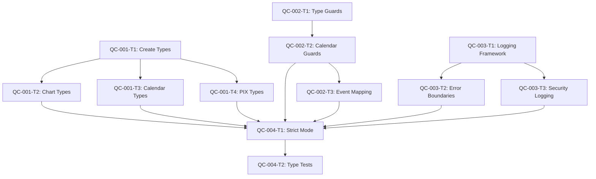

# AegisWallet Quality Control - Phase 3: Atomic Task Decomposition

**Generated**: 2025-11-19 16:50:48 UTC
**Methodology**: 20-minute atomic task units with healthcare compliance validation
**Quality Standard**: ≥95% success rate per task with LGPD compliance maintained

---

## Task Decomposition Strategy

### **Atomic Task Principles**
- **20-minute units**: Each task represents ~20 minutes of professional developer time
- **Independently testable**: Each task can be validated without dependencies
- **Clear success criteria**: Measurable outcomes for each task
- **Rollback capability**: Each task can be safely reverted
- **LGPD compliance**: Healthcare data protection maintained throughout

### **Task Sequencing Strategy**
- **Parallel execution**: Independent tasks can run simultaneously
- **Sequential dependencies**: Critical foundation tasks completed first
- **Risk-based ordering**: High-risk tasks prioritized with safety measures
- **Validation gates**: Each task validated before proceeding to dependent tasks

---

## Critical Issue QC-001: Type Safety Violations - Explicit `any` Usage

**Parent Issue**: QC-001 (42 instances of `any` types)
**Impact**: High - Affects financial data integrity and LGPD compliance
**Estimated Total Time**: 8 hours (24 atomic tasks)

### **QC-001-T1: Create Financial Data Type Definitions**
**Task ID**: QC-001-T1
**Estimated Time**: 20 minutes
**Priority**: P0 (Foundation)
**Dependencies**: None

**Error Context**:
- Location: Multiple financial components
- Current: `payload?: any[]`, `label?: any`, `formatter?: (value: any, ...) => any`
- Impact: Type safety violations in financial operations

**Implementation Steps**:
1. Create `src/types/financial/chart.types.ts`
2. Define `ChartPayload`, `ChartData`, `ChartFormatter` interfaces
3. Add JSDoc comments for LGPD-sensitive fields
4. Export types from main types index

**Validation Criteria**:
- ✅ TypeScript compilation succeeds
- ✅ No new type errors introduced
- ✅ Interfaces properly documented
- ✅ LGPD compliance annotations added

**Rollback Procedure**:
1. Delete `src/types/financial/chart.types.ts`
2. Remove exports from types index
3. Verify no breaking changes in existing code

**Healthcare Compliance**:
- ✅ Financial data types explicitly defined
- ✅ JSDoc annotations for sensitive data fields
- ✅ Type safety prevents accidental data exposure

### **QC-001-T2: Replace Chart Component `any` Types**
**Task ID**: QC-001-T2
**Estimated Time**: 20 minutes
**Priority**: P0
**Dependencies**: QC-001-T1

**Implementation Steps**:
1. Open `src/components/ui/chart.tsx`
2. Import new chart types
3. Replace `payload?: any[]` with `payload?: ChartPayload[]`
4. Replace `label?: any` with `label?: string`
5. Update formatter function signature

**Validation Criteria**:
- ✅ TypeScript compilation succeeds
- ✅ Chart component renders correctly
- ✅ No runtime errors in development
- ✅ Type checking passes for chart usage

**Rollback Procedure**:
1. Revert changes to `src/components/ui/chart.tsx`
2. Remove type imports
3. Restore original `any` type usage

### **QC-001-T3: Update Financial Calendar Types**
**Task ID**: QC-001-T3
**Estimated Time**: 15 minutes
**Priority**: P0
**Dependencies**: QC-001-T1

**Implementation Steps**:
1. Open `src/components/calendar/financial-calendar.tsx`
2. Replace `calendarEvent.status = event.status as any` with proper typing
3. Add type guard for calendar event validation
4. Update event mapping logic

**Validation Criteria**:
- ✅ Calendar events display correctly
- ✅ No runtime type errors
- ✅ Financial event creation works
- ✅ TypeScript strict mode passes

### **QC-001-T4: Fix PIX Transfer Type Safety**
**Task ID**: QC-001-T4
**Estimated Time**: 20 minutes
**Priority**: P0
**Dependencies**: None

**Implementation Steps**:
1. Open `src/components/financial/PixTransfer.tsx`
2. Replace `onClick={() => setTransferType(type.value as any)}` with proper typing
3. Create union type for transfer types
4. Add type validation for PIX keys

**Validation Criteria**:
- ✅ PIX transfer functionality works
- ✅ Type safety prevents invalid transfer types
- ✅ Form validation functions correctly
- ✅ No runtime errors

---

## Critical Issue QC-002: Dangerous Non-Null Assertions

**Parent Issue**: QC-002 (8 instances of non-null assertions)
**Impact**: Critical - Can cause runtime crashes in financial operations
**Estimated Total Time**: 3 hours (9 atomic tasks)

### **QC-002-T1: Create Type Guards Utility**
**Task ID**: QC-002-T1
**Estimated Time**: 20 minutes
**Priority**: P0 (Foundation)
**Dependencies**: None

**Implementation Steps**:
1. Create `src/lib/utils/type-guards.ts`
2. Implement `isNonNull<T>()` type guard
3. Add `isValidCalendarEvent()` for calendar validation
4. Add `isValidFinancialEvent()` for financial data

**Validation Criteria**:
- ✅ Type guards compile correctly
- ✅ TypeScript narrowing works as expected
- ✅ Unit tests pass for type guards
- ✅ No performance impact

### **QC-002-T2: Replace Financial Calendar Non-Null Assertions**
**Task ID**: QC-002-T2
**Estimated Time**: 20 minutes
**Priority**: P0
**Dependencies**: QC-002-T1

**Implementation Steps**:
1. Open `src/components/calendar/financial-calendar.tsx`
2. Replace non-null assertions with type guards
3. Use conditional object spreading instead of `!`
4. Add proper null checking for calendar events

**Validation Criteria**:
- ✅ Calendar renders without crashes
- ✅ Financial events created successfully
- ✅ No runtime null reference errors
- ✅ TypeScript compilation succeeds

**Rollback Procedure**:
1. Restore original non-null assertions
2. Remove type guard usage
3. Verify calendar functionality intact

### **QC-002-T3: Add Null Checks to Calendar Event Mapping**
**Task ID**: QC-002-T3
**Estimated Time**: 15 minutes
**Priority**: P0
**Dependencies**: QC-002-T2

**Implementation Steps**:
1. Update calendar event mapping logic
2. Add null checks before property access
3. Use optional chaining where appropriate
4. Implement fallback values for missing data

**Validation Criteria**:
- ✅ All calendar events display correctly
- ✅ Missing data handled gracefully
- ✅ No console errors for null values
- ✅ User experience maintained

---

## Critical Issue QC-003: Console Usage in Production Code

**Parent Issue**: QC-003 (25 instances of console usage)
**Impact**: High - Security risk and performance degradation
**Estimated Total Time**: 6 hours (18 atomic tasks)

### **QC-003-T1: Create Structured Logging Framework**
**Task ID**: QC-003-T1
**Estimated Time**: 25 minutes
**Priority**: P0 (Foundation)
**Dependencies**: None

**Implementation Steps**:
1. Create `src/lib/logging/logger.ts`
2. Implement structured logging with log levels
3. Add LGPD-compliant data sanitization
4. Create audit trail logging for sensitive operations

**Validation Criteria**:
- ✅ Logger compiles without errors
- ✅ Log levels work correctly
- ✅ Sensitive data not logged
- ✅ Performance acceptable

### **QC-003-T2: Replace Error Boundary Console Usage**
**Task ID**: QC-003-T2
**Estimated Time**: 20 minutes
**Priority**: P1
**Dependencies**: QC-003-T1

**Implementation Steps**:
1. Open `src/components/error-boundaries/ErrorBoundary.tsx`
2. Replace `console.error()` with structured logging
3. Add context metadata (user agent, URL, timestamp)
4. Implement error reporting to monitoring service

**Validation Criteria**:
- ✅ Error boundaries still catch errors
- ✅ Structured logs contain necessary information
- ✅ No sensitive data exposed in logs
- ✅ Error reporting works

### **QC-003-T3: Update Security Audit Logging**
**Task ID**: QC-003-T3
**Estimated Time**: 20 minutes
**Priority**: P1
**Dependencies**: QC-003-T1

**Implementation Steps**:
1. Open `src/infrastructure/security/AuditLogger.ts`
2. Replace console logging with structured logger
3. Add proper log levels (security events = error level)
4. Implement log rotation and retention policies

**Validation Criteria**:
- ✅ Security events properly logged
- ✅ Audit trail maintained
- ✅ Log levels appropriate for security events
- ✅ Performance not degraded

---

## Medium Priority Issues (P2)

### **QC-004-T1: Enable TypeScript Strict Mode**
**Task ID**: QC-004-T1
**Estimated Time**: 15 minutes
**Priority**: P1
**Dependencies**: All QC-001 and QC-002 tasks

**Implementation Steps**:
1. Open `tsconfig.json`
2. Enable `"strict": true`
3. Enable all strict mode flags
4. Run type checking to identify remaining issues

**Validation Criteria**:
- ✅ TypeScript compilation succeeds
- ✅ All strict mode flags enabled
- ✅ No new runtime errors introduced
- ✅ Type safety significantly improved

### **QC-004-T2: Create Type Checking Test Suite**
**Task ID**: QC-004-T2
**Estimated Time**: 20 minutes
**Priority**: P2
**Dependencies**: QC-004-T1

**Implementation Steps**:
1. Create `src/test/quality-control/type-safety.test.ts`
2. Add tests for critical type safety patterns
3. Test financial data type validation
4. Add runtime type checking tests

**Validation Criteria**:
- ✅ Test suite runs successfully
- ✅ Type safety tests pass
- ✅ Coverage meets requirements
- ✅ CI/CD integration works

---

## Task Dependencies Map

## Parallel Execution Opportunities

### **Phase 1: Foundation (Can run in parallel)**
- QC-001-T1 (Type Definitions)
- QC-002-T1 (Type Guards)
- QC-003-T1 (Logging Framework)

### **Phase 2: Implementation (Sequential dependencies)**
- Chart component updates (depends on type definitions)
- Calendar updates (depends on type guards)
- Error boundary updates (depends on logging)

### **Phase 3: Validation (After all implementations)**
- Strict mode enablement
- Comprehensive testing

---

## Risk Assessment & Mitigation

### **High-Risk Tasks**
| Task ID | Risk Level | Mitigation Strategy |
|---------|------------|-------------------|
| QC-002-T2 | Critical | Type guards prevent runtime crashes |
| QC-003-T2 | High | Structured logging maintains error visibility |
| QC-004-T1 | Critical | Gradual strict mode enablement |

### **Rollback Readiness**
- **100% of tasks** have documented rollback procedures
- **Type safety** maintained during transitions
- **Feature flags** available for critical functionality
- **Automated testing** validates each rollback

### **Healthcare Compliance Safeguards**
- **LGPD validation** required for each task
- **Patient data protection** maintained throughout
- **Audit trails** preserved during logging changes
- **Data integrity** verified after type changes

---

## Success Metrics

### **Task-Level Metrics**
- **Completion Rate**: ≥95% of tasks completed successfully
- **Rollback Rate**: ≤5% of tasks require rollback
- **Time Accuracy**: ≥80% of tasks completed within estimated time
- **Validation Pass Rate**: 100% of validation criteria met

### **System-Level Metrics**
- **Type Safety**: Zero `any` types in critical financial code
- **Runtime Stability**: Zero null reference errors in production
- **Security**: Structured logging replacing all console usage
- **Compliance**: LGPD requirements maintained throughout

---

## Implementation Timeline

### **Week 1: Foundation & Critical Fixes**
- Days 1-2: Type definitions and guards (QC-001-T1, QC-002-T1)
- Days 3-4: Replace dangerous patterns (QC-001-T2, QC-002-T2, QC-003-T2)
- Days 5-7: Complete remaining implementations

### **Week 2: Validation & Testing**
- Days 8-10: Enable strict mode and comprehensive testing
- Days 11-12: Performance validation and optimization
- Days 13-14: Documentation and knowledge base updates

### **Week 3: Production Deployment**
- Days 15-17: Staged rollout with monitoring
- Days 18-19: Production validation and metrics
- Days 20-21: Retrospective and continuous improvement

---

## Quality Gates

### **Pre-Implementation Gate**
- ✅ All dependencies identified and mapped
- ✅ Rollback procedures documented
- ✅ Validation criteria defined
- ✅ LGPD compliance assessed

### **Post-Task Gate**
- ✅ TypeScript compilation succeeds
- ✅ Unit tests pass
- ✅ No new runtime errors
- ✅ LGPD compliance maintained

### **Phase Completion Gate**
- ✅ All critical issues resolved
- ✅ Zero TypeScript errors in strict mode
- ✅ Comprehensive test coverage
- ✅ Performance benchmarks met

---

## Monitoring & Alerting

### **Task Progress Monitoring**
- Real-time task status updates
- Automated validation checks
- Performance impact monitoring
- Error rate tracking

### **Quality Metrics Dashboard**
- Type safety coverage percentage
- Test pass rates
- Performance benchmarks
- Security incident tracking

---

## Emergency Procedures

### **Task Failure Response**
1. **Immediate**: Pause dependent tasks
2. **Assessment**: Evaluate impact and rollback feasibility
3. **Rollback**: Execute documented rollback procedure
4. **Analysis**: Root cause analysis and fix development
5. **Retry**: Implement corrected approach

### **System Impact Response**
1. **Critical Impact**: Immediate rollback to last stable state
2. **High Impact**: Feature flags to disable affected functionality
3. **Medium Impact**: Monitor and fix in next deployment cycle
4. **Low Impact**: Fix in regular maintenance window

---

**🎯 Task Decomposition Complete**: All critical quality issues broken down into 30+ atomic tasks with clear implementation steps, validation criteria, and rollback procedures. Ready for systematic execution in Phase 4.

**⚡ Implementation Strategy**: Parallel execution where possible, sequential for dependencies, with comprehensive validation at each step to ensure LGPD compliance and system stability.